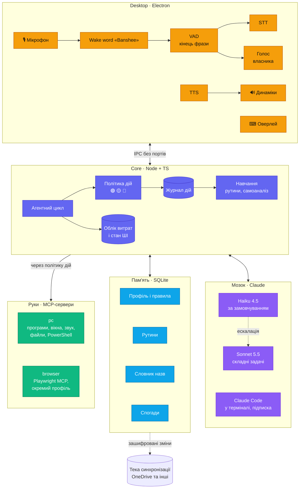

# 01 · Архітектура



## Компоненти

| Компонент | Відповідальність | Технології |
|---|---|---|
| `apps/core` | агентний цикл, маршрутизація, політика дій, пам'ять, журнал, облік і ліміт витрат, стан ШІ й базовий режим, статистика, навчання, експорт і синхронізація | Node.js в `utilityProcess` Electron, `@anthropic-ai/sdk`, `@modelcontextprotocol/sdk`, `better-sqlite3` |
| `apps/desktop` | трей, оверлей, картки підтвердження, центр керування з «Активністю», мікрофон, wake word, VAD, розпізнавання власника; STT і TTS — у процесі voice | Electron + React, Fluent UI System Icons, модель слова (ознаки openWakeWord через `onnxruntime-node`), sherpa-onnx: VAD, відбиток голосу, Parakeet і Piper — усе локально |
| `mcp/pc` | інструменти ПК: програми, вікна, звук, файли, PowerShell | MCP-сервер на Node; один постійний процес PowerShell + UI Automation |
| Playwright MCP | дії в браузері | зовнішній пакет `@playwright/mcp`, окремий профіль браузера |
| `packages/shared` | спільні типи, протокол core ↔ desktop і схема налаштувань — крок 1.2 | TypeScript, zod 4 з українськими повідомленнями |
| `evals/` | еталонний набір команд і сценарії ін'єкцій | заглушки MCP-серверів, див. [07-quality.md](07-quality.md) |

## Процеси

- **desktop** (головний процес Electron) — точка входу. Один екземпляр (`requestSingleInstanceLock`), автозапуск при вході в Windows, значок у треї.
- **core** — дочірній процес desktop (`utilityProcess`). Зв'язок через `MessagePort`, без мережевих портів: до core не підключиться ні інша програма, ні сторінка в браузері. Desktop перезапускає core після падіння за ≤ 5 с. Після 3 падінь за хвилину — повідомлення в треї й без нових спроб.
  - **Службовий канал** — `process.parentPort`, `packages/shared/src/control.ts` (крок 1.1): `core.init` зі шляхами в теці Banshee й портом головного процесу, `core.attach` з портом нового вікна, `core.stop` під час виходу; у відповідь — `core.started` або `core.failed`. Повідомлення протоколу core ↔ desktop ідуть окремими портами: свій у головного процесу (трей, сповіщення) і в кожного вікна; core розсилає свої повідомлення всім.
  - **Перезапуск:** пауза 300 мс, далі новий core і нові порти для головного процесу й вікон. Виміряно (`npm run desktop:check`, 2026-10-05): падіння помічено за 5 мс, core знову готовий за 0,65 с, вікно підключилося тоді ж.
  - **Код:** `apps/core/src/start.ts` запускає core без Electron — БД, журнал, ключ, mcp/pc, рушій; `host.ts` — протокол; `apps/desktop/src/core/core.ts` — вхід `utilityProcess`, лише шляхи й порти.
- **Аудіо.**
  - Renderer бере мікрофон через `getUserMedia` з ехоподавленням і передає PCM 16 кГц у main.
  - У main працюють wake word, VAD і перевірка голосу власника — легкі моделі на процесорі.
  - Parakeet (STT) і Piper (TTS) — в окремому `utilityProcess` voice: важкі обчислення не блокують трей та інтерфейс. Модель Parakeet тримається в RAM (≈ 0,8 ГБ); desktop перезапускає voice після падіння, як і core.
  - Відтворення озвучки — у тому самому renderer, що й мікрофон. Тоді Chromium прибирає власний голос Banshee з мікрофона (перевірити на етапі 0).
- **MCP-сервери** — дочірні процеси core (stdio). `mcp/pc` тримає один постійний процес PowerShell, бо запуск `powershell.exe` на кожну дію коштує сотні мілісекунд. Команду, що зависла, вбиваємо через 30 с, а процес перезапускаємо.
  - Окремого Node на ПК користувача немає: core запускає `mcp/pc` тим самим exe Banshee в режимі Node (`ELECTRON_RUN_AS_NODE=1`). Змінні оточення — лише базові, яких потребує Windows; ключів серед них немає.
  - Процес `mcp/pc` упав — наступна дія запускає його знову. Core упав — `mcp/pc` завершується сам, щойно закривається його stdin: Windows не закриває дочірні процеси разом із батьківським, а сирота тримав би PowerShell.
- **Без інтернету** core переходить у базовий режим ([03-brain.md](03-brain.md)): рутини й вбудовані команди працюють, голос працює як завжди — він локальний, на решту Banshee відповідає «Немає зв'язку». Команди в чергу не ставляться: виконати їх пізніше було б несподіванкою.
- Banshee працює як звичайний застосунок у сесії користувача, а не як служба Windows: службам недоступний робочий стіл.
- Нативні модулі — на Node-API, тож одна готова збірка працює і в Node, і в Electron, без перезбирання й Build Tools (крок 0.8, 2026-10-05): `better-sqlite3` 13 (збірки — в самому пакеті), `sherpa-onnx-node`, `onnxruntime-node`, `@napi-rs/keyring`. Перевірено в головному процесі Electron 44.5.1 (Node 24.21) — `npm run desktop:check-native`.
  - **Порядок завантаження:** `onnxruntime-node` — до `sherpa-onnx-node`. Обидва везуть `onnxruntime.dll` — 1.30 і 1.28 — з однією назвою; хто завантажився першим, той і в процесі. Старіша першою — і `onnxruntime-node` падає з помилкою Windows 182; новіша першою — працюють обидва.
  - **Головний процес — ESM без top-level await навколо `app.whenReady()`:** подія ready настає лише після завантаження модуля.
  - **Розробка у VS Code:** термінал успадковує `ELECTRON_RUN_AS_NODE=1`, і Electron працює як звичайний Node; скрипти запускаються через `scripts/electron.ts`, який прибирає змінну.

## Протокол core ↔ desktop

Крок 1.2, `packages/shared/src/protocol.ts`. Повідомлення йдуть через `MessagePort`; кожне перевіряє схема zod на вході, тож зіпсоване чи чуже повідомлення відкидається з поясненням, а не кладе процес. Версія протоколу — `PROTOCOL_VERSION`; core і desktop — однієї збірки, тож різні версії означають зіпсоване встановлення.

| Напрям | Повідомлення | Навіщо |
|---|---|---|
| desktop → core | `hello` | версія протоколу й програми; core відповідає `ready` зі станом ШІ |
| | `command` | команда з оверлея чи голосу; для голосу — схожість на профіль власника й чи пройдено поріг |
| | `stop` | скасувати запит до API, поточну дію й підтвердження; озвучку desktop зупиняє сам |
| | `confirm.reply` | відповідь на картку: так чи ні, голосом, кліком чи клавішею |
| | `settings.get`, `settings.set` | налаштування; зміна з інтерфейсу чи голосу проходить правила [10-settings.md](10-settings.md) |
| | `ai.extraDay` | «ще $1 на сьогодні» — лише кліком |
| | `episode.new`, `undo` | «нова розмова»; «скасуй» — останню дію або дію з картки |
| core → desktop | `ready`, `reply` | готовність і відповіді на запити з `id` |
| | `turn.state`, `turn.done` | стан ходу для трею й оверлея; маршрут, результат, затримка, вартість |
| | `say` | текст відповіді частинами: оверлей показує стрімом, voice озвучує по реченнях |
| | `action` | картка дії: рівень, що зроблено, стан, чи можна скасувати |
| | `confirm.request`, `confirm.closed` | картка підтвердження: для 🔴 — точна команда й наслідок, способи, час на рішення |
| | `ai.state`, `settings.changed`, `notice` | стан ШІ, зміна налаштування, сповіщення Windows |
| desktop → core, з кроку 1.7 | `key.status`, `key.set`, `key.check`, `key.delete` | ключ Claude: «••••1234», вставити й перевірити, перевірити збережений, видалити; сам ключ іде лише в `key.set` |
| | `ai.details` | картка «Стан ШІ»: модель, ключ, витрати проти лімітів, оцінка кредитів, останній запит |
| | `stats.get`, `journal.list` | «Огляд» і «Активність» за 7, 30, 90 днів чи рік; журнал дій з фільтрами |

Протокол версії 2 — крок 1.7. Результати запитів — у `reply`, типи — `packages/shared/src/views.ts`.

**Вікна й головний процес** (не core) говорять каналом `ui`, схема — `apps/desktop/src/shared/ui.ts`: сховати оверлей і підігнати його висоту, відкрити розділ центру керування, відкрити посилання в браузері — лише з переліку адрес Console. Головний процес перевіряє, що команда прийшла з вікна Banshee.

Голос між main і процесом voice (аудіо, тексти для озвучки) — внутрішня справа desktop, у цей протокол не входить.

## Встановлення й оновлення

- **Встановлювач** — NSIS (electron-builder) з вибором теки (рішення власника 2026-10-04), для поточного користувача, без прав адміністратора.
  - Сторінка «Куди встановити»: типово `%LOCALAPPDATA%\Banshee`; «Змінити» — будь-який диск і тека, наприклад `D:\Banshee`. Поруч — вільне місце на кожному диску й скільки потрібно (≈ 1,1 ГБ з моделями).
  - Не приймає, з поясненням: теку, куди без прав адміністратора не записати (`C:\Program Files`, корінь системного диска), і теку всередині хмарної синхронізації (OneDrive, Google Drive, Dropbox) — БД SQLite там псується.
  - Перевіряє системні вимоги (розділ нижче): слабший ПК — попередження, а не заборона.
- **Усе в одній теці `Banshee`** (рішення власника 2026-10-04):

  | Тека | Що | Під час оновлення |
  |---|---|---|
  | `app\` | програма | замінюється |
  | `data\` | БД пам'яті `banshee.db`, налаштування, профіль голосу, резервні копії, дані Chromium | лишається |
  | `models\` | моделі голосу, ~0,7 ГБ | лишається; нові версії моделей докачуються |
  | `logs\` | журнал роботи | лишається |

  - Electron типово пише в `%APPDATA%`; Banshee до старту перенаправляє `userData`, `sessionData`, `logs` і `crashDumps` у свою теку (`app.setPath`).
  - Поза текою — лише те, що Windows тримає у своїх місцях: ярлики в меню «Пуск» і на робочому столі, запис у «Програми та компоненти», автозапуск (`HKCU\…\Run`), ключі API в Credential Manager (рішення 2026-10-03, [12-api.md](12-api.md)) і тимчасові файли в `%TEMP%`. Тека синхронізації — там, де її обрав користувач ([11-sync.md](11-sync.md)).
- **Моделі** (wake word, VAD, відбиток голосу, Parakeet, голос озвучки) завантажуються під час першого запуску в `models\` з перевіркою SHA-256, разом ~0,7–0,8 ГБ. Голосам Piper з `rhasspy/piper-voices` Banshee після перевірки дописує метадані sherpa-onnx і словник звуків (`prototypes/tts/prepare-piper.ts`).
- **Майстер першого запуску:**
  - мікрофон: перевіряє дозвіл Windows «Доступ до мікрофона для класичних програм» і веде до потрібної сторінки параметрів, якщо доступ закрито; далі — вибір мікрофона й «Перевірити мікрофон»;
  - слово «Banshee» під голос користувача: 10 вимов;
  - запис голосу власника, 30 с ([02-voice.md](02-voice.md), «Налаштування під голос і мікрофон»: усі три кроки можна пропустити й пройти пізніше в налаштуваннях);
  - підключення API ([12-api.md](12-api.md)) — можна пропустити й працювати в базовому режимі;
  - перенесення пам'яті з іншого ПК ([11-sync.md](11-sync.md)).
- **Видалення програми** прибирає `app\` і ярлики, а `data\`, `models\` і `logs\` лишає, щоб перевстановлення не стирало пам'ять і не качало моделі вдруге. Повне видалення — кнопкою «Видалити всі дані» в розділі «Про програму»: тека Banshee разом з ключами в Credential Manager.
- **Оновлення** — новою версією встановлювача. Пам'ять і налаштування зберігаються, схема БД мігрує автоматично. Автооновлення з GitHub Releases (безкоштовно) — пізніше.
- **Реалізація — крок 1.9** (`apps/desktop/electron-builder.yml`, `build/installer.nsh`, 2026-10-05):
  - `npm run dist` → `.data/dist/Banshee-Setup-<версія>.exe`, ≈ 113 МБ; програма після встановлення — ≈ 0,4 ГБ, з них Electron ≈ 0,37 ГБ. electron-builder 26 бере Electron з `node_modules` — без завантаження й перезбирання; NSIS і решту інструментів качає в `.data/electron-builder-cache` на D:.
  - У `node_modules` програми — лише нативні модулі: `better-sqlite3` (лише збірка win32-x64, без вихідного коду SQLite) і `@napi-rs/keyring`; решту JavaScript Vite вже зібрав. `onnxruntime-node` і `sherpa-onnx-node` додасть етап 2.
  - Тека за замовчуванням — `%LOCALAPPDATA%\Banshee`. Після вибору теки встановлювач дописує `\Banshee`, якщо його немає в шляху, і `\app` — і в тихому режимі (`/S`, оновлення), де сторінок немає. Корінь системного диска стає `C:\Banshee`.
  - Для Program Files, теки Windows і тек OneDrive, Google Drive, Dropbox, iCloud кнопка «Далі» неактивна; пояснення — над полем вибору теки.
  - Системні вимоги перевіряються на старті встановлювача: збірка Windows, ядра, RAM; слабший ПК — попередження.
  - Видалення лишає `data\`, `models\`, `logs\` і прибирає запис автозапуску `Banshee` (`HKCU\…\Run`), який пише сама програма, лише зібрана.
  - Перевірено 2026-10-05 на цьому ПК (Windows 10 22H2): тихе встановлення в теку на D: — програма в `Banshee\app`, у «Програмах та компонентах» і меню «Пуск» — Banshee; встановлена програма проходить `--self-check`; видалення прибирає `app\`, запис і ярлик, дані лишаються. Сторінки встановлювача й Windows 11 перевіряє власник.
  - «Видалити всі дані» («Про програму», підтвердження кліком): ключ Claude видаляє core, далі окремий PowerShell після виходу Banshee тихо запускає деінсталятор і кладе теку Banshee в Кошик (`src/main/erase.ts`). Лише у встановленій програмі: у розробці й розпакованій збірці — відмова. Скрипт перевірено сухим прогоном у PowerShell; повний шлях наживо не запускався — він видалив би справжній ключ Claude власника.
- **Підтримувані Windows і ризики платформи** — [11-sync.md](11-sync.md), розділ «Сумісність з Windows».

## Системні вимоги

Вимога власника (2026-10-04): мінімальні й рекомендовані вимоги бачить користувач — у встановлювачі, у довідці й у «Про програму» поруч з даними свого ПК. Числа попередні: розпізнавання виміряно на кроці 0.3, решту підтверджують кроки 0.7–0.8 і 2.2.

| | Мінімальні | Рекомендовані |
|---|---|---|
| Windows | 10 22H2 (збірка 19045), 64-біт | 11, 64-біт |
| Процесор | 4 ядра x64, рівня Intel Core i5-6600 (2015): фраза розпізнається за ≈ 0,5 с | 6 ядер і більше, новіший: розпізнавання швидше |
| Оперативна пам'ять | 8 ГБ; Banshee займає до 1,5 ГБ | 16 ГБ |
| Місце на диску | 3 ГБ вільного: програма ~0,4 ГБ, моделі ~0,7 ГБ, пам'ять росте з часом | 5 ГБ на SSD |
| Відеокарта | не потрібна | не потрібна |
| Мікрофон | будь-який; Bluetooth-гарнітура — з широкою смугою (16 кГц) у режимі дзвінка | гарнітура або USB-мікрофон |
| Звук | динаміки чи навушники | — |
| Інтернет і ключ Claude API | для ШІ; без них працює базовий режим ([03-brain.md](03-brain.md)) | стабільний зв'язок; кредити API — ≈ $11 на місяць ([12-api.md](12-api.md)) |

- Встановлювач перевіряє Windows, кількість ядер, RAM і вільне місце в обраній теці.
- Вузьку смугу (8 кГц) Bluetooth-гарнітури розпізнавання чує гірше — «Перевірити мікрофон» про це попереджає ([02-voice.md](02-voice.md)).

## Діагностика
- **Журнал роботи** (не плутати з журналом дій) — `logs\` у теці Banshee: файли по 5 МБ, зберігаються 5 останніх; рівні error, warn, info.
- Пише core, desktop і MCP-сервери. Тексту команд, транскриптів і секретів у журналі роботи немає — лише події, коди помилок, тривалість.
- Формат (крок 1.3, `@banshee/shared/log`): рядок JSON — час, рівень, джерело, подія й поля. Рядкові поля обрізаються до 200 символів, ключі `sk-ant-…` маскуються. Файл `<джерело>.log`; понад ліміт він стає `<джерело>.1.log`, найстаріший замінюється.
- **«Зібрати діагностику»** («Про програму») — ZIP із журналами, версіями Banshee, Windows і Electron. Пам'яті й налаштувань у ньому немає.
- Звіти про збої — лише локально; нікуди не відправляються.

## Інструменти етапу 1

Рівень визначає код ([05-safety.md](05-safety.md)).
- `final` — проста дія, яка в разі успіху завершує хід без другого виклику моделі ([03-brain.md](03-brain.md)).
- `replayable` — дію можна повторити у вивченій рутині ([08-learning.md](08-learning.md)).
- `locked` — дозволено на заблокованому ПК.

| Інструмент | Що робить | Рівень | Позначки |
|---|---|---|---|
| `open_app(app)` | відкрити програму зі словника назв або з меню «Пуск» | 🟢 | final, replayable |
| `close_app(app)` | закрити програму | 🟡 | replayable |
| `volume(level \| delta \| mute)` | гучність і вимкнення звуку (Core Audio) | 🟢 | final, replayable, locked |
| `media(action)` | відтворення, пауза, наступна, попередня | 🟢 | final, replayable, locked |
| `window(action, app?)` | показати, згорнути, розгорнути вікно; згорнути всі | 🟢 | final, replayable |
| `open_target(target)` | відкрити теку, файл чи сайт | 🟢 | final, replayable |
| `find_files(query, folder?)` | знайти файли за назвою чи датою | 🟢 | — |
| `file_op(op, paths, dest?)` | перемістити, скопіювати, перейменувати, видалити в Кошик | 🟡; понад 20 файлів — 🔴 | undo |
| `run_powershell(script)` | PowerShell: дозволені команди — 🟡, решта — 🔴 | 🟡 / 🔴 | — |
| `system_info(kind)` | час, дата, заряд, вільне місце, мережа | 🟢 | final, locked |
| `lock_pc()` | заблокувати ПК | 🟢 | final, replayable |

Схеми — `mcp/pc/src/definitions.ts` (з кроку 1.4; до того — `scripts/lib/tools.ts`, тепер він лише посилається на них): описи англійською, кожен опис каже, коли викликати інструмент. Без `strict`: на кроці 0.1 він додавав ≈ 0,35 с до першого токена і ≈ 22 с до першого запиту після зміни схем, а точність без нього не гірша ([03-brain.md](03-brain.md)). Схеми лишаються сумісними зі strict: без `minimum`, `maximum`, `minLength`, не більше 24 необов'язкових параметрів. Межі значень перевіряє код.

**Реалізація — крок 1.4** (`mcp/pc`, 2026-10-05):
- **Один процес PowerShell** на весь час роботи: скрипт іде рядком у base64, вивід і помилки повертаються JSON-ом. Перший виклик — ≈ 1,9 с (запуск процесу), далі — 50–70 мс. Скрипт довший за 30 с вбивається разом із процесом; наступний виклик запускає новий.
- **Значення з команди** потрапляють у скрипт лише рядком в одинарних лапках — без підстановок і виконання.
- **Службові інструменти лише для core**, Claude їх не бачить: `banshee_assess` — рівень і речення для картки підтвердження до виконання; `banshee_undo` — «скасуй» файлової дії. Що повертати для «скасуй», сервер кладе в `_meta` результату, а не в текст для Claude.
- **Програми:** Windows власника українською, тож системні програми («Калькулятор», «Блокнот», «Провідник») шукаються за сталими AppID, решта — за назвою в меню «Пуск». Процеси Windows (explorer, dwm, svchost тощо) `close_app` не закриває.
- **Гучність** — Core Audio, медіаклавіші й вікна — user32, через `Add-Type`: компілятор C# є в кожній Windows, Build Tools не потрібні. Відтворення й пауза — одна медіаклавіша-перемикач.
- **Файли:** пошук — у Node, з обмеженням глибини й часу, без `node_modules`, `AppData`, `.git`. Перезапису немає: якщо в цілі вже є файл з такою назвою — помилка.
- **Кошик:** видалення — через Shell з `SendToRecycleBin` і діалогами Windows: завеликий для Кошика файл Windows запитає, а не видалить тихо. «Скасуй» відновлює з Кошика за початковим шляхом з файлу `$I`. Переміщення між дисками — копія, а оригінал іде в Кошик.
- **Перевірка на цьому ПК без змін у системі** — `npm run pc:check`: диски, мережа, заряд, пошук, оцінка дій і проба Кошика на тимчасовому файлі (2026-10-05: відновлено). Дії, що змінюють стан ПК — відкрити чи закрити програму, гучність, медіа, вікна, блокування, — у тестах лише з підробним PowerShell; наживо їх перевіряє власник у встановленій програмі після кроку 1.9 (рішення власника 2026-10-05).

Інструменти core, не ПК:
- `escalate(task, reason)` — етап 1, `reason`: `complex_plan`, `long_document`, `repeated_failure`, `owner_request`; на кроці 0.1 — уже в еталонному наборі;
- `recall(query)` — етап 3;
- `code_task(project, task)` — етап 4.

## Розробка
- **Інструменти:**
  - Node.js 22 LTS — на ПК власника 22.22.2;
  - npm workspaces;
  - TypeScript у режимі `strict`;
  - збірка — Vite через electron-vite;
  - ESLint (typescript-eslint, flat config) і Prettier;
  - тести — Vitest, наскрізні — Playwright для Electron;
  - еталонний набір — власний скрипт `npm run evals`.
- **Встановлено на кроці П3 (2026-10-03):** TypeScript 6, ESLint 10 (flat config, typescript-eslint `strictTypeChecked`), Prettier 3, Vitest 5, `@anthropic-ai/sdk` 0.131, `@napi-rs/keyring` 2.1.
  - Скрипти пишемо TypeScript-ом і запускаємо Node напряму, без tsx: Node ≥ 22.18 сам прибирає типи. Тому лише синтаксис, що стирається (`erasableSyntaxOnly`), і імпорти з розширенням `.ts`.
  - Хук Claude Code `lint-fix` після кожного запису `.ts` форматує файл Prettier і запускає `eslint --fix`.
  - Спільний код скриптів — `scripts/lib`; на кроках 1.2 і 1.5 він переїде в `packages/shared` і `apps/core`.
- **Крок 1.1 (2026-10-05):** `apps/desktop` — `@banshee/desktop`: electron-vite 5 (Vite 7, бо Vite 8 electron-vite 5 ще не підтримує), React 19.
  - Збірка `npm run build` → `apps/desktop/out`: головний процес, core і `mcp/pc` — окремі входи (`?modulePath`), preload — CommonJS, бо ізольований preload ESM не вантажить; сторінка — React. Пакети `@banshee/*` — вихідний TypeScript, тож Vite збирає їх разом із залежностями; зовнішні — лише нативні модулі з `dependencies` пакета desktop. У встановлювач (крок 1.9) із `node_modules` потраплять лише вони.
  - Головний процес: тека Banshee через `app.setPath` до старту (`src/main/paths.ts`), один екземпляр, значок у треї, нагляд за core (`supervisor.ts`), вікно з портом до core, сторінкам заборонено навігацію, нові вікна й будь-які дозволи — мікрофон відкриває етап 2.
  - Сторінка отримує від preload лише `send`, `onMessage`, `onConnect`; порт лишається в preload. CSP — лише власні скрипти.
  - `npm run desktop:check` — збірка й перевірка програми з `--self-check` в окремій теці `self-check`: старт, вікно, команда без ШІ «котра година», перезапуск core, сирота `mcp/pc`, другий екземпляр, пам'ять. Ключ Claude перевірка не читає — запитів до API немає. 2026-10-05: core готовий за 0,4–1,5 с від запуску, команда — 0,04–0,14 с, перезапуск — 0,65 с, другий екземпляр завершується за 0,16 с і передає керування першому, усі процеси Electron — ≈ 380 МБ.
  - Іконки трею й програми малює код (`apps/desktop/scripts/icons.ts`, `npm run desktop:icons`): PNG для 100–200 % і ICO до 256 px.
  - Модуль ключа Claude (`credentials.ts`) переїхав у core: ключ читає core; `scripts/lib` на нього посилається.
- **Крок 1.4 (2026-10-05):** `mcp/pc` — `@banshee/pc`: MCP-сервер (`@modelcontextprotocol/sdk` 1.32, `McpServer`, stdio), постійний PowerShell, 11 інструментів, AST-класифікатор, Кошик і «скасуй»; розділ «Інструменти етапу 1».
- **Крок 1.3 (2026-10-05):** `apps/core` — `@banshee/core`: БД на `better-sqlite3` 13 (готова збірка під Node 22, SQLite 3.53, FTS5 є), міграції, ідентифікатор ПК ([04-memory.md](04-memory.md)). Журнал роботи — `@banshee/shared/log`.
- **Крок 1.2 (2026-10-05):** `packages/shared` — `@banshee/shared`, без збирання: `exports` вказує на `src/index.ts`, і Node прибирає типи сам, бо пакет лежить поза `node_modules` (workspace — посилання). Рівні дій і підтвердження, стан ШІ, ходи, типи інструментів, схема налаштувань, протокол. `scripts/lib` бере типи звідси.
- **Крок 0.2 (2026-10-04):** `prototypes/recorder` — записувач `npm run recorder`: сервер на `127.0.0.1` з одноразовим токеном і сторінка з AudioWorklet; WAV 16 кГц у `.data/recordings` ([07-quality.md](07-quality.md), «Записи етапу 0»). Перевірка записів — `npm run recordings` (`analyze.ts`, без розпізнавання мови). Тимчасовий інструмент розробки, у продукт не потрапляє.
- **Крок 0.1 (код 2026-10-03):** `scripts/lib/tools.ts` — схеми й позначки інструментів; `system-prompt.ts` — системний промпт; `turn.ts` — рядок контексту ходу; `scripts/lib/evals/` — набір, заглушки, хід на заглушках, оцінка, звіт; `scripts/evals.ts` — `npm run evals`.
- **Electron** — точна версія, без `^`; оновлюється окремою зміною з прогоном усіх перевірок. Обрано 44.5.1 (крок 0.8); бінарник качається в `.data/electron-cache` на D:.
- **Нативні модулі** (`better-sqlite3`, `sherpa-onnx-node`, `@napi-rs/keyring`) — лише з готовими збірками під обрану версію Electron.
  - Visual Studio Build Tools на ПК немає, а на диску C: мало місця.
  - Наявність готових збірок перевіряє етап 0.
  - `@napi-rs/keyring` — доступ до Credential Manager. Він на Node-API, тож одна збірка працює і в Node, і в Electron. keytar не беремо: його архівовано 15.12.2022.
- **Дані в розробці** — `.data/` у корені репозиторію (диск D:), а не `%LOCALAPPDATA%`. Там БД, моделі, журнали й кеш npm (`.data/npm-cache`, через `.npmrc` проєкту): на C: вільно лише ~5 ГБ. Тека в `.gitignore`.
- **Ключ Claude** — у Credential Manager, той самий запис, що й у застосунку; змінних середовища немає (рішення власника 2026-10-03). Поки вікна налаштувань немає, його вводить власник командою `npm run key` ([12-api.md](12-api.md)). `ANTHROPIC_API_KEY` не задавати: Claude Code перейде з підписки на оплату за API.
- **Git** — локальний репозиторій. `.gitignore`: `node_modules`, `out`, `dist`, `*.tsbuildinfo`, `.data`, `*.db` (з `-wal` і `-shm`), `coverage`, `evals/results`, `.env*`, `.mcp.json` (токени MCP-серверів), `.claude/settings.local.json` (особисті налаштування Claude Code).
  - Репозиторій: `github.com/if251189kmo/banshee`, гілка `main`.
  - Автор комітів — git-ім'я й email власника; коміт — лише з його дозволу.
- **Скрипти кореня:**
  - `npm run check` = typecheck + lint + test;
  - `npm run key` — введення ключа Claude у Credential Manager (замість символів — «•»; `-- --clipboard` — з буфера обміну, `-- --delete` — видалити); запускає лише власник;
  - `npm run check:api` — перевірка ключа без його виводу: список моделей, один короткий виклик Haiku;
  - `npm run recorder` — записувач етапу 0 (крок 0.2);
  - `npm run recordings` — перевірка цих записів: рівні, шум, смуга, обрізані фрази, слова в серіях «Banshee»;
  - `npm run voiceprint` — крок 0.6: моделі відбитків голосу на записах власника й чужих голосів, похибки в обидва боки й поріг;
  - `npm run tts` — крок 0.4: голоси озвучки, час першого звуку, сторінка для прослуховування `.data/tts/index.html`;
  - `npm run stt` — крок 0.3: розпізнає записані команди (`--engine whisper` — whisper.cpp на відеокарті, `--engine parakeet` — sherpa-onnx на процесорі), міряє час і пише тексти для `npm run evals -- --texts`;
  - `npm run pc:check` — крок 1.4: інструменти ПК через справжній MCP-сервер, без змін у системі, і проба Кошика;
  - `npm run db` — крок 1.3: відкриває БД розробки `.data/banshee.db`, мігрує й показує таблиці;
  - `npm run evals` — еталонний набір на справжньому Haiku 4.5, інструменти — заглушки; витрачає кредити (≈ $0,1), тож у Claude Code — з підтвердженням;
  - `npm run dev` — програма з перезбиранням на льоту (electron-vite);
  - `npm run build` — збірка в `apps/desktop/out`;
  - `npm run desktop:check` — крок 1.1: перевірка зібраної програми, результат — `.data/desktop-check.json`;
  - `npm run desktop:icons` — іконки трею й програми.

## Структура репозиторію

```
banshee/
├─ apps/
│  ├─ core/        агентний цикл, політика дій, пам'ять, облік витрат
│  └─ desktop/     Electron: трей, оверлей, аудіо, процес voice, підтвердження
│     ├─ src/main/      головний процес: тека Banshee, трей, нагляд за core, вікна
│     ├─ src/core/      вхід utilityProcess core
│     ├─ src/pc/        вхід mcp/pc у зібраній програмі
│     ├─ src/preload/   міст сторінки до core
│     ├─ src/renderer/  сторінки React
│     └─ resources/     іконки
├─ mcp/
│  └─ pc/          інструменти ПК, постійний PowerShell
├─ packages/
│  └─ shared/      типи й протокол core ↔ desktop, схема налаштувань
├─ prototypes/     прототипи етапу 0, не потрапляють у продукт
├─ scripts/        key, check-api, допоміжні скрипти
├─ evals/          еталонний набір і сценарії ін'єкцій
└─ .data/          дані в розробці (не в git)
```

- **Монорепо — npm workspaces** (рішення власника, 2026-10-03): кореневий `package.json` з полем `workspaces`, без pnpm і Yarn.
- **Перевірки Definition of Done** (рішення власника, 2026-10-03) — скрипти кореневого `package.json`: `npm run typecheck`, `npm run lint`, `npm test`, `npm run evals`. Перші три з'являються на кроці П3, `evals` — на кроці 0.1.

> **Референси для `mcp/pc`:** desk-mcp (Node + вбудований PowerShell) і mcp-windows (елементи за назвою, а не за координатами). Код перевірити перед використанням.
