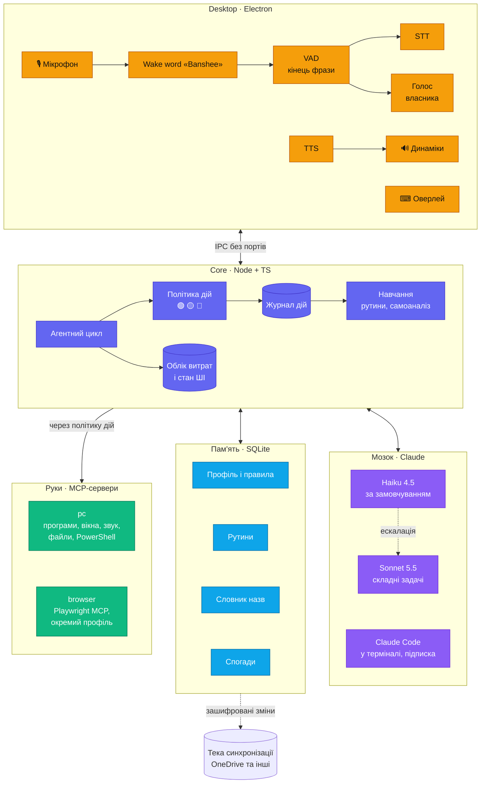

# 01 · Архітектура



## Компоненти

| Компонент | Відповідальність | Технології |
|---|---|---|
| `apps/core` | агентний цикл, маршрутизація, політика дій, пам'ять, журнал, облік і ліміт витрат, стан ШІ й базовий режим, статистика, навчання, експорт і синхронізація | Node.js в `utilityProcess` Electron, `@anthropic-ai/sdk`, `@modelcontextprotocol/sdk`, `better-sqlite3` |
| `apps/desktop` | трей, оверлей, картки підтвердження, центр керування з «Активністю», мікрофон, wake word, VAD, розпізнавання власника; STT і TTS — у процесі voice | Electron + React, Fluent UI System Icons, sherpa-onnx: wake word, VAD, відбиток голосу, Whisper і Piper — усе локально |
| `mcp/pc` | інструменти ПК: програми, вікна, звук, файли, PowerShell | MCP-сервер на Node; один постійний процес PowerShell + UI Automation |
| Playwright MCP | дії в браузері | зовнішній пакет `@playwright/mcp`, окремий профіль браузера |
| `packages/shared` | спільні типи й протокол між core і desktop | TypeScript |
| `evals/` | еталонний набір команд і сценарії ін'єкцій | заглушки MCP-серверів, див. [07-quality.md](07-quality.md) |

## Процеси

- **desktop** (головний процес Electron) — точка входу. Один екземпляр (`requestSingleInstanceLock`), автозапуск при вході в Windows, значок у треї.
- **core** — дочірній процес desktop (`utilityProcess`). Зв'язок через `MessagePort`, без мережевих портів: до core не підключиться ні інша програма, ні сторінка в браузері. Desktop перезапускає core після падіння за ≤ 5 с. Після 3 падінь за хвилину — повідомлення в треї й без нових спроб.
- **Аудіо.**
  - Renderer бере мікрофон через `getUserMedia` з ехоподавленням і передає PCM 16 кГц у main.
  - У main працюють wake word, VAD і перевірка голосу власника — легкі моделі на процесорі.
  - Whisper (STT) і Piper (TTS) — в окремому `utilityProcess` voice: важкі обчислення не блокують трей та інтерфейс. Модель Whisper тримається в пам'яті відеокарти; desktop перезапускає voice після падіння, як і core.
  - Відтворення озвучки — у тому самому renderer, що й мікрофон. Тоді Chromium прибирає власний голос Banshee з мікрофона (перевірити на етапі 0).
- **MCP-сервери** — дочірні процеси core (stdio). `mcp/pc` тримає один постійний процес PowerShell, бо запуск `powershell.exe` на кожну дію коштує сотні мілісекунд. Команду, що зависла, вбиваємо через 30 с, а процес перезапускаємо.
- **Без інтернету** core переходить у базовий режим ([03-brain.md](03-brain.md)): рутини й вбудовані команди працюють, голос працює як завжди — він локальний, на решту Banshee відповідає «Немає зв'язку». Команди в чергу не ставляться: виконати їх пізніше було б несподіванкою.
- Banshee працює як звичайний застосунок у сесії користувача, а не як служба Windows: службам недоступний робочий стіл.
- Нативні модулі ставляться готовими збірками під ABI Electron: `@electron/rebuild` бере prebuilt-бінарники, без компіляції. `@napi-rs/keyring` — на Node-API, перезбирання не потребує; `better-sqlite3` і `sherpa-onnx-node` перевіряє крок 0.8.

## Встановлення й оновлення

- **Встановлювач** — NSIS (electron-builder), для поточного користувача, без прав адміністратора. Програма ставиться в `%LOCALAPPDATA%\Programs\Banshee`, дані лежать у `%LOCALAPPDATA%\Banshee`.
- **Моделі** (wake word, VAD, відбиток голосу, Whisper, Piper) завантажуються під час першого запуску з перевіркою SHA-256.
  - Разом ~1 ГБ.
  - Типова тека — `%LOCALAPPDATA%\Banshee\models`. На диску C: цього ПК вільно лише ~5 ГБ, тому теку моделей можна перенести на інший диск (налаштування пристрою).
- **Майстер першого запуску:**
  - мікрофон: перевіряє дозвіл Windows «Доступ до мікрофона для класичних програм» і веде до потрібної сторінки параметрів, якщо доступ закрито;
  - запис голосу власника, 30 с;
  - підключення API ([12-api.md](12-api.md)) — можна пропустити й працювати в базовому режимі;
  - перенесення пам'яті з іншого ПК ([11-sync.md](11-sync.md)).
- **Видалення програми** лишає дані в `%LOCALAPPDATA%\Banshee`, щоб перевстановлення не стирало пам'ять. Повне видалення — кнопкою «Видалити всі дані» в розділі «Про програму». Ключі з Credential Manager при цьому теж видаляються.
- **Оновлення** — новою версією встановлювача. Пам'ять і налаштування зберігаються, схема БД мігрує автоматично. Автооновлення з GitHub Releases (безкоштовно) — пізніше.
- **Підтримувані Windows і ризики платформи** — [11-sync.md](11-sync.md), розділ «Сумісність з Windows».

## Діагностика
- **Журнал роботи** (не плутати з журналом дій) — `%LOCALAPPDATA%\Banshee\logs`: файли по 5 МБ, зберігаються 5 останніх; рівні error, warn, info.
- Пише core, desktop і MCP-сервери. Тексту команд, транскриптів і секретів у журналі роботи немає — лише події, коди помилок, тривалість.
- **«Зібрати діагностику»** («Про програму») — ZIP із журналами, версіями Banshee, Windows і Electron. Пам'яті й налаштувань у ньому немає.
- Звіти про збої — лише локально; нікуди не відправляються.

## Інструменти етапу 1

Рівень визначає код ([05-safety.md](05-safety.md)).
- `final` — проста дія, яка в разі успіху завершує хід без другого виклику моделі ([03-brain.md](03-brain.md)).
- `replayable` — дію можна повторити у вивченій рутині ([08-learning.md](08-learning.md)).
- `locked` — дозволено на заблокованому ПК.

| Інструмент | Що робить | Рівень | Позначки |
|---|---|---|---|
| `open_app(app)` | відкрити програму зі словника назв або з меню «Пуск» | 🟢 | final, replayable |
| `close_app(app)` | закрити програму | 🟡 | replayable |
| `volume(level \| delta \| mute)` | гучність і вимкнення звуку (Core Audio) | 🟢 | final, replayable, locked |
| `media(action)` | відтворення, пауза, наступна, попередня | 🟢 | final, replayable, locked |
| `window(action, app?)` | показати, згорнути, розгорнути вікно | 🟢 | final, replayable |
| `open_target(target)` | відкрити теку, файл чи сайт | 🟢 | final, replayable |
| `find_files(query, folder?)` | знайти файли за назвою чи датою | 🟢 | — |
| `file_op(op, paths, dest?)` | перемістити, скопіювати, перейменувати, видалити в Кошик | 🟡; понад 20 файлів — 🔴 | undo |
| `run_powershell(script)` | PowerShell: дозволені команди — 🟡, решта — 🔴 | 🟡 / 🔴 | — |
| `system_info(kind)` | час, дата, заряд, вільне місце, мережа | 🟢 | final, locked |
| `lock_pc()` | заблокувати ПК | 🟢 | final, replayable |

Інструменти core, не ПК:
- `escalate(task, reason)` — етап 1;
- `recall(query)` — етап 3;
- `code_task(project, task)` — етап 4.

## Розробка
- **Інструменти:**
  - Node.js 22 LTS — на ПК власника 22.22.2;
  - npm workspaces;
  - TypeScript у режимі `strict`;
  - збірка — Vite через electron-vite;
  - ESLint (typescript-eslint, flat config) і Prettier;
  - тести — Vitest, наскрізні — Playwright для Electron;
  - еталонний набір — власний скрипт `npm run evals`.
- **Electron** — точна версія, без `^`; оновлюється окремою зміною з прогоном усіх перевірок.
- **Нативні модулі** (`better-sqlite3`, `sherpa-onnx-node`, `@napi-rs/keyring`) — лише з готовими збірками під обрану версію Electron.
  - Visual Studio Build Tools на ПК немає, а на диску C: мало місця.
  - Наявність готових збірок перевіряє етап 0.
  - `@napi-rs/keyring` — доступ до Credential Manager. Він на Node-API, тож одна збірка працює і в Node, і в Electron. keytar не беремо: його архівовано 15.12.2022.
- **Дані в розробці** — `.data/` у корені репозиторію (диск D:), а не `%LOCALAPPDATA%`. Там БД, моделі, журнали й кеш npm (`.data/npm-cache`, через `.npmrc` проєкту): на C: вільно лише ~5 ГБ. Тека в `.gitignore`.
- **Ключ Claude** — у Credential Manager, той самий запис, що й у застосунку; змінних середовища немає (рішення власника 2026-10-03). Поки вікна налаштувань немає, його вводить власник командою `npm run key` ([12-api.md](12-api.md)). `ANTHROPIC_API_KEY` не задавати: Claude Code перейде з підписки на оплату за API.
- **Git** — локальний репозиторій. `.gitignore`: `node_modules`, `out`, `dist`, `*.tsbuildinfo`, `.data`, `*.db` (з `-wal` і `-shm`), `coverage`, `evals/results`, `.env*`, `.mcp.json` (токени MCP-серверів), `.claude/settings.local.json` (особисті налаштування Claude Code).
  - Репозиторій: `github.com/if251189kmo/banshee`, гілка `main`.
  - Автор комітів — git-ім'я й email власника; коміт — лише з його дозволу.
- **Скрипти кореня:**
  - `npm run check` = typecheck + lint + test;
  - `npm run key` — введення ключа Claude прихованим рядком у Credential Manager; запускає лише власник;
  - `npm run check:api` — перевірка ключа без його виводу: список моделей, один короткий виклик Haiku;
  - `npm run evals`;
  - `npm run dev`;
  - `npm run build`.

## Структура репозиторію

```
banshee/
├─ apps/
│  ├─ core/        агентний цикл, політика дій, пам'ять, облік витрат
│  └─ desktop/     Electron: трей, оверлей, аудіо, процес voice, підтвердження
├─ mcp/
│  └─ pc/          інструменти ПК, постійний PowerShell
├─ packages/
│  └─ shared/      типи й протокол core ↔ desktop, схема налаштувань
├─ prototypes/     прототипи етапу 0, не потрапляють у продукт
├─ scripts/        key, check-api, допоміжні скрипти
├─ evals/          еталонний набір і сценарії ін'єкцій
└─ .data/          дані в розробці (не в git)
```

- **Монорепо — npm workspaces** (рішення власника, 2026-10-03): кореневий `package.json` з полем `workspaces`, без pnpm і Yarn.
- **Перевірки Definition of Done** (рішення власника, 2026-10-03) — скрипти кореневого `package.json`: `npm run typecheck`, `npm run lint`, `npm test`, `npm run evals`. Перші три з'являються на кроці П3, `evals` — на кроці 0.1.

> **Референси для `mcp/pc`:** desk-mcp (Node + вбудований PowerShell) і mcp-windows (елементи за назвою, а не за координатами). Код перевірити перед використанням.
