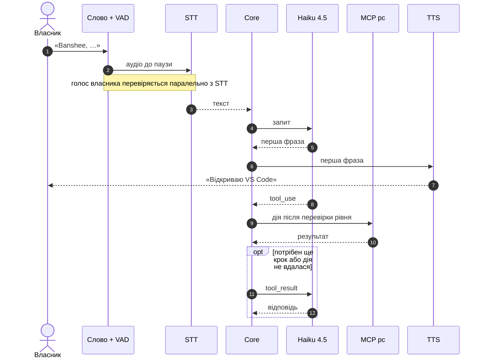

# 02 · Голосовий конвеєр

Перша фраза звучить, поки дія ще виконується. Проста дія, що вдалася, завершує хід без другого виклику Haiku (див. [03-brain.md](03-brain.md)). Для 🟡 і 🔴 дій після фрази core ставить питання підтвердження.

## Ланки

| Ланка | Основний варіант | Альтернатива |
|---|---|---|
| Wake word «Banshee» | власна модель слова — рішення власника 2026-10-05: ознаки openWakeWord через `onnxruntime-node` + мала нейромережа на TypeScript, що довчається на ПК користувача; перевірка голосу на «слово + команда». Ітерація 4: 17 % пропусків, ≤ 1 хибне на 10 год; до цілі 5 % — довчанням | довша фраза активації (на кшталт «Гей, Банші») — лише за рішенням власника. Готові моделі sherpa-onnx KWS вимову власника не ловлять: щонайбільше 12 з 33 |
| Кінець фрази (VAD) | Silero VAD через sherpa-onnx, пауза 0,5 с (налаштовується) | — |
| Голос власника | sherpa-onnx: відбиток голосу (speaker embedding) і порівняння з профілем власника | — |
| STT | Parakeet TDT 0.6B v3 (int8) через `sherpa-onnx-node` на процесорі — рішення власника 2026-10-04 за вимірами 0.3: 0,47 с на фразу | запасний варіант 3: Parakeet + Whisper large-v3-turbo на відеокарті лише для команд, які Haiku не зрозумів; хмарний Whisper Groq — лише за рішенням власника |
| TTS | Piper `tetiana` high через sherpa-onnx на процесорі — рішення власника 2026-10-04: найчіткіший жіночий голос; часті фрази готові заздалегідь | швидші Piper `lada` або Coqui `olena` (0,05–0,09 с), якщо затримка нових фраз заважатиме |
| Ехоподавлення | вбудоване в Chromium (`getUserMedia`) | — |

> Porcupine не підходить: Picovoice закрив безкоштовний тариф 30.06.2026, а планів для особистого використання немає.

## Вартість голосу: $0

Рішення власника (2026-10-03): голос лише локально. Обліковий запис Azure без даних картки не активується, а вводити картку власник не хоче.

- **Розпізнавання — Parakeet TDT 0.6B v3** (int8, ~0,55 ГБ) на процесорі, рішення власника 2026-10-04. Назви програм підказує словник (розділ «Правила»).
- **Озвучка — Piper `tetiana` high** (114 МБ, 22 кГц) через sherpa-onnx на процесорі, рішення власника 2026-10-04 (розділ «Озвучка» нижче).
- **$0, без облікових записів, ключів і лімітів.** Працює без інтернету.
- **Аудіо не залишає ПК.**
- **Ризик — точність розпізнавання** (нижче): 72 % команд на старті, ціль кроку 2.2 — ≥ 90 %.
- **Запасний план** — варіант 3: Whisper на відеокарті лише для команд, які Haiku не зрозумів (нижче). Хмарний Whisper large-v3-turbo від Groq — лише за рішенням власника:
  - Безкоштовний тариф без картки: 20 запитів за хвилину, 2000 на день, 8 год аудіо на день ([Groq rate limits](https://console.groq.com/docs/rate-limits), 2026-10-03). Для 50 команд на день цього вистачає із запасом.
  - Аудіо тоді йде в хмару Groq.
  - Рішення — за власником.
- **Не беремо:**
  - Azure Speech F0 — потрібна картка;
  - ElevenLabs — безкоштовного обсягу на щоденну озвучку не вистачить;
  - Edge TTS (голоси Azure через функцію читання вголос у Edge) — неофіційний доступ: Microsoft його не публікує й може будь-коли закрити.

## Розпізнавання мови: Parakeet на процесорі

Рішення власника 2026-10-04 за вимірами кроку 0.3: розпізнавання — **Parakeet TDT 0.6B v3** (int8) через `sherpa-onnx-node` на процесорі.

ПК власника, перевірено 2026-10-03: NVIDIA GeForce GTX 960 на 2 ГБ, з них ~0,85 ГБ займає робочий стіл, драйвер — CUDA 12.6; процесор Intel Core i5-6600, 4 ядра; RAM 32 ГБ.

**Виміри кроку 0.3 (2026-10-04)** — 50 команд власника, звіт — `evals/stage0-report.md`:

| Варіант | Де | Час на команду: p50 / p90 / фрази від 4 с | Пам'ять | Дослівно | Haiku з розпізнаного тексту |
|---|---|---|---|---|---|
| Whisper large-v3-turbo q5, whisper.cpp b5130 CUDA 12.4 | відеокарта | 1,67 / 1,73 / 1,73 с | RAM 311 МБ, відеопам'ять +831 МБ | 14 з 50 | **80 %** |
| те саме з підказкою назв | відеокарта | 1,68 / 1,74 / 1,74 с | відеопам'ять +983 МБ | 11 з 50 | — |
| Parakeet TDT 0.6B v3 int8, `sherpa-onnx-node` 1.13.8 | процесор, 4 потоки | 0,47 / 0,65 / 0,68 с | RAM ≈ 780 МБ | 18 з 50 | **72 %** |
| еталонний текст без розпізнавання | — | — | — | — | 98 % |

- **Чому Parakeet.** Єдиний вкладається в затримку: 0,47 с на фразу проти 1,67 с у Whisper. Працює в процесі Node без мережевого порту й Build Tools; відеокарта вільна.
- **Чому не Whisper на GTX 960.** Кодувальник Whisper завжди обробляє вікно 30 с — 1,66 с на фразу будь-якої довжини. Коротше вікно (`-ac`) псує якість, а підказка назв погіршує розпізнавання.
- **Пам'ять.** Модель ≈ 0,55 ГБ на диску й ≈ 0,8 ГБ у RAM — весь час, поки Banshee слухає: завантаження займає секунди, тож на кожну фразу модель не вантажимо. Ціль N6 переглянуто: RAM у спокої ≤ 1,5 ГБ (рішення власника 2026-10-04).
- **Точність — головний ризик.** З розпізнаного тексту Haiku на старті виконує правильно 72 % команд, з еталонного — 98 %. Parakeet визначає мову сам і короткі фрази інколи пише польською латинкою («Wymkny zwuk»). Важкі випадки — назви зі словника власника й сленг: «тєлєгу», «вс код», «пів гучності», «гучність на повну», «вирубай», шляхи до файлів. На кроці 2.2 піднімаємо до ≥ 90 %:
  - словник назв: core виправляє знайомі помилки й підставляє назви перед Haiku (розділ «Правила»);
  - гарячі слова sherpa-onnx (hotwords): назви зі словника підсилюються під час розпізнавання;
  - виправлення власника поповнюють словник.
- **Запасний варіант 3** (рішення власника 2026-10-04) — якщо точність Parakeet лишиться низькою. Parakeet розпізнає одразу, а Whisper large-v3-turbo на відеокарті — лише ті команди, які Haiku не зрозумів: +1,7 с у таких випадках, відеопам'ять ≈ 0,83 ГБ. whisper.cpp у Node без Build Tools — лише через `whisper-server` на localhost, тож перед увімкненням варіанта 3 це окреме рішення власника. Хмарний Whisper Groq — теж лише за рішенням власника: аудіо йде в хмару.
- **Окремий процес.** Parakeet і Piper працюють в окремому `utilityProcess` voice, щоб важкі обчислення не блокували трей та інтерфейс ([01-architecture.md](01-architecture.md)).
- **Спекулятивний старт.** Розпізнавання починається з першою тишею, не чекаючи кінця паузи 0,5 с. Якщо мова продовжилась, результат відкидається. Parakeet встигає за 0,47 с — у межах паузи.
- **Прогрів.** Модель завантажується під час старту Banshee й одразу розпізнає тестовий звук, щоб перша команда власника не чекала.

## Налаштування під голос і мікрофон

Вимога власника (2026-10-04): той, хто встановив Banshee, сам налаштовує його під свій мікрофон і голос — без розробника й без записувача етапу 0. Три кроки є в майстрі першого запуску й у Налаштуваннях → Голос; кожен можна пропустити й пройти пізніше, текст працює й без них. Разом — до 3 хв.

1. **Мікрофон.**
   - Вибір: «як у Windows» (типово) або конкретний пристрій. Рівень видно наживо.
   - «Перевірити мікрофон»: користувач каже фразу ~5 с, Banshee програє її й показує гучність (тихо, добре, перевантаження), шум між словами й смугу частот. Порада — до кожної проблеми: «тихо — підійди ближче або підніми рівень» з кнопкою «Параметри звуку Windows».
   - Попередження: вузька смуга (8 кГц) погіршує розпізнавання; Bluetooth-гарнітура в режимі дзвінка, поки Banshee слухає, грає музику гірше.
   - Перевірки ті самі, що в `npm run recordings` етапу 0 (`prototypes/recorder/analyze.ts`); у продукті вони переїдуть у `packages/shared`.
2. **Слово «Banshee» під голос.** Користувач каже «Banshee» 10 разів: 5 — зблизька, 5 — з місця, звідки зазвичай кличе. Banshee довчає модель слова на цих вимовах у фоні, на процесорі (розділ «Слово "Banshee"»), і обирає поріг спрацювання, за якого впізнано щонайменше 9 з 10. Поріг не опускається нижче безпечної межі з етапів 0 і 2, щоб звичайна мова не будила Banshee. Результат видно: «упізнано 10 з 10». Зберігається для пристрою й мікрофона.
3. **Мій голос** — 5 фраз для профілю голосу ([нижче](#розпізнавання-власника-за-голосом)).

Аудіо цих кроків не зберігається: лише числа — ознаки вимов слова й ваги моделі слова, поріг, профіль голосу, результат перевірки. Ознаки вимов, як і профіль голосу, — лише на цьому ПК. Запис для прослуховування живе в пам'яті, поки відкрите вікно.

## Розпізнавання власника за голосом

Вимога власника F9: команди виконує лише власник. Телевізор, відео й інші люди в кімнаті не керують ПК і не потрапляють у пам'ять.

- **Запис голосу.** Майстер першого запуску або Налаштування → Голос → «Мій голос»: 5 фраз по ~5 с, разом ~30 с, звичайним мікрофоном. Banshee рахує відбиток голосу й зберігає профіль. Аудіо записів не зберігається, лише профіль — набір чисел. Після зміни моделі чи мікрофона в налаштуваннях Banshee запропонує записати голос ще раз.
- **Перевірка.** Кожна фраза після «Banshee» і у вікні продовження дає відбиток, який порівнюється з профілем. Нижче порогу — фраза відкидається до маршрутизації: нічого не виконується, у пам'ять і журнал ходів вона не потрапляє. В оверлеї на 2 с з'являється «Голос не впізнано», а лічильник відкинутих фраз росте в статистиці.
- **Без затримки.** Відбиток рахується на процесорі за десятки мілісекунд, паралельно з розпізнаванням тексту.
- **Короткі фрази.** На фразі коротшій за ~1 с голос надійно не впізнати. Тому «стоп» приймається від будь-кого — він лише зупиняє. Голосове «так» для 🟡 приймається лише у вікні 8 с після питання до команди, яку дав власник.
- **Поріг** — «Суворість перевірки» в налаштуваннях: низька, середня (типово) чи висока. Підбираємо на етапі 2 так, щоб власника не впізнавало ≤ 5 % разів, а чужий голос проходив ≤ 5 % разів ([07-quality.md](07-quality.md)).
- **Чужі голоси ігноруються** (рішення власника, 2026-10-03). Гостьовий режим (лише 🟢 дії без пам'яті) і довірені голоси рідних — пізніше, якщо знадобляться.
- **Не захист.** Голос можна записати чи синтезувати, тому розпізнавання — фільтр, а не автентифікація: 🔴 і далі лише руками ([05-safety.md](05-safety.md)).
- **Якщо не впізнає власника** (застуда, інший мікрофон) — текст в оверлеї працює завжди, а в налаштуваннях можна додати зразки голосу. Сам профіль Banshee не змінює, щоб він не «дрейфував» до чужих голосів.
- **Лише на цьому ПК.** Профіль не експортується й не синхронізується: це біометричні дані, а інший мікрофон дає інший відбиток. На новому ПК голос записується в майстрі першого запуску.
- **Модель** — NeMo TitaNet small (40 МБ, 21 мс на фразу), крок 0.6 (2026-10-04). На 50 командах власника й 20 чужих кліпах — 0 % помилок в обидва боки: найнижча схожість власника з профілем 0,373, найвища чужих — 0,271. Запасна — 3D-Speaker ERes2Net (теж 0 %, 54 мс). Поріг на старті ≈ 0,32, посередині між ними; уточнюємо на етапі 2 на 50 + 50 фразах — інший день, голоси рідних.
  - Найнижча схожість — у найкоротших фразах («тихіше», 1,6 с) і в суржику («открой калькулятор»).
  - WeSpeaker ResNet34 на тих самих даних помиляється в 12 % фраз власника — не беремо.

## Озвучка: виміри кроку 0.4 (2026-10-04)

`npm run tts`: кожен голос на процесорі (4 потоки) синтезує типові відповіді й пише сторінку для прослуховування `.data/tts/index.html`. Ціль — перший звук ≤ 0,2 с. Власник попросив приємніші й чіткіші жіночі голоси, тож чіткість міряємо числом: Parakeet розпізнає 121 справжню відповідь Banshee з прогонів еталонного набору, сказану цим голосом, — менше помилок, чіткіша вимова. Приємність власник оцінює на слух.

| Голос | Модель | Перший звук, 4 потоки | Чіткість: помилок на 100 слів (два прогони) | Дослівно з 121 | Стан |
|---|---|---|---|---|---|
| `tetiana` | Piper `uk_UA-tetiana-high`, 114 МБ, 22 кГц | 0,45–0,46 с | **15 і 17** | 61 і 62 | найчіткіший і найякісніший; повільний |
| `lada` | Piper `uk_UA-lada-x_low`, 26 МБ, 16 кГц | 0,05–0,06 с | 22 і 21 | 46 і 47 | швидкий, нижча якість |
| `olena` | Coqui VITS `uk-mai`, 67 МБ, 22 кГц | 0,08–0,09 с | 23 і 22 | 44 і 38 | швидкий; латиницю пропускає |

- **`tetiana` high** — з офіційного каталогу Piper (`rhasspy/piper-voices`), набір даних `egorsmkv/ukrainian-tts-datasets`, Apache 2.0. У sherpa-onnx його немає: `prototypes/tts/prepare-piper.ts` дописує в модель метадані sherpa-onnx і словник звуків, саму модель не змінює. У продукті це робить завантажувач моделей після перевірки SHA-256 оригіналу.
- **Перший звук `tetiana` — 0,45 с, понад ціль 0,2 с.** Перші фрази Banshee здебільшого повторюються — «Відкриваю Телеграм», «Гучність п'ятдесят відсотків», «Готово». Їх Banshee синтезує заздалегідь, у простої, і зберігає готовими: тоді вони звучать одразу. Нові фрази — ≈ 0,45 с, і N1 для них ≈ 1,6 с замість 1,5 с.
- Рівніша вимова (менша випадковість VITS) і повільніший темп (0,9) чіткості `tetiana` не додали.
- **Не працюють або не годяться:** Piper `ukrainian_tts` medium (lada, mykyta, tetiana) — модель читає літери, а sherpa-onnx подає їй фонеми espeak, фраза стає уривком; Meta MMS — 0,68 с і ліцензія лише некомерційна.
- **StyleTTS2 українською** (`patriotyk`) звучить природніше за Piper, але не годиться зараз: обробка тексту на Python (числа словами окремою моделлю, наголоси, фонетика), моделі 330–770 МБ, а голоси багатодикторної моделі названі іменами реальних акторів дубляжу, і згоди на таке використання в репозиторії не видно.
- **Текст для озвучки (крок 2.3):** голоси espeak читають лапки вголос («відкриті лапки… закриті лапки»); латиницю всі голоси читають погано або пропускають; цифри — по-різному. Core перед озвученням прибирає лапки, назви пише кирилицею зі словника назв, числа й знаки — словами.
  - Зроблено 2026-10-06, `apps/core/src/speech`: повідомлення `say` несе поле `speech` — текст для голосу; оверлей показує `text`.
  - Числа — з родом і відмінком за прийменником: «до 50 %» → «до п'ятдесяти відсотків», «через 1 хв» → «через одну хвилину», «8,1 ГБ» → «вісім цілих одна десята гігабайта», «3–5 хвилин» → «від трьох до п'яти хвилин». Час — «о 18:00» → «о вісімнадцятій»; дати й роки — порядковими.
  - Латиниця: словник вимов (програми й сайти словника назв, клавіші, техніка), назви власника зі словника назв («обсідіан» → Obsidian), абревіатури — назвами літер («USB» → «ю ес бі»), решта — читанням англійських буквосполучень. Кирилиця: «ПК» → «пе ка».
  - Шляхи — лише остання тека, адреси — сайт («гітхаб крапка ком»), розширення файлів, емодзі й розмітка Markdown прибираються.
- **Рішення власника 2026-10-04: `tetiana` high.** Крок 0.4 закрито. Ціль «перший звук ≤ 0,2 с» тепер така: часті фрази — з готових, одразу; нові — ≈ 0,45 с.
- **Готові фрази** (крок 2.3): у простої voice синтезує й зберігає в `data\` звук частих перших фраз — «Відкриваю …» для програм і сайтів зі словника назв, «Закриваю …», «Гучність … відсотків» кроком 5, «Готово», «Не зрозумів …». Кожна вперше озвучена фраза теж зберігається; ключ — текст, голос і темп. Зміна голосу чи темпу очищає збережене.

## Слово «Banshee»: виміри кроку 0.5 (2026-10-05)

Власник каже слово коротко — «Ба́нші», 0,3–1,1 с, медіана 0,5 с; Parakeet чує його як «Bunch». Вимови в серіях знайдено за звуком (`npm run recordings`): у тиші — 33 з 1 м і 30 з 3 м від гарнітури на столі. Під музикою слово й музика однаково гучні, межі слів невідомі — там рахуємо спрацювання на 25 вимов серії.

**Готові моделі sherpa-onnx KWS не годяться** (`npm run kws`). Словникове «BANSHEE» англійської (gigaspeech) і англо-китайської (zh-en, 3 млн параметрів) моделей не знаходить жодної вимови власника. Найкраще — набір написань «банч / банш» для zh-en: 12 з 33 з 1 м, 2 з 30 з 3 м, 0–1 під музикою. Ці моделі вчились на англійській і китайській мові, а коротке українське «Ба́нші» для них — інше слово.

**Власна модель слова** — `prototypes/wakeword/`, `npm run wakeword`. Так працює openWakeWord, але без Python:
- **Ознаки** — моделі openWakeWord `melspectrogram.onnx` і `embedding_model.onnx` (Google speech_embedding, Apache 2.0) через `onnxruntime-node`: готові збірки, без Build Tools. 96 чисел кожні 80 мс; модель слова дивиться на 16 кроків — ≈ 2 с звуку.
- **Класифікатор** — нейромережа з одним прихованим шаром на 32 нейрони, ≈ 49 тис. ваг. Вчиться на TypeScript на процесорі за хвилини, тож у продукті може довчитися на ПК користувача.
- **Сходинка 2 — голос власника** (TitaNet, крок 0.6) на звуці від 1,6 с до спрацювання до 2 с після: слово разом із початком команди.
- **Позитивні приклади** — вимови власника й синтетичні «Банші» локальними голосами; кожну вимову ще й накладено на чужу мову подкастів (3–15 дБ). **Негативні** — подкасти UK-PODS, кімната власника, його звичайні фрази й складні приклади: місця, де попередня модель помилялась.

| Ітерація | Що змінено | Пропуски, тиша (поріг 0,5 → 0,999) | Хибних на 10 год: слово → з голосом | Хибних у командах власника |
|---|---|---|---|---|
| 2 | позитивні — лише вимови власника | 16 % → 16 % | 1633 → 44; 512 → 12 | 7 → 2 з 50 |
| 3 | + 96 синтетичних «Банші» 4 голосами; половина команд власника — негативні | 29 % → 49 % | 2154 → 32; 199 → 5 | 1 → 0 з 25 |
| 4, лише синтетика | подкасти поділено за епізодами: 41 год для навчання, 10,1 год перевірки з інших епізодів; + 600 «Banshee» англійською моделлю на 904 дикторів; два раунди складних негативних. Модель не чула власника | 32 % (0,5) → 54 % (0,97) | 508 → 7,9; 35 → 0 | 0 з 25 |
| 4, + 10 вимов власника з 1 м | як у майстрі першого запуску; перевірка — на вимовах з 3 м | 17 % (0,5) → 23 % (0,97) | 1126 → 20,6; 94 → 1,0 | 3 → 1 з 25 |
| 4, + 10 вимов власника з 3 м | перевірка — на вимовах з 1 м | 21 % (0,5) → 39 % (0,9) | 548 → 5,0; 80 → 1,0 | 0 з 25 |

- **Ітерація 2 вчила голос власника, а не слово:** усі позитивні — його вимови, тож модель спрацьовувала на його звичайних командах — 7 разів на 50.
- **Перевірка голосу на «слово + команда» нічого не губить:** в ітерації 3 підтверджено 45 знайдених фраз з 45. На самому слові (1,6 с до спрацювання) вона губила кожну четверту вимову — слово коротке.
- **Під музикою** модель ітерації 3 майже глуха: 0–2 спрацювання на 25 вимов.
- В ітераціях 2–3 перевірочні подкасти були з тих самих епізодів, що й навчальні, — диктори знайомі, хибних менше, ніж буде. Ітерація 4 ділить подкасти за епізодами.
- **Ітерація 4 (2026-10-05):** найкраще — 10 вимов власника з 1 м і поріг 0,97: «Banshee, команда» з перевіркою голосу губиться в 17 % вимов з 3 м, хибних на 10 год — 1,0. Хибні спрацювання з перевіркою голосу ціль тримають, пропуски — ні (ціль 5 %). Синтетика сама вимову власника не ловить: 54 % пропусків. Під музикою — 3–7 вимов з 25.
- **Мел-модель openWakeWord нормує значення відносно максимуму всього входу** (знайдено на кроці 0.8): ті самі тихі кадри поруч із гучним звуком змінюються на 57 одиниць. Ітерації 1–4 рахували ознаки на цілих епізодах, а продукт рахує потоком по 80 мс — ознаки різні, тож виміри вище стосуються пакетного режиму. Потоковий обчислювач (`createStreamingFeatures`) вирівняно з пакетними вікнами, але нормування лишається.
- **Вартість потоком:** модель слова й VAD — 2,2–2,5 % усього процесора i5-6600 (крок 0.8).
- **Ітерація 5** (не запускалась): ознаки потоком і для навчання, і для перевірки — як у продукті; вимови власника з обох місць (5 з 1 м і 5 з 3 м); музика в доповненнях; у продукті — довчання на вимовах, після яких власник справді дав команду.
- **Рішення власника 2026-10-05: власна модель слова з перевіркою голосу на «слово + команда», далі — довчання.** Воно замінює ключове рішення «sherpa-onnx KWS». До цілі 5 % пропусків модель доводять ітерація 5 і довчання в продукті: 10 вимов у майстрі (крок 2.6) і вимови, після яких власник справді дав команду. Довша фраза активації (на кшталт «Гей, Банші») — лише за рішенням власника.
- **Що везе продукт** — вирішуємо на кроці 2.6: базова модель, моделі ознак openWakeWord і набір складних негативних ознак для довчання на ПК користувача. Подкасти UK-PODS мають ліцензію CC BY-NC 4.0 і поки служать лише для локальної перевірки.
- **Ітерація 5 — важкі обчислення** (ознаки потоком для 51 год фону — години роботи процесора). За вказівкою власника 2026-10-05 спершу робимо кроки без них.

## Реалізація — етап 2 (2026-10-06)

`apps/voice` — `@banshee/voice`: усе, що працює зі звуком, в одному процесі voice ([01-architecture.md](01-architecture.md), «Процеси»).

| Модуль | Що робить |
|---|---|
| `wake.ts` | ознаки openWakeWord потоком і модель слова; поріг за чутливістю: низька 0,99, середня 0,97, висока 0,9 |
| `vad.ts` | Silero VAD: чи є мова в кроці 80 мс |
| `listener.ts` | автомат станів: очікує слова → слухає команду → розпізнає й перевіряє голос → хід core → вікно продовження; кнопка мікрофона без слова; перебивання |
| `speaker.ts` | відбиток голосу TitaNet і профіль власника; поріг за суворістю: 0,28 / 0,32 / 0,36 |
| `stt.ts`, `tts.ts` | Parakeet і Piper `tetiana` асинхронно; збережені фрази |
| `scripts/check.ts` | `npm run voice:check` — конвеєр на записах етапу 0, без мікрофона |

**Ознаки слова потоком (знахідка 2026-10-06).** Мел-модель openWakeWord обрізає кадри на 80 дБ нижче найгучнішого кадру входу. Модель слова вчилась на пакетних ознаках — серії по 78 с, кліпи по 3 с, епізоди подкастів, — де поріг обрізання задає найгучніший звук кліпу, а потік бачить лише вікно 110 мс. Продукт тримає сирі мел-кадри й рахує поріг від найгучнішого кадру за останні 3 с; коли поріг росте, 16 ознак вікна класифікатора перераховуються. З порогом від усієї серії потокові оцінки збігаються з пакетними до сотих — розбіжність була лише в обрізанні.

**Виміри `npm run voice:check` (2026-10-06)** — модель ітерації 4 (10 вимов з 1 м), поріг 0,97, тиша між фразами — цифрова тиша гарнітури з самих серій:

| Що | Результат |
|---|---|
| Слово, серія з 1 м потоком | 32 з 33, зайвих 0 — серед них 10 вимов, на яких модель вчилась |
| Слово, серія з 3 м | 21 з 30 (30 % пропусків), зайвих 0 |
| Слово під музику з колонок | 0 і 4 спрацювання на ≈ 25 вимов — модель під музикою глуха |
| Команди через кнопку мікрофона, 50 | почуто 50, дослівно 18; голос власника — 50 з 50, найнижча схожість 0,350 |
| «Banshee» з 1 м, якого модель не чула, + команда, 50 | слово 50 з 50; почуто 49, дослівно 16; голос — 49 з 49, найнижча схожість 0,400 |
| Розпізнавання після паузи | p50 0,37 с, p90 0,52 с; розпізнавання наперед готове в 48–50 з 50 |
| Озвучка нової фрази `tetiana` | перший звук p50 0,53–0,57 с, найдовше 0,69 с |

- **Хвіст слова.** Слово спрацьовує ще під час вимови — за 0,3 с до кінця й до 0,3 с після, — тож хвіст слова потрапляє в команду. Звук, що надходить, поки розпізнається хвіст, не губиться: якщо розпізнано лише слово («Банчі», «Bunch») чи шум («Yeah.», «Okay.» — так Parakeet пише на шумі), команда продовжується з нього. Уривок мови до 160 мс — клацання, його не розпізнаємо. Три «лише слова» поспіль — Banshee перестає слухати.
- **Відбиток голосу** рахується на звуці від першого до останнього кроку з мовою: тиша навколо фрази розмивала відбиток — до обрізання найнижча схожість була 0,260, 4 команди з 50 не пройшли поріг.
- **Скидання** («стоп», пауза мікрофона) відкидає розпізнавання, що ще триває: його результат не стає командою.
- **Головні вади зараз:** слово з 3 м і під музику — ітерація 5 і довчання (крок 0.5); точність розпізнавання — польська латиниця («Wymkny zwuk»), як на кроці 0.3, — крок 2.2.

### У програмі (2026-10-06)

- **Процес voice** — `utilityProcess` під наглядом, як core: після падіння — новий за 0,3 с, після 3 падінь за хвилину — «голос не працює». Моделі вантажаться асинхронно; Parakeet прогрівається тестовим звуком, щоб перша команда не чекала. Звук — у портах просто між вікном звуку й voice; voice — ще один клієнт протоколу core: шле `command` з джерелом `voice` і схожістю голосу, слухає `say`, `turn.done`, `confirm.request`.
- **Вікно звуку** — приховане вікно: `getUserMedia` з ехоподавленням, шумоприглушенням і автопідсиленням, `AudioContext` на 16 кГц, AudioWorklet кроками по 80 мс; там само грає озвучка. Дозвіл мікрофона Electron дає лише цьому вікну й лише на звук. Новий типовий мікрофон Windows — `devicechange`, без перезапуску; після сну — мікрофон наново (`powerMonitor` `resume`). Пристрій відкрився, але 5 с поспіль дає цифрову тишу — запис `voice.silence` у журнал роботи; звук повернувся — `voice.sound`.
  - **Порт до процесу voice — після `audio:ready`** (2026-10-07): сторінка вікна звуку сама каже головному процесу, що підписалася на порт і керування; тоді він шле порт і `audio:control`. До того порт ішов на `did-finish-load` з перевіркою `webContents.isLoading()`, а вона в ту мить ще true — порт не доходив ніколи. Мікрофон відкривався (керування надсилали пізніші зміни стану), але кроки звуку губилися в сторінці: Banshee не чув живого мікрофона жодного разу. Знайшла самоперевірка зі справжнім вікном звуку; давня самоперевірка подавала звук в обхід вікна.
  - **Вибір мікрофона й динаміків** (10-settings.md, «Голос»): налаштування зберігає назву пристрою, а не id Chromium — id різний для сторінки розробки й зібраної програми і скидається разом із профілем Chromium. «Як у Windows» — типовий пристрій Windows; обраного немає — типовий, і картка «Голос» це каже. Список пристроїв дає вікно звуку, тож він є, коли «Голосові команди» ввімкнено; зміна пристрою відкриває мікрофон наново без перезапуску.
  - **Стан мікрофона — у журнал і картку «Голос»:** яким пристроєм відкрито (`voice.capture`), потік обірвався — вікно звуку відкриває мікрофон наново за 1 с, пристрій перестав давати звук (`muted`), не відкрився. Призупинений `AudioContext` відновлюється. Вхід без каналів AudioWorklet перетворює на тишу, а не на пропуск: процес voice бачить, що мікрофон мовчить, а не що звук не надходить. Помилки консолі прихованого вікна й падіння його процесу — у журнал роботи.
  - **Перевірка програми слухає справжнє вікно звуку:** Chromium бере «мікрофон» із WAV, який пише процес voice (`--use-fake-device-for-media-stream`, `--use-file-for-fake-audio-capture`), — мікрофон власника не відкривається. 4 с «Мого голосу» з вікна звуку, потім голос вимкнути й за 1 с увімкнути, як перемикачем, і ще 4 с: 2026-10-07 — 3,9 с звуку й 3,0 с мови, після перемикання — 4,0 с і 3,1 с.
- **Мікрофон відкривається**, лише коли «Голосові команди» ввімкнено (типово вимкнено), моделі завантажено й мікрофон не на паузі. Пауза (Ctrl+Shift+M, пункт трею) закриває мікрофон повністю: гарнітура виходить з режиму дзвінка.
- **Кнопка мікрофона** в оверлеї — команда без слова «Banshee». Слово відкриває оверлей без фокусу: видно «Слухаю», фокус лишається в програмі власника. Почута команда — в рядку ходу, як набрана.
- **Відповідь голосом — на голосову команду**, якщо «Озвучувати відповіді» ввімкнено; на набрану в оверлеї — лише текстом (core ставить `speak`). Питання 🟡 на голосову команду core ще й каже: «… Скажи "так" або "ні"»; після нього Banshee слухає без слова, «так» / «ні» — відповідь на картку, інше — нова команда. 🔴 — «Підтверди кліком на картці».
- **Перебивання:** слово під час озвучки — замовкнути одразу й слухати; гаряча клавіша «стоп» — ще й скасувати хід. Вікно продовження відкривається, коли хід завершено й озвучку договорено.
- **Готові фрази:** кожне озвучене речення зберігається в `data\voice\phrases` (PCM 16 біт, ключ — текст, голос і темп); часті перші фрази — «Готово», «Гучність … відсотків» кроком 5, «Відкриваю / Закриваю …» для програм словника — синтезуються в простої один раз.
- **sherpa-onnx в Electron:** пам'ять V8 там ізольована, тож звук озвучки й відбиток голосу — копією (`enableExternalBuffer: false`); інакше синтез падає з «TTS settlement failed».
- **Заблокований ПК** (крок 2.5): головний процес бачить блокування (`powerMonitor`) і шле core `pc.state`; core виконує лише дії з групи «Дій на заблокованому ПК» — час і дата, музика, гучність. Рутина каже «Розблокуй комп'ютер» до кроку; у ході через ШІ інструмент відмовляє, і модель пояснює чому.
- **Дзвінок:** хто тримає мікрофон, Windows пише в реєстр (`CapabilityAccessManager\ConsentStore\microphone`, `LastUsedTimeStop = 0`); раз на 5 с, поки голос увімкнено, головний процес читає його. Teams, Discord, Zoom, Skype, месенджери чи браузер — дзвінок: відповіді лише текстом, озвучка, що звучить, замовкає; слово працює. Сам Banshee не рахується.
- **«Слухати, лише коли ПК активний»:** за 15 хв без введення з клавіатури чи миші слово не будить; кнопка мікрофона працює.
- **«Мій голос»** (крок 2.4) — Налаштування → Голос: 5 фраз для читання уголос, «Почати» / «Готово» на кожну. Поки триває запис, команди не слухаються; фраза, де мови менше 1,5 с, — «скажи ще раз»; профіль — від 3 фраз. Звук фраз — лише в пам'яті процесу voice; на диск іде профіль — 192 числа в `data\voice\voice-profile.json`; він одразу вмикає перевірку голосу. Самоперевірка програми записує профіль трьома фразами озвучки (у своїй теці).
  - 2026-10-07, після першої спроби власника — «Замало мови» на кожній фразі: поки записується фраза, картка показує рівень мікрофона й «чую мову» / «тиша»; після фрази — скільки звуку надійшло, скільки з нього мови й найгучніше місце. Відмова називає причину: звук не надходить, мікрофон дає тишу (тихіше за −60 дБ) або замало мови («Почуто 0,6 с мови з 4,8 с запису»). Ті самі числа — у журнал роботи (`voice.enroll`), звуку там немає.
  - Фрази слухає окремий VAD, щоразу з чистого стану: VAD слухача отримує кроки в черзі, запис — одразу, і спільний детектор отримував би впереміш звук двох моментів. Причиною відмов це не було — крок слухача на ПК власника займає 3–30 мс із 80, черги немає.
  - Ланцюжок «вікно звуку → порт → VAD» перевірено без мікрофона: Chromium бере «мікрофон» із WAV-файлу (`--use-fake-device-for-media-stream`), справжня сторінка вікна звуку — у зібраній програмі й з dev-сервера. Запис етапу 0 доходить цілим: 5,6 с мови з 9,8 с, і так само приглушений на 35 дБ — автопідсилення вирівнює рівень.
- **Перевірка програми** (`npm run desktop:check`) проганяє голос без мікрофона й динаміків: Banshee каже собі «Котра година?» голосом озвучки й слухає це кнопкою мікрофона. 2026-10-06: процес voice готовий за 4,9 с від запуску (моделі з HDD), почуто «Котра година.», розпізнавання після паузи — 0,29 с, core відповів без ШІ, відповідь озвучено. Пам'ять: процес voice — 971 МБ, усі процеси Banshee — 1,42 ГБ (N6 — до 1,5 ГБ).
- **Моделі голосу** — Налаштування → Голос → «Завантажити моделі голосу», ≈ 0,8 ГБ (\`apps/voice/src/download.ts`): докачування після обриву, перевірка розміру й SHA-256, проксі Windows (`net.fetch`). Джерела: Parakeet — HuggingFace `csukuangfj`, голос `tetiana` — `rhasspy/piper-voices` (після перевірки дописуються метадані sherpa-onnx і `tokens.txt`; сума результату — та сама щоразу), TitaNet і Silero VAD — випуски sherpa-onnx, ознаки слова — випуск openWakeWord 0.5.1. Суми звірено з HuggingFace і `checksum.txt` випусків; чотири малі файли скачано наживо.
- **Дані вимови espeak-ng** везе сама програма — урізані до української: 7 файлів, 813 КБ замість 355 файлів і 18 МБ. Серед них `en_dict`: espeak перемикається на англійські правила для деяких слів («…п'ятдесят вісім.»), і без цього словника процес voice падав (0xC0000005) — знайдено самоперевіркою, тест тримає файл на місці. Перевірено на 422 фразах — гучність 0–100, усі хвилини й години, часті фрази, відповіді Banshee з прогонів еталонного набору: без падінь і без запитів інших словників. Ліцензія espeak-ng — GPL-3.0.
- **Модель слова** — `data\voice\wake-model.json`, лише на цьому ПК; без неї працює кнопка мікрофона. Базової моделі програма поки не везе: модель ітерації 4 вчилась на подкастах UK-PODS (CC BY-NC 4.0 — лише локальна перевірка); що везти — крок 2.6. Для розробки й перевірки власником `npm run voice:dev-setup` кладе модель ітерації 4 і профіль голосу з 5 фраз запису етапу 0 у `.data\voice`; `-- --to D:\Banshee` — у встановлену програму.

## Бюджет затримки (оцінка, p50)

| Ланка | Час |
|---|---|
| VAD: пауза, після якої фраза вважається завершеною | 0,5 с |
| STT: Parakeet стартує з початком паузи й встигає за 0,47 с (крок 0.3) — у межах паузи | ≈ 0 с |
| Haiku: перше речення з кешованим префіксом (крок 0.1) | 0,61 с |
| TTS: перший звук — часта фраза з готових (нова, `tetiana` high — 0,45 с) | ≈ 0 с |
| **Разом до першого звуку** | **≈ 1,2 с** |

STT і Haiku виміряно на кроках 0.3 і 0.1, решта — оцінки; наскрізь міряє крок 0.7 ([07-quality.md](07-quality.md)). Головний ризик — точність розпізнавання. Без спекулятивного старту розпізнавання додало б 0,47 с — ≈ 1,8 с, понад ціль.

## Цілі

| Сценарій | Що міряємо | p50 | p90 |
|---|---|---|---|
| Рутина без LLM | кінець фрази → початок дії | ≤ 0,9 с | ≤ 1,3 с |
| Команда через Haiku | кінець фрази → перший звук | ≤ 1,5 с | ≤ 2,5 с |
| Довга задача (Sonnet, Claude Code) | кінець фрази → «Секунду…» | ≤ 1,5 с | — |
| «Banshee» під час озвучки | слово → озвучка стихла | ≤ 0,3 с | — |

## Правила

- **Стрімінг там, де можливо.** Відповідь Haiku й озвучка йдуть по реченнях. Перша фраза — та, яку модель пише перед дією: «Відкриваю VS Code». Parakeet розпізнає фразу цілком, тому його час ховає спекулятивний старт.
- **Приватність.** Слово, розпізнавання й озвучка працюють локально: аудіо не залишає ПК. У Claude йде лише текст команди.
- **Вікно продовження.** Після відповіді Banshee ще 5 с слухає без слова активації, індикатор у треї світиться. Розпізнавання запускається, лише коли VAD почув мову. Фраза в цьому вікні продовжує ту саму розмову.
- **Перебивання.** Слово «Banshee» під час озвучки одразу її приглушує. «Banshee, стоп» або гаряча клавіша зупиняє озвучку й скасовує поточний хід: запит до API і дію, що виконується. Уже виконані дії не відкочуються — для цього є «скасуй».
- **Ехоподавлення.** Мікрофон і озвучка — в одному renderer-процесі, тож власний голос Banshee не будить і не перебиває його.
- **Без інтернету** голос працює повністю: усі моделі локальні. Недоступний лише Claude — тоді базовий режим ([03-brain.md](03-brain.md)).
- **Процесор зайнятий** (гра, збірка, відео) — розпізнавання повільніше; якщо фраза розпізнається довше 1,5 с, це видно в треї. Відеокарта для голосу не потрібна.
- **Словник назв** (`aliases`): «ві ес код» → VS Code. Core підставляє назви перед пошуком рутини й перед запитом до Haiku. Виправлення власника поповнює словник. Назви зі словника йдуть у розпізнавання гарячими словами (hotwords sherpa-onnx), крок 2.2. Підказка назв для Whisper (initial prompt) на кроці 0.3 розпізнавання погіршила.
- **Заблокований ПК.** Виконуються лише дії з позначкою `allowWhenLocked`: час і дата, музика, гучність; погода — з етапу 4, коли з'явиться її інструмент. На решту — «Розблокуй комп'ютер».
- **Стан у треї:** слухає / вікно продовження / думає / виконує / пауза. Пауза мікрофона — однією гарячою клавішею. Етап 2 (2026-10-06): стан голосу — у підказці значка, «Пауза мікрофона» — пункт меню; окремі значки голосу — пізніше.
- **Відповідь голосом — на голосові команди;** на набрані в оверлеї — текстом. «Голосові команди» типово вимкнено: мікрофон відкривається, лише коли їх увімкнено.
- **Мікрофон — Bluetooth-гарнітура JBL TUNE710BT, поки що** (рішення власника 2026-10-04). Власник носить її не завжди: коли не на голові, вона лежить на столі й слухає кімнату.
  - Поки мікрофон відкритий, гарнітура працює в режимі дзвінка (Hands-Free): 16 кГц, 16 біт, моно — саме те, що чекають розпізнавання, модель слова й відбитки голосу; перетворення частоти не потрібне. Виміряно з параметрів звуку Windows; спектр записів — до ≈ 7,7 кГц, тобто смуга справді широка.
  - Banshee слухає постійно, тож гарнітура в режимі дзвінка весь час: музика в ній — моно й гірша. Коли гарнітура лежить на столі, звук іде на колонки, і музика з них потрапляє в мікрофон — ехоподавлення прибирає лише голос самого Banshee. Пауза мікрофона (Ctrl+Shift+M) повертає звичайний звук.
  - На столі гарнітура чує слово з 3 м: у тиші воно лише на ≈ 3 дБ тихіше, ніж з 1 м (записи 2026-10-04, [07-quality.md](07-quality.md)). Під музикою з колонок слово й музика однаково гучні — це найважча умова для слова, її міряє крок 0.5.
  - Шумозаглушення браузера й гарнітури дає між словами цифрову тишу. Чи не зрізає воно початки й кінці слів — покаже крок 0.3.
  - Коли гарнітури немає поруч (вимкнена, заряджається, винесена), Windows перемикає типовий мікрофон, і Banshee слухає його. Відбиток голосу з гарнітури на іншому мікрофоні може не впізнати власника — тоді працює текст в оверлеї. Як Banshee має поводитися в цьому разі, відкладено (рішення власника 2026-10-04): поки вважаємо, що гарнітура завжди ввімкнена й поруч.
- **Зміна пристроїв і сон.** Новий типовий мікрофон чи динаміки Windows (гарнітура, Bluetooth) Banshee підхоплює без перезапуску (подія `devicechange`). Після сну чи гібернації аудіоконвеєр перезапускається сам.
- **Дзвінки.** Коли мікрофон використовує програма зв'язку (Teams, Discord, Zoom), Banshee не озвучує відповідей, лише показує текст в оверлеї. Слово «Banshee» при цьому працює.
- **Кілька ПК поруч.** Налаштування пристрою «Слухати, лише коли ПК активний»: реагувати на слово, лише якщо за останні 15 хв було введення з клавіатури чи миші. Типово вимкнено: за одного ПК в кімнаті воно не потрібне.
- **Голосом — коротко й українською**, подробиці — текстом в оверлеї.
