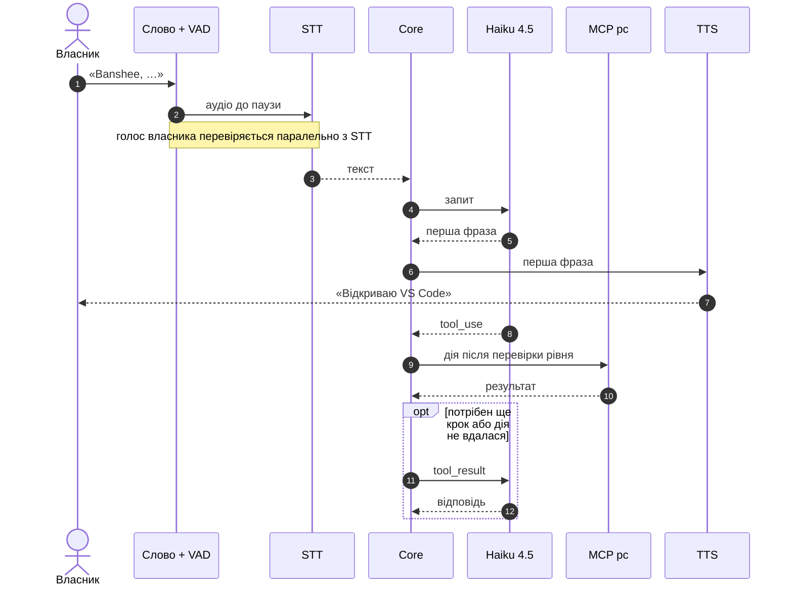

# 02 · Голосовий конвеєр

Перша фраза звучить, поки дія ще виконується. Проста дія, що вдалася, завершує хід без другого виклику Haiku (див. [03-brain.md](03-brain.md)). Для 🟡 і 🔴 дій після фрази core ставить питання підтвердження.

## Ланки

| Ланка | Основний варіант | Альтернатива |
|---|---|---|
| Wake word «Banshee» | sherpa-onnx KWS: будь-яке слово без навчання, Node-модуль | openWakeWord: власна модель, навчання в Colab (Python) |
| Кінець фрази (VAD) | Silero VAD через sherpa-onnx, пауза 0,5 с (налаштовується) | — |
| Голос власника | sherpa-onnx: відбиток голосу (speaker embedding) і порівняння з профілем власника | — |
| STT | Whisper large-v3-turbo, стиснутий q5, на відеокарті: sherpa-onnx або whisper.cpp, обрати на етапі 0 | менша модель Whisper; хмарний Whisper без картки — лише за рішенням власника після етапу 0 |
| TTS | Piper, український голос (`uk_UA`), через sherpa-onnx | інший голос Piper `uk_UA` |
| Ехоподавлення | вбудоване в Chromium (`getUserMedia`) | — |

> Porcupine не підходить: Picovoice закрив безкоштовний тариф 30.06.2026, а планів для особистого використання немає.

## Вартість голосу: $0

Рішення власника (2026-10-03): голос лише локально. Обліковий запис Azure без даних картки не активується, а вводити картку власник не хоче.

- **Розпізнавання — Whisper large-v3-turbo**, стиснутий q5 (~0,55 ГБ), на відеокарті. Назви програм підказує словник (розділ «Правила»).
- **Озвучка — Piper** з українським голосом. Голоси `uk_UA`: `lada`, `mykyta`, `oleksa`, `tetiana`, `ukrainian_tts` ([piper-voices](https://huggingface.co/rhasspy/piper-voices/tree/main/uk/uk_UA)); власник обирає на слух на етапі 0. Модель ~60–80 МБ, працює на процесорі.
- **$0, без облікових записів, ключів і лімітів.** Працює без інтернету.
- **Аудіо не залишає ПК.**
- **Ризик — швидкість Whisper на GTX 960** (нижче). Мірило — етап 0.
- **Запасний план**, якщо етап 0 не вкладеться в ціль, — хмарний Whisper large-v3-turbo від Groq.
  - Безкоштовний тариф без картки: 20 запитів за хвилину, 2000 на день, 8 год аудіо на день ([Groq rate limits](https://console.groq.com/docs/rate-limits), 2026-10-03). Для 50 команд на день цього вистачає із запасом.
  - Аудіо тоді йде в хмару Groq.
  - Рішення — за власником після звіту етапу 0.
- **Не беремо:**
  - Azure Speech F0 — потрібна картка;
  - ElevenLabs — безкоштовного обсягу на щоденну озвучку не вистачить;
  - Edge TTS (голоси Azure через функцію читання вголос у Edge) — неофіційний доступ: Microsoft його не публікує й може будь-коли закрити.

## Локальний Whisper і відеокарта

Перевірено 2026-10-03 на ПК власника:
- відеокарта — NVIDIA GeForce GTX 960 (2015), 2 ГБ пам'яті, з них ~0,85 ГБ уже зайняв робочий стіл; драйвер підтримує CUDA 12.6;
- процесор — Intel Core i5-6600, 4 ядра; RAM — 32 ГБ.

Висновок:
- **Whisper — основне розпізнавання.**
- **Пам'ять.** Whisper large-v3-turbo займає ~1,6 ГБ у fp16, стиснутий q5 — ~0,55 ГБ. На 2 ГБ разом із робочим столом він влізе лише стиснутим і впритул.
- **Швидкість.** GTX 960 не має тензорних ядер, тож розпізнавання повільніше, ніж на сучасних картах. На процесорі — ще повільніше.
- **Окремий процес.** Whisper і Piper працюють в окремому `utilityProcess` voice, щоб важкі обчислення не блокували трей та інтерфейс ([01-architecture.md](01-architecture.md)).
- **Інтеграцію обираємо на кроці 0.3** з двома умовами: без Build Tools і без мережевого порту, як і зв'язок core ↔ desktop.
  - Кандидати: `sherpa-onnx-node` (готова збірка; чи є варіант із GPU — перевірити) і Node-API-обгортка whisper.cpp з готовою збіркою під CUDA або Vulkan.
  - Якщо відеокарта доступна лише через `whisper-server` (HTTP на localhost), — це окреме рішення власника.
- **Спекулятивний старт.** Whisper починає розпізнавати з першою тишею, не чекаючи кінця паузи 0,5 с. Якщо мова продовжилась, результат відкидається. Так пауза ховає до 0,5 с розпізнавання.
- **На етапі 0** заміряємо стиснутий turbo на GTX 960 на 50 командах, у sherpa-onnx і whisper.cpp (CUDA або Vulkan).
  - Ціль: фраза ~5 с розпізнається за ≤ 0,8 с, назви й числа правильні в ≥ 90 % команд.
  - Не вкладається — менша модель або запасний план.
- З відеокартою від 6 ГБ ціль, найімовірніше, досяжна. Купувати її не плануємо — бюджет.

## Розпізнавання власника за голосом

Вимога власника F9: команди виконує лише власник. Телевізор, відео й інші люди в кімнаті не керують ПК і не потрапляють у пам'ять.

- **Запис голосу.** Майстер першого запуску або Налаштування → Голос → «Мій голос»: 5 фраз по ~5 с, разом ~30 с, звичайним мікрофоном. Banshee рахує відбиток голосу й зберігає профіль. Аудіо записів не зберігається, лише профіль — набір чисел. Після зміни моделі Banshee попросить записати голос ще раз.
- **Перевірка.** Кожна фраза після «Banshee» і у вікні продовження дає відбиток, який порівнюється з профілем. Нижче порогу — фраза відкидається до маршрутизації: нічого не виконується, у пам'ять і журнал ходів вона не потрапляє. В оверлеї на 2 с з'являється «Голос не впізнано», а лічильник відкинутих фраз росте в статистиці.
- **Без затримки.** Відбиток рахується на процесорі за десятки мілісекунд, паралельно з розпізнаванням тексту.
- **Короткі фрази.** На фразі коротшій за ~1 с голос надійно не впізнати. Тому «стоп» приймається від будь-кого — він лише зупиняє. Голосове «так» для 🟡 приймається лише у вікні 8 с після питання до команди, яку дав власник.
- **Поріг** — «Суворість перевірки» в налаштуваннях: низька, середня (типово) чи висока. Підбираємо на етапі 2 так, щоб власника не впізнавало ≤ 5 % разів, а чужий голос проходив ≤ 5 % разів ([07-quality.md](07-quality.md)).
- **Чужі голоси ігноруються** (рішення власника, 2026-10-03). Гостьовий режим (лише 🟢 дії без пам'яті) і довірені голоси рідних — пізніше, якщо знадобляться.
- **Не захист.** Голос можна записати чи синтезувати, тому розпізнавання — фільтр, а не автентифікація: 🔴 і далі лише руками ([05-safety.md](05-safety.md)).
- **Якщо не впізнає власника** (застуда, інший мікрофон) — текст в оверлеї працює завжди, а в налаштуваннях можна додати зразки голосу. Сам профіль Banshee не змінює, щоб він не «дрейфував» до чужих голосів.
- **Лише на цьому ПК.** Профіль не експортується й не синхронізується: це біометричні дані, а інший мікрофон дає інший відбиток. На новому ПК голос записується в майстрі першого запуску.
- **Модель** — відбитки голосу з каталогу sherpa-onnx; вибір і поріг — на етапі 2 за вимірюванням.

## Бюджет затримки (оцінка, p50)

| Ланка | Час |
|---|---|
| VAD: пауза, після якої фраза вважається завершеною | 0,5 с |
| STT: Whisper стартує з початком паузи, тож чекаємо лише час понад 0,5 с (при розпізнаванні за 0,8 с) | 0,3 с |
| Haiku: перше речення з кешованим префіксом | 0,5 с |
| TTS: Piper, перший звук | 0,15 с |
| **Разом до першого звуку** | **≈ 1,45 с** |

Оцінки — не виміри; виміряти на етапі 0 ([07-quality.md](07-quality.md)). Головний ризик — швидкість Whisper на GTX 960.

## Цілі

| Сценарій | Що міряємо | p50 | p90 |
|---|---|---|---|
| Рутина без LLM | кінець фрази → початок дії | ≤ 0,9 с | ≤ 1,3 с |
| Команда через Haiku | кінець фрази → перший звук | ≤ 1,5 с | ≤ 2,5 с |
| Довга задача (Sonnet, Claude Code) | кінець фрази → «Секунду…» | ≤ 1,5 с | — |
| «Banshee» під час озвучки | слово → озвучка стихла | ≤ 0,3 с | — |

## Правила

- **Стрімінг там, де можливо.** Відповідь Haiku й озвучка йдуть по реченнях. Перша фраза — та, яку модель пише перед дією: «Відкриваю VS Code». Whisper розпізнає фразу цілком, тому його час ховає спекулятивний старт.
- **Приватність.** Слово, розпізнавання й озвучка працюють локально: аудіо не залишає ПК. У Claude йде лише текст команди.
- **Вікно продовження.** Після відповіді Banshee ще 5 с слухає без слова активації, індикатор у треї світиться. Розпізнавання запускається, лише коли VAD почув мову. Фраза в цьому вікні продовжує ту саму розмову.
- **Перебивання.** Слово «Banshee» під час озвучки одразу її приглушує. «Banshee, стоп» або гаряча клавіша зупиняє озвучку й скасовує поточний хід: запит до API і дію, що виконується. Уже виконані дії не відкочуються — для цього є «скасуй».
- **Ехоподавлення.** Мікрофон і озвучка — в одному renderer-процесі, тож власний голос Banshee не будить і не перебиває його.
- **Без інтернету** голос працює повністю: усі моделі локальні. Недоступний лише Claude — тоді базовий режим ([03-brain.md](03-brain.md)).
- **Відеокарта недоступна** (драйвер, пам'ять зайнята грою) — Whisper переходить на процесор: повільніше, стан видно в треї.
- **Словник назв** (`aliases`): «ві ес код» → VS Code. Core підставляє назви перед пошуком рутини й перед запитом до Haiku. Виправлення власника поповнює словник. Найчастіші назви йдуть у Whisper підказкою (initial prompt); чи це допомагає — перевіряємо на етапі 0.
- **Заблокований ПК.** Виконуються лише дії з позначкою `allowWhenLocked`: час і дата, музика, гучність; погода — з етапу 4, коли з'явиться її інструмент. На решту — «Розблокуй комп'ютер».
- **Стан у треї:** слухає / вікно продовження / думає / виконує / пауза. Пауза мікрофона — однією гарячою клавішею.
- **Зміна пристроїв і сон.** Новий типовий мікрофон чи динаміки Windows (гарнітура, Bluetooth) Banshee підхоплює без перезапуску (подія `devicechange`). Після сну чи гібернації аудіоконвеєр перезапускається сам.
- **Дзвінки.** Коли мікрофон використовує програма зв'язку (Teams, Discord, Zoom), Banshee не озвучує відповідей, лише показує текст в оверлеї. Слово «Banshee» при цьому працює.
- **Кілька ПК поруч.** Налаштування пристрою «Слухати, лише коли ПК активний»: реагувати на слово, лише якщо за останні 15 хв було введення з клавіатури чи миші. Типово вимкнено: за одного ПК в кімнаті воно не потрібне.
- **Голосом — коротко й українською**, подробиці — текстом в оверлеї.
