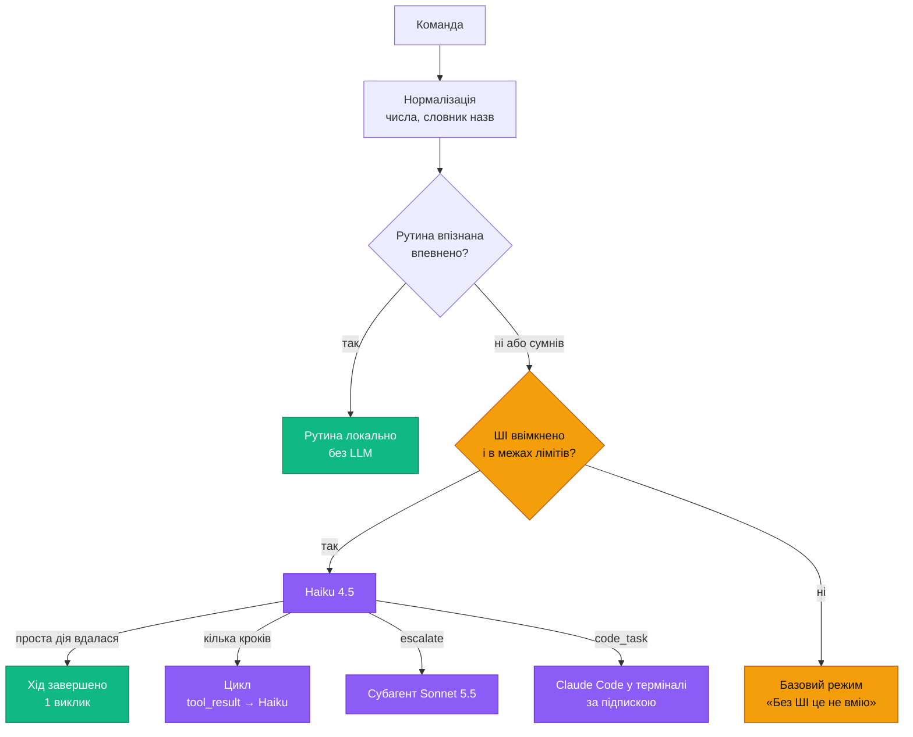

# 03 · Мозок: моделі Claude

## Моделі

| Роль | Модель | ID | $ за 1M токенів (вхід / вихід) |
|---|---|---|---|
| Мозок за замовчуванням | Claude Haiku 4.5 | `claude-haiku-4-5` | 1 / 5 |
| Складні задачі | Claude Sonnet 5.5 | `claude-sonnet-5-5` | 2 / 10 |
| Робота з кодом | Claude Code у терміналі | на вибір у Claude Code | $0 понад підписку Claude |

## Маршрутизація

- **Рутина.** Нормалізований текст збігся з рутиною впевнено — виконуємо локально, без LLM. Як саме розпізнається збіг — [04-memory.md](04-memory.md).
- **ШІ вимкнено або недоступний** — базовий режим: команда без рутини не виконується, Banshee каже чому (див. «Стан ШІ й базовий режим»).
- **Проста дія.** Інструменти з позначкою `final` (гучність, відкрити програму, музика): якщо дія вдалася, хід завершується без другого виклику. Фразу вже озвучено, решту core договорює шаблоном «Готово». Якщо дія не вдалася, результат іде в Haiku.
- **Кілька кроків.** Звичайний агентний цикл: `tool_result` → Haiku → наступна дія.
- **`escalate(task, reason)`.** Haiku викликає його, коли:
  - потрібен план із понад ~5 кроків або порівняння варіантів;
  - треба розібрати довгий текст чи документ;
  - та сама задача двічі не вдалася;
  - власник просить «подумай краще».

  Sonnet працює окремим субагентом зі своїм контекстом і кешем і повертає результат як `tool_result`. Озвучує результат Haiku.
- **`code_task(project, task)`.** Banshee відкриває Claude Code у терміналі в теці проєкту з налаштувань і передає задачу першим повідомленням. Далі працюєш ти, за своєю підпискою Claude: $0 понад неї. Автономний режим через Agent SDK працював би лише з API-ключем і коштував би окремо за кожну задачу ([05-safety.md](05-safety.md)).
  - Запуск: `claude "<задача>"` у новому вікні PowerShell. Windows Terminal (`wt.exe`) — якщо встановлений; на ПК власника його немає.
  - Оточення дочірнього процесу — без `ANTHROPIC_API_KEY` і `ANTHROPIC_AUTH_TOKEN`, щоб Claude Code працював за підпискою.
  - CLI `claude` на ПК власника вже є в PATH (перевірено 2026-10-03).

## Один хід за раз
- Нова команда під час ходу, поки дія ще не почалася: попередній хід скасовується, виконується нова.
- Нова команда під час дії: чекає її завершення, до 30 с, і виконується після неї. Banshee каже: «Секунду, закінчую попереднє».
- «Стоп» діє завжди й одразу.
- Фонові задачі — рефлексія, самоаналіз, синхронізація — ходам не заважають: вони мають нижчий пріоритет і окремі виклики.

## Системний промпт
Англійською, бо так менше токенів. Частини в порядку кешування:
1. **Роль.** Голосовий асистент власника на Windows; відповідає українською, коротко; першу фразу дає перед дією.
2. **Політика.** Рівні дій, чужий вміст, заборона вигадувати результати інструментів, коли кликати `escalate`.
3. **Інструменти** зі схемами ([01-architecture.md](01-architecture.md), «Інструменти етапу 1»).
4. **Профіль власника й правила** — ≤ 1,5K токенів, оновлюються раз на добу.

Після кешованого префікса: дата, час, нові факти за день, історія розмови.

## Контекст розмови

- Розмова триває, поки паузи коротші за 10 хв, або до команди «нова розмова».
- Дві точки кешу:
  1. інструменти, системний промпт і профіль — TTL 1 год;
  2. кінець історії розмови — TTL 5 хв.

  Точка з довшим TTL іде першою.
- Історія довша за ~20K токенів: старші ходи стискаються в підсумок.
- Після простої дії без другого виклику наступний запит починається з `tool_result` тієї дії, а вже за ним іде новий текст власника. Інакше API поверне помилку.

## Haiku 4.5: перевірено за документацією (2026-10-02)

- Контекст 200K, вихід до 64K.
- Працюють tool use, prompt caching, tool search, Batch API (−50%).
- Computer use не заявлено → інтерфейсами керуємо через UI Automation.
- Кеш вмикається від 4096 токенів незмінного префікса. Читання кешу — $0.10 за 1M; запис — 1.25× (TTL 5 хв) або 2× (TTL 1 год).

## Ціни API (перевірено 2026-10-02)

За 1 млн токенів, без податків ([platform.claude.com, Pricing](https://platform.claude.com/docs/en/about-claude/pricing)):

| Модель | Вхід | Запис у кеш, 5 хв / 1 год | Читання кешу | Вихід | Batch API |
|---|---|---|---|---|---|
| Haiku 4.5 | $1 | $1,25 / $2 | $0,10 | $5 | −50 % |
| Sonnet 5.5 | $2 | $2,50 / $4 | $0,20 | $10 | −50 % |

## Прайс Banshee (оцінка)

**Один виклик Haiku ≈ 0,28 ¢:** префікс ~6K токенів з кешу (інструменти, системний промпт, профіль), історія розмови ~2K з кешу, ~1K нових токенів, ~150 на виході. Перший виклик після години тиші переписує кеш префікса: + ≈ 1,14 ¢.

**Команди:** 20 % рутин (без LLM), 50 % простих дій (1 виклик), 30 % багатокрокових (~2,5 виклики).

| Навантаження | Команд на день | Розмов / записів кешу / ескалацій на день | $ на місяць |
|---|---|---|---|
| Легке | 20 | 5 / 4 / 0,5 | ≈ 5,5 |
| **Звичайне** | **50** | **10 / 6 / 1** | **≈ 11** |
| Інтенсивне | 100 | 15 / 8 / 2 | ≈ 20 |
| Звичайне, якщо кеш не спрацює | 50 | 10 / — / 1 | ≈ 22 |

Звичайне навантаження по статтях:

| Стаття | $ на місяць |
|---|---|
| Команди через Haiku (~62 виклики на день) | ≈ 5,3 |
| Записи кешу | ≈ 2,1 |
| Ескалації на Sonnet (~7 ¢ кожна) | ≈ 2,1 |
| Рефлексія після розмов (~0,45 ¢ кожна) | ≈ 1,4 |
| Нічна консолідація (Batch −50 %) | ≈ 0,3 |
| Голос (локальні моделі, [02-voice.md](02-voice.md)) і Claude Code (підписка) | 0 |
| **Разом** | **≈ 11** |

- У середньому ≈ 0,7 ¢ на команду разом із фоновими задачами.
- Кеш не спрацює, якщо префікс коротший за 4096 токенів або змінюється між запитами. Тому влучання в кеш — метрика в [07-quality.md](07-quality.md).
- Розробка: один прогін еталонного набору ≈ $0,2–0,3; на етапи 0–1 вистачить ~$10.
- Навчання ([08-learning.md](08-learning.md)): самоаналіз і перевірки — ≈ $1–2 на місяць; вивчені рутини економлять приблизно стільки ж на викликах Haiku.
- **Ціль навчання — 40 % команд без ШІ** (рішення власника). Досягнувши її, Banshee витрачатиме ≈ $9,5 на місяць замість ≈ $11. Викликів Haiku стане ~47 на день замість ~62; записи кешу й рефлексія не зміняться.
- Системний промпт і описи інструментів — англійською: українська займає більше токенів. Відповіді — українською.

## Як платити

- **Підписка Claude API не покриває.** Власні застосунки на кшталт Banshee працюють лише з API-ключем: вхід через підписку Anthropic дозволяє тільки в Claude Code і своїх застосунках ([Legal and compliance](https://code.claude.com/docs/en/legal-and-compliance)).
- API оплачується окремо в Claude Console передплаченими кредитами: мінімум $5, діють рік, не повертаються.
- **Старт:** $10 без автопоповнення й ліміт $20 на місяць у Console. Баланс тоді — жорстка стеля: на нулі API зупиняється, а Banshee переходить у базовий режим.
- Далі — поповнювати ~$10–15 на місяць, коли Banshee попередить.
- Покроково з посиланнями — [12-api.md](12-api.md).

## Ліміти витрат

Рішення власника (2026-10-03): **$1 на день і $20 на місяць**.

- Core рахує вартість кожного виклику з `usage` і таблиці цін і пише її в `llm_calls` ([04-memory.md](04-memory.md)).
- **80 % ліміту** — попередження в треї.
- **Денний ліміт.** На $1 Banshee переходить у базовий режим до 00:00; дозволити «ще $1 на сьогодні» можна лише кліком. Звичайне навантаження — ≈ $0,37 на день, тож ліміт ловить помилку, через яку модель ходить по колу.
- **Місячний ліміт.** На $20 — базовий режим до 1-го числа. Підняти ліміт — лише вручну в налаштуваннях.
- **Для всіх ПК разом:** кожен ПК бачить витрати інших через синхронізовану статистику `usage_daily`, із затримкою до 10 хв ([11-sync.md](11-sync.md)).
- **Остання стеля — на боці Anthropic:** залишок кредитів без автопоповнення й ліміт $20 у Console ([12-api.md](12-api.md), кроки 3–4).

## Стан ШІ й базовий режим

ШІ — це виклики Claude API. Без них Banshee працює в **базовому режимі**: виконує рутини й команди, яким не потрібна модель. Вимога F11.

| Стан | Причина | Як повертається ШІ |
|---|---|---|
| ШІ активний | ключ перевірено, ліміти не вичерпано | — |
| Базовий: вимкнено | власник вимкнув ШІ | власник вмикає |
| Базовий: немає ключа | ключ ще не додано | ключ додано й перевірено |
| Базовий: ліміт дня | витрати за день досягли $1 | о 00:00 або «ще $1 на сьогодні» кліком |
| Базовий: ліміт місяця | витрати за місяць досягли $20 | 1-го числа або ліміт піднято вручну |
| Базовий: немає зв'язку | немає мережі, 5xx чи 529 після повторів | сам: перевірка щохвилини |
| Базовий: ключ | 401 `authentication_error` або 403 `permission_error` | новий ключ |
| Базовий: оплата | 402 `billing_error` або 400 про нестачу кредитів | поповнення кредитів |
| Базовий: ліміт Console | 400, повідомлення починається з «You have reached your specified» | дата з повідомлення або ліміт піднято в Console |

- **Що працює:** слово «Banshee» і голос (локальні моделі — це не Claude), рутини вбудовані, власника й вивчені, «стоп» і «скасуй», пам'ять, налаштування, журнал, «Активність», синхронізація й експорт.
- **Що ні:** довільні запити й розмова, нові задачі, ескалація, рефлексія. Нічний самоаналіз переноситься на першу ніч з увімкненим ШІ.
- **Вбудовані команди** — рутини, що постачаються з Banshee (`origin = builtin`): гучність, медіа, відкрити програму, теку чи сайт зі словника, вікна, час і дата. Тож базовий режим корисний з першого дня.
- **Відповідь** на команду, якій потрібен ШІ, — коротко й з причиною: «Без ШІ це не вмію. Увімкнути?», «Ліміт на сьогодні вичерпано. Дозволити ще $1?», «Скінчилися кредити API». В оверлеї — кнопка дії. Команди в чергу не ставляться. У журналі ходів — `route = none`, `outcome = no_ai`.
- **Перемикач:** меню трею, Налаштування → Мозок і витрати, голосом «Banshee, базовий режим» / «Banshee, увімкни ШІ». Вимкнення — одразу; увімкнення голосом — 🟡 дія з підтвердженням, бо коштує грошей. Перемикач — налаштування пристрою. Кожне перемикання пишеться в журнал із причиною.
- **Стан видно завжди:** позначка на значку трею й в оверлеї, картка «Стан ШІ» на «Огляді» й у налаштуваннях ([09-ui.md](09-ui.md), [10-settings.md](10-settings.md)).
- **Перевірка ключа і зв'язку** — запит до списку моделей (`GET /v1/models`): безкоштовно, без токенів.

## Збої API

- 429, 5xx і 529 (overloaded): дві повторні спроби з паузою 0,5 і 2 с. Далі — базовий режим «немає зв'язку».
- 401, 402, 403 і 400 про ліміт чи кредити не повторюються — це не тимчасові помилки. Одразу базовий режим із причиною, таблиця вище.
- 429 з `error.details.error_code = enforced_spend_limit_reached` — вичерпано місячну стелю тарифу; повтори не допоможуть ([Rate limits](https://platform.claude.com/docs/en/api/rate-limits)).
- Перший токен не прийшов за 8 с: запит скасовується, Banshee каже про це.
- Команда «стоп» скасовує запит через `AbortController`.

## Пастки API

- Тільки точні ID без дат; виклики лише через `@anthropic-ai/sdk`, не сирим `fetch`.
- **ID моделей і таблиця цін** — у конфігурації core, а не в коді. Якщо Anthropic виведе модель з обігу, нову задаємо прихованим налаштуванням «Мозок → Моделі» без нової версії Banshee.
- **Ключ API — не `ANTHROPIC_API_KEY`.** SDK отримує ключ явно: `new Anthropic({ apiKey })`. Ключ береться лише з Credential Manager, куди його вводять у налаштуваннях Banshee; змінних середовища Banshee не читає. Змінна `ANTHROPIC_API_KEY` перевела б Claude Code власника з підписки на оплату за API ([Claude Code: Authentication](https://code.claude.com/docs/en/iam)).
- Префікс коротший за 4096 токенів кеш не вмикає, і помилки при цьому немає. Тому слідкуємо за `usage.cache_read_input_tokens` / `cache_creation_input_tokens` у `llm_calls`.
- Дата, час і нові факти — після кешованого префікса. Профіль ≤ 1,5K токенів, оновлюється раз на добу.
- Зміна моделі посеред розмови скидає кеш → ескалація йде окремим субагентом.
- Понад 10–30 інструментів — tool search: 3–5 найчастіших без `defer_loading`, решта з `defer_loading: true`.
- Sonnet 5.5: `thinking: {type: "disabled"}` і примусовий `tool_choice` (`any` / `tool`) повертають 400. Найнижчий рівень мислення — `thinking: {type: "between_tools"}` ([API errors](https://platform.claude.com/docs/en/api/errors)).
- Memory tool з API у швидкому шляху не використовуємо: API додає інструкцію «спершу переглянь пам'ять», а це +1 запит.
- Підписка Claude API не покриває — див. «Як платити».
- Перед кодом, що викликає Claude API, — скіл `claude-api`.
