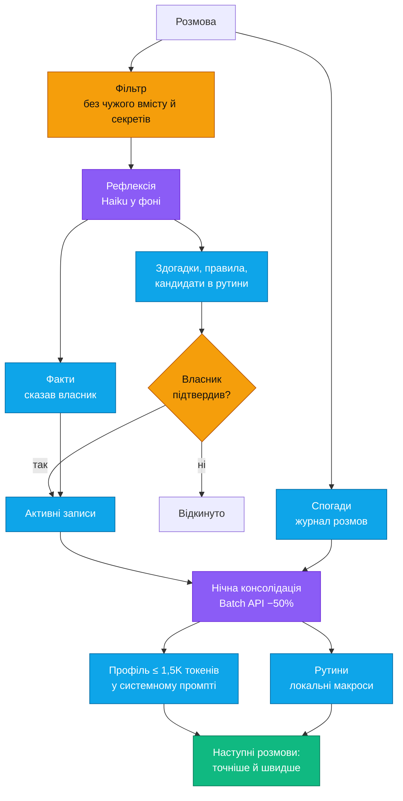
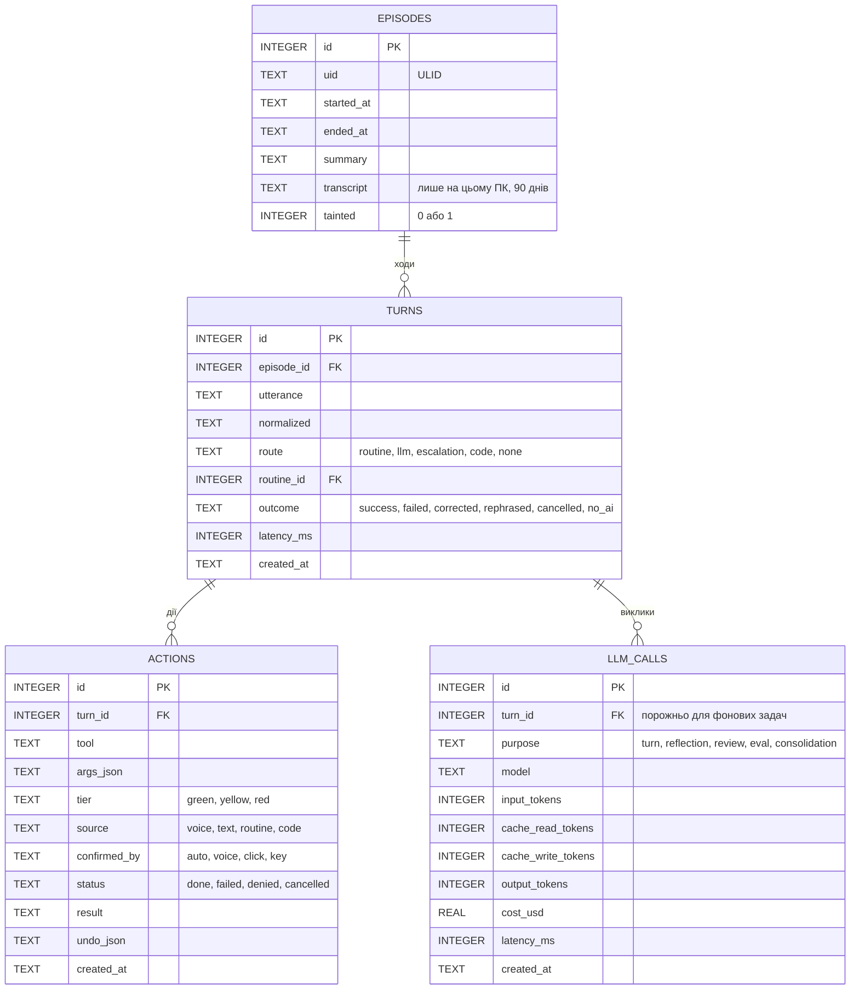
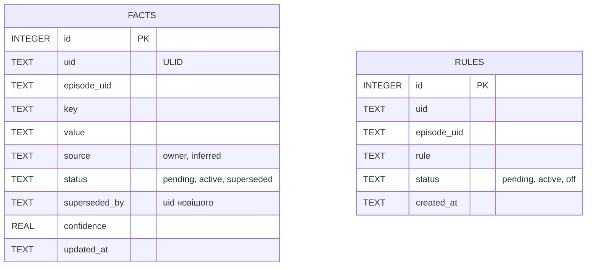
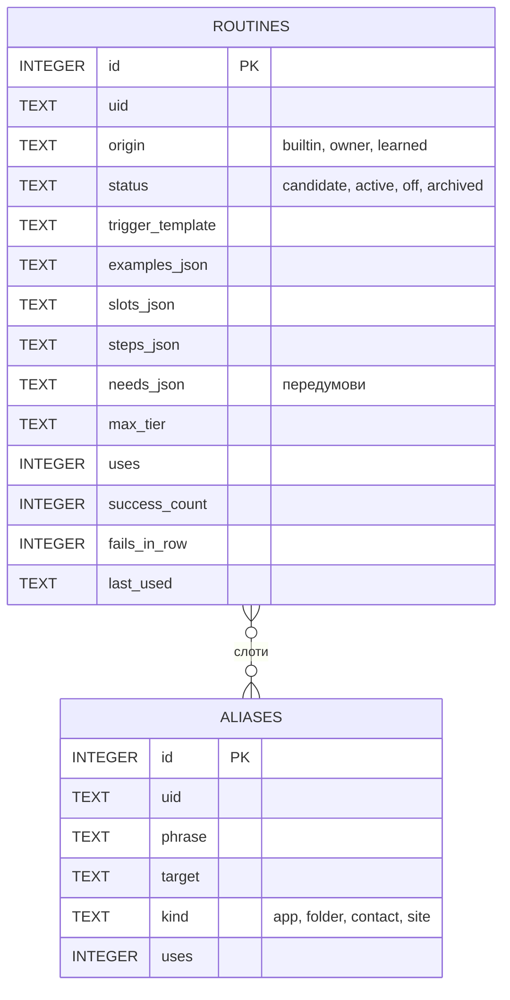
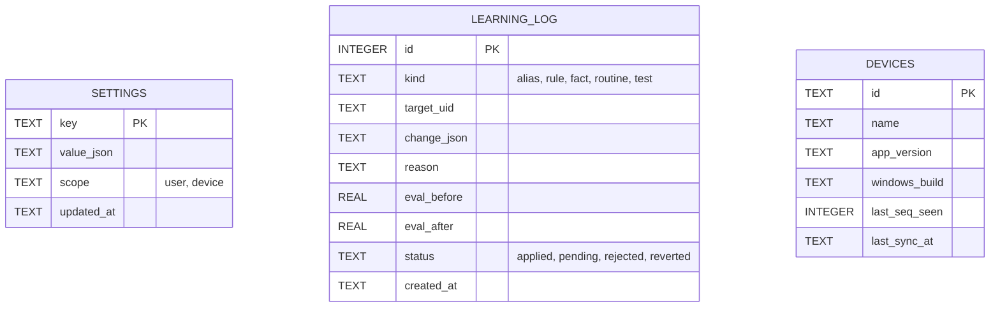
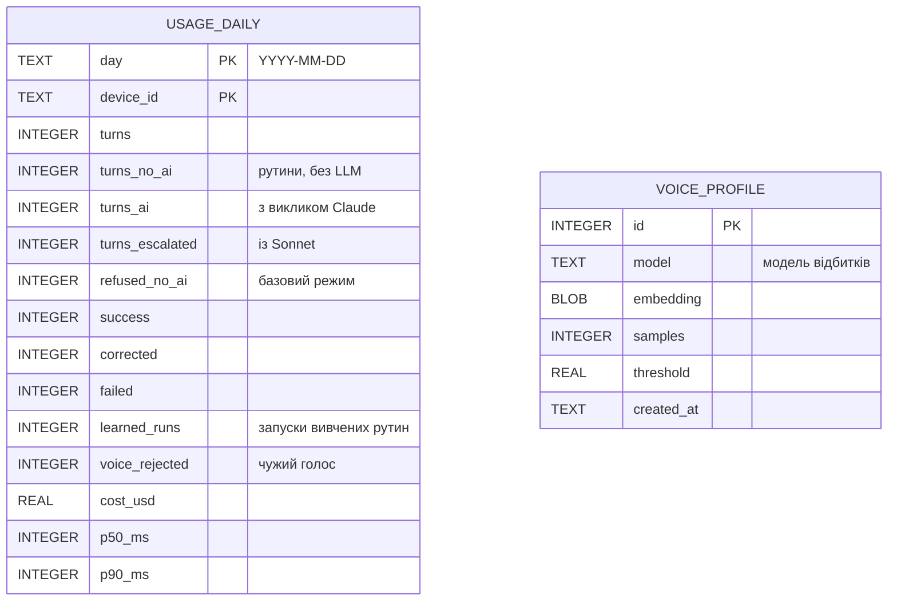

# 04 · Пам'ять і навчання

Модель не донавчається. Ефект «вчиться сам» дає пам'ять, яку асистент веде сам. Записи, що змінюють поведінку, власник підтверджує.

Як Banshee вчиться на власних успішних виконаннях і на помилках — [08-learning.md](08-learning.md).

## Механізми

| Механізм | Звідки | Підтвердження | Таблиця | Як використовується |
|---|---|---|---|---|
| Факти | слова власника: «я працюю до 18:00» | не потрібне | `facts`, `source = owner` | у профілі |
| Здогадки | рефлексія помітила закономірність | «Запам'ятати, що…?» | `facts`, `source = inferred` | у профілі після «так» |
| Виправлення | «ні, я мав на увазі…» | одне «так» на сформульоване правило | `rules` | завжди в профілі |
| Рутини | вбудовані в Banshee; власник показав; асистент помітив повтор або вивчив з успішного виконання ([08-learning.md](08-learning.md)) | вбудовані — не потрібне; 🟢 — після двох успіхів; 🟡 — одне «так» | `routines` | локально без LLM |
| Словник назв | виправлення назви програми, теки, контакту | не потрібне | `aliases` | нормалізація тексту |
| Спогади | кожна розмова | не потрібне | `episodes` + FTS5 | інструмент `recall` |

Питання на підтвердження Banshee ставить наприкінці розмови, не частіше одного разу. Решта чекає в центрі керування на сторінці «Нове про тебе» ([09-ui.md](09-ui.md)).

**Розмова** — послідовність ходів із паузами до 10 хв, або до команди «нова розмова». Рефлексія запускається після її завершення.

## Захист пам'яті

Пам'ять потрапляє в системний промпт кожного запиту, тож ін'єкція, записана в пам'ять, діяла б завжди.

- Рефлексія бачить лише слова власника й короткий опис дій. Вміст сайтів, листів, файлів і буфера обміну замінюється позначкою на кшталт «[сторінка example.com]».
- Факти без підтвердження беруться лише зі слів власника. Здогадки й правила — лише після його «так».
- Розмова з чужим вмістом позначається `tainted`. Рутину з неї не створити без підтвердження з показом усіх кроків, а вивчити автоматично — не можна.
- Секрети фільтруються перед записом: паролі, токени, ключі, номери карток.
- Сценарії ін'єкцій входять в еталонний набір ([07-quality.md](07-quality.md)).

## Рутини

- **Походження** — вбудовані (постачаються з Banshee, `builtin`), власника або вивчені з успішних виконань ШІ ([08-learning.md](08-learning.md)). Працюють однаково, зокрема в базовому режимі без ШІ ([03-brain.md](03-brain.md)).
- **Тригер** — шаблон зі слотами: «гучність {n: 0–100}», «увімкни плейлист {name}».
- **Розпізнавання без LLM:**
  - нормалізація: нижній регістр, без розділових знаків, числа словами → цифри, словник назв;
  - точний збіг шаблону або нечіткий збіг зі схожістю ≥ 0,85;
  - два кандидати з різницею < 0,05 або схожість нижче порогу — команда йде в Haiku.
- **Політика.** Кроки рутини проходять ту саму політику дій. 🟡 кроки підтверджуються один раз, коли рутину створюють; 🔴 — щоразу. Вивчена рутина 🔴 кроків не містить.
- **Збої.** Рутина, що двічі поспіль завершилася помилкою, вимикається, і Banshee про це каже. Вивчена рутина при цьому повертається в кандидати.

## Конфлікти, забування, строки

- **Новий факт із тим самим ключем** не перезаписує старий: старий отримує `status = superseded` і посилання `superseded_by`. Історія лишається, щоб відповісти на «чому ти так вирішив?».
- **«Забудь …»** видаляє факт, правило, рутину або назву. «Забудь цю розмову» видаляє транскрипт і все, що з нього витягнуто. Видалене не потрапляє в нічну консолідацію, тож не повертається. Видалення поширюється на всі синхронізовані ПК ([11-sync.md](11-sync.md)).
- **Строки зберігання:**
  - транскрипти — 90 днів, далі лишається підсумок;
  - ходи, журнал дій, витрати й журнал навчання — 1 рік;
  - статистика за днями — безстроково, це ~1 рядок на день на ПК;
  - факти, правила, рутини, назви — доки власник не видалить.
- **Де лежить БД:** `%LOCALAPPDATA%\Banshee\banshee.db` — у профілі користувача, поза роумінгом і поза хмарними теками.
- **Шифрування.** Окремого шифрування БД поки немає (рішення власника, 2026-10-03): її захищає обліковий запис Windows, за бажання — BitLocker для диска. Файл експорту й пакети синхронізації шифруються завжди ([11-sync.md](11-sync.md)).

## Схема БД (SQLite)

Дати в усіх таблицях — TEXT у форматі ISO 8601.

**Розмови й виконання**

`turns.routine_id` посилається на рутину, яка виконала хід без LLM. `route = none` з `outcome = no_ai` — команда, яку в базовому режимі не виконано, бо потрібен ШІ.

Слоти рутин (`{app}`, `{folder}`) підставляються зі словника назв цього ПК.

**Знання про власника** — синхронізуються між ПК

**Навички** — синхронізуються між ПК

**Службові**

**Статистика й голос**

- `usage_daily` — дані для розділу «Активність» ([09-ui.md](09-ui.md)). Щоночі зводиться з `turns`, `llm_calls` і `learning_log`; за сьогодні графіки рахують наживо. Лише числа, без тексту команд.
- `voice_profile` — профіль голосу власника ([02-voice.md](02-voice.md)). Аудіо записів не зберігається.

- **Що синхронізується:** `episodes` (без транскриптів), `facts`, `rules`, `routines`, `aliases` і `settings` з `scope = user`. Ці таблиці мають ще службові поля `hlc`, `device_id`, `deleted` ([11-sync.md](11-sync.md)). Ще й `usage_daily`: кожен ПК пише лише свої рядки, тож конфліктів немає.
- **Посилання між ними** — через `uid`, бо локальні `id` на різних ПК різні.
- **Лише на цьому ПК:** `turns`, `actions`, `llm_calls`, `learning_log`, `devices`, `voice_profile`. Профіль голосу не потрапляє ні в синхронізацію, ні у файл `.banshee`.

## Інше

- Профіль у промпті оновлюється раз на добу, щоб не скидати кеш. Нові факти за день ідуть окремим блоком після кешованого префікса.
- Власник бачить і редагує пам'ять: «що ти про мене знаєш?» і розділ «Пам'ять» у центрі керування.
- Векторний пошук — рішення відкладено (власник, 2026-10-03); поки вистачає FTS5. Коли повернемося: Claude не генерує ембедінги, тож потрібна локальна мультимовна модель (transformers.js) або Voyage AI, а він платний.
