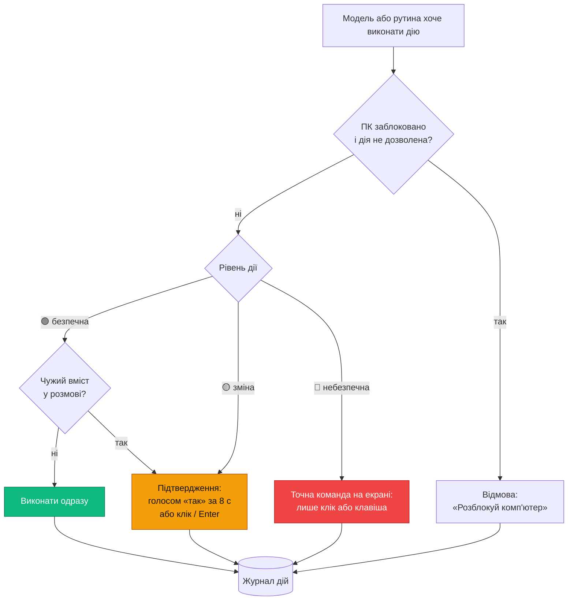

# 05 · Безпека

LLM з доступом до PowerShell має повний доступ до ПК, тому кожна дія проходить через політику. Рівень визначає код, а не модель.

## Рівні дій

| Рівень | Приклади | Підтвердження |
|---|---|---|
| 🟢 безпечні | відкрити програму, гучність, музика, пошук файлів, час і дата | не потрібне, якщо в розмові немає чужого вмісту |
| 🟡 зміни | записати, перемістити, перейменувати файл; видалити в Кошик до 20 файлів; закрити програму; надіслати повідомлення; запустити Claude Code із задачею; PowerShell зі списку дозволених команд | голосом «так» за 8 с або клік / Enter в оверлеї |
| 🔴 небезпечні | очистити Кошик або видалити повз нього; понад 20 файлів за раз; реєстр; встановлення програм; права адміністратора; платежі; PowerShell поза списком | лише клік або клавіша в оверлеї з точною командою; голос не приймається; 60 с без відповіді — скасовано |

## Підтвердження

- **🔴 — лише фізичне.** Голос може належати телевізору, відео чи іншій людині в кімнаті. Голосове «так» на картку 🔴 core вважає відмовою (крок 1.5).
- **🟡 голосом** приймається лише протягом 8 с після питання, без слова активації. Картка 🟡 чекає стільки ж (налаштування «Підтвердження 🟡 голосом»), далі дію скасовано; кліком чи Enter підтвердити можна протягом усього цього часу.
- **Голос власника** (F9, [02-voice.md](02-voice.md)) — фільтр, а не захист. Чужі голоси команд не виконують, але голос можна записати чи синтезувати. Тому 🔴 і далі лише руками, а голосове «так» для 🟡 приймається лише на питання до команди, яку дав власник. Розпізнавання голосу — безпекове налаштування; чужі голоси ігноруються (рішення власника).
- **Чужий вміст** — сайт, лист, завантажений файл чи буфер обміну. Інструменти етапу 1 його не читають: назви файлів, вивід PowerShell про процеси й мережу — дані самого ПК, розмову вони не позначають (крок 1.5). Позначка з'явиться з браузером і читанням файлів. Він позначає розмову (`tainted`) до її кінця: 🟢 дії тоді теж питають підтвердження, в оверлеї світиться позначка. «Нова розмова» скидає позначку.
- **Заблокований ПК.** Дозволені лише дії з позначкою `allowWhenLocked`: час і дата, музика, гучність; погода — з етапу 4.

## Правила

- Кожен інструмент MCP декларує свій рівень у коді.
- **Довільний PowerShell.** Скрипт розбирає парсер PowerShell (AST).
  - Базовий список дозволених (крок 1.2, `DEFAULT_POWERSHELL_ALLOWLIST`; власник змінює в Налаштуваннях → Безпека): процеси (`Get-Process`, `Stop-Process`, `Start-Process`), служби (`Get-Service`), мережа (`Get-NetIPAddress`, `Get-NetIPConfiguration`, `Get-NetAdapter`, `Get-NetConnectionProfile`, `Test-Connection`, `Test-NetConnection`, `Resolve-DnsName`), система й програми (`Get-ComputerInfo`, `Get-CimInstance`, `Get-PSDrive`, `Get-Volume`, `Get-HotFix`, `Get-StartApps`, `Get-AppxPackage`, `Get-Package`, `Get-TimeZone`, `Get-Date`), список файлів (`Get-ChildItem`, `Get-Item`) і обробка виводу (`Select-Object`, `Where-Object`, `Sort-Object`, `Measure-Object`, `Group-Object`, `ForEach-Object`, `Format-Table`, `Format-List`, `Out-String`, `ConvertTo-Json`). Немає читання вмісту файлів, буфера обміну й реєстру: це чужий вміст або 🔴.
  - Усі команди зі списку дозволених → 🟡.
  - Будь-яка інша команда → 🔴.
  - `Invoke-Expression`, `-EncodedCommand`, завантаження з мережі й `Start-Process -Verb RunAs` → завжди 🔴, навіть якщо команду додано до списку дозволених. Так само (крок 1.4): `Invoke-Command`, `New-Object`, `Add-Type`, `Set-ExecutionPolicy`, команда зі змінної (`& $x`), запис у файл перенаправленням (`>`), виклик методів .NET — крім тих, що лише перетворюють значення (`ToString`, `AddDays`, `Split`…), і скрипт з помилками синтаксису. Аліаси розкриваються: `gps` — це `Get-Process`.
- **Видалення** — лише в Кошик. Якщо файл не може потрапити в Кошик (мережевий диск, завеликий файл) — це 🔴. Завеликий для Кошика файл Windows сам запитає перед видаленням назавжди: Banshee не приховує цей діалог.
- **Відкрити ≠ запустити.** `open_target` для файлу програми чи скрипту (`.exe`, `.msi`, `.bat`, `.ps1`, `.lnk` тощо) — 🔴 з поясненням «це запуск програми».
- **Без перезапису.** Переміщення, копіювання й перейменування не замінюють наявних файлів.
- **«Стоп».** «Banshee, стоп» або гаряча клавіша зупиняє озвучку, скасовує запит до API й поточну дію (процес PowerShell вбивається) і знімає очікування підтверджень.
- **«Скасуй».** Для 🟡 дій з файлами журнал зберігає `undo_json`: звідки перемістили, що відновити з Кошика. «Скасуй» повертає останню таку дію.
- **Журнал.** Кожна дія, зокрема відмова й скасування, пишеться в таблицю `actions` ([04-memory.md](04-memory.md)).
- **Пам'ять** захищена від ін'єкцій — [04-memory.md](04-memory.md), розділ «Захист пам'яті».
- **Самонавчання** змінює лише пам'ять: не рівні дій, не списки дозволених команд, не безпекові налаштування й не власні дозволи ([08-learning.md](08-learning.md)). Вивчена рутина не містить 🔴 кроків.
- **Безпекові налаштування** змінюються лише вручну в центрі керування, з підтвердженням кліком. Отримані синхронізацією діють після підтвердження на цьому ПК ([10-settings.md](10-settings.md)).

## Ізоляція

- **core ↔ desktop** — IPC без мережевих портів ([01-architecture.md](01-architecture.md)).
- **Electron:** `contextIsolation`, `sandbox`, без віддаленого вмісту у вікнах Banshee. Ключі API — лише в main і core, ніколи в renderer.
- **Claude Code** запускається в терміналі лише в теках проєктів із налаштувань, з входом власника за підпискою. Дозволи — його власні, з питаннями перед змінами. Banshee ніколи не передає прапорці, що вимикають підтвердження: `--dangerously-skip-permissions`, `--permission-mode acceptEdits` чи `bypassPermissions`.
- **Браузер (Playwright MCP)** — окремий профіль без логінів власника.
- **Пошта й календар** поки поза межами (рішення власника, 2026-10-03). Якщо з'являться — лише через їхні API з окремими дозволами, а не через браузер.
- **Права.** Процес працює від звичайного користувача, без прав адміністратора.
- **Прозорість.** Значок у треї показує стан і базовий режим. Пауза — однією гарячою клавішею.
- **API-ключі** — лише в Windows Credential Manager. Ніколи в пам'яті, журналі, промпті чи змінних середовища.
  - Вводяться лише в налаштуваннях Banshee або майстрі; до появи вікна налаштувань — командою `npm run key`, яку запускає власник (рішення власника 2026-10-03).
  - `ANTHROPIC_API_KEY` не задаємо: її читає Claude Code власника й переходить з підписки на оплату за API.
  - Хук Claude Code `guard-secrets` блокує команди, які могли б прочитати ключі зі сховища або вивести їх у транскрипт.
- **Electron: CSP** `default-src 'self'` у всіх вікнах; переходи на зовнішні адреси відкриваються в системному браузері, не у вікні Banshee.
- **Файл пам'яті й пакети синхронізації** зашифровані паролем (AES-256-GCM); ключів API в них немає ([11-sync.md](11-sync.md)). Сама БД окремо не шифрується (рішення власника, 2026-10-03).
