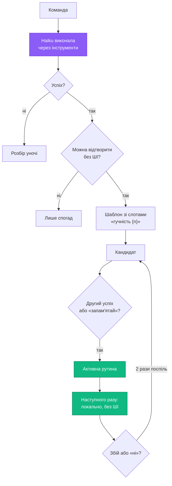
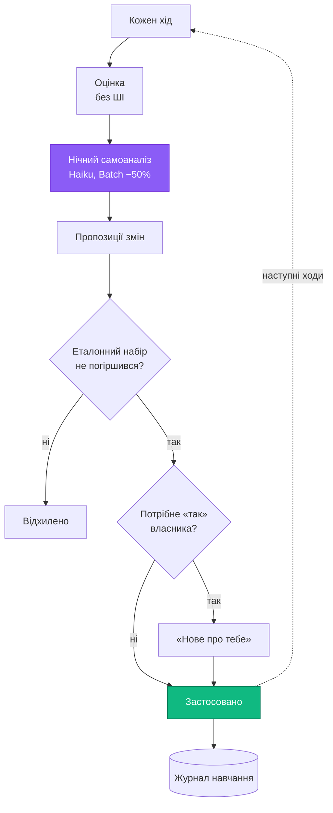

# 08 · Навчання й самонавчання

Banshee вчиться трьома способами:
- зі слів власника ([04-memory.md](04-memory.md));
- на власних успішних виконаннях;
- на власних помилках.

Модель при цьому не донавчається. Змінюється лише пам'ять, і кожна зміна потрапляє в журнал навчання з можливістю відкотити.

## 1. Успішне виконання → рутина без ШІ

### Успіх
Виконання вважається успішним, якщо:
- усі інструменти повернули успіх;
- протягом 2 хв власник не сказав «ні», «не те», «скасуй» і не повторив команду іншими словами;
- у розмові не було чужого вмісту (`tainted`);
- жодного 🔴 кроку.

### Можна відтворити без ШІ
- Кожен інструмент позначений `replayable`: його результат залежить лише від аргументів. Це відкрити програму, гучність, медіа, вікна, відкрити теку чи сайт, налаштування Windows.
- Кожен аргумент — константа, слот зі слів команди або поле з результату попереднього кроку.
- Згенерованого тексту немає: листи й повідомлення щоразу пише модель.

### Шаблон
1. Число зі слів команди, що стало аргументом, — числовий слот у межах схеми інструмента: «гучність 30» → `volume(level={n})`, n від 0 до 100.
2. Назва зі словника — слот свого типу: «відкрий VS Code» → `open_app(app={app})`.
3. Значення, що збіглося з полем результату попереднього кроку, — зв'язок: «відкрий останній завантажений файл» → `find_files(query=newest, folder=Downloads)` → `open_target(target=$1.path)`.

Назви інструментів — з [01-architecture.md](01-architecture.md), «Інструменти етапу 1».
4. Решта аргументів — константи.

Кроки посилаються на назви програм і стандартні теки Windows, а не на абсолютні шляхи. Тож рутина працює й на іншому ПК ([11-sync.md](11-sync.md)).

### Активація
- **Лише 🟢 кроки** — рутина вмикається сама після другого успіху з тим самим шаблоном або одразу після «запам'ятай це».
- **Є 🟡 кроки** — після «так» власника. Питання звучить наприкінці розмови: «Запам'ятати, як я це зробив? Наступного разу виконаю одразу».
- Нові фрази власника з тим самим шаблоном додаються до прикладів рутини. Вночі консолідація зливає рутини з однаковими кроками.

### Виконання й збої
- **Розпізнавання й політика** — як у звичайних рутин ([04-memory.md](04-memory.md)). В оверлеї видно позначку «⚡ без ШІ».
- **Передумови.** Перед запуском Banshee перевіряє, що програма встановлена, а назва є в словнику цього ПК. Якщо ні — команда йде в Haiku, і це не рахується збоєм.
- **Збій** — помилка кроку, «ні» або «скасуй» одразу після виконання. Тоді дію скасовуємо, якщо можна, і команда йде в Haiku. Після двох збоїв поспіль рутина вимикається й повертається в кандидати.
- **Зміна інструмента.** Якщо змінилася схема інструмента, рутини з ним перевіряються; невалідні вимикаються.
- **Архів.** Рутина без запусків 90 днів архівується.

## 2. Самонавчання

### Оцінка кожного ходу, без ШІ

| Сигнал | Результат |
|---|---|
| Усі дії вдалися, заперечень немає | успіх |
| Помилка інструмента | збій |
| «ні», «не те», «скасуй» протягом 2 хв | виправлено власником |
| Та сама команда іншими словами протягом 60 с | не зрозумів |
| «Стоп» під час виконання | скасовано |
| «Дякую», «супер» | підтверджений успіх |

Результат пишеться в таблицю `turns` ([04-memory.md](04-memory.md)).

### Нічний самоаналіз
Haiku через Batch API переглядає збої й виправлення за день. Чужий вміст відсікає той самий фільтр, що й для рефлексії. У базовому режимі самоаналіз не запускається й переноситься на першу ніч з увімкненим ШІ ([03-brain.md](03-brain.md)). Пропонувати можна лише зміни таких типів:
- **назва в словник** — STT почув «ві ес код», а власник мав на увазі VS Code;
- **правило поведінки**;
- **виправлення або злиття рутин**;
- **новий тест в еталонний набір** з виправленого випадку;
- **прогалина** — задача, для якої немає інструмента. Вона йде в список «Чого я поки не вмію», щоб власник вирішив, чи додавати такий інструмент.

### Перевірка перед застосуванням
- Зміни правил і профілю спершу проганяються на еталонному наборі (Batch).
- Застосовуються, лише якщо точність не впала, а випадок, з якого виникла зміна, тепер проходить.
- Назви й рутини перевіряються самим відтворенням.

### Що застосовується саме, а що — після «так»

| Застосовується саме | Після «так» власника |
|---|---|
| назва в словнику, що повторилася ≥ 2 рази | нові правила й здогадки |
| вмикання 🟢 рутини після 2 успіхів | рутини з 🟡 кроками |
| вимикання рутини після збоїв | зміни, що зачіпають багато команд |
| новий тест в еталонний набір | — |

### Пропозиції з повторів
Core без ШІ рахує, які команди повторюються в той самий час або в тій самій послідовності, і пропонує рутину. Наприклад: «Помітив, що щобудня о 9:00 ти відкриваєш браузер і Telegram. Зробити ранкову рутину?» Такі пропозиції — не частіше одного разу на день.

### Межі самонавчання
- Не змінює рівні дій, списки дозволених команд, безпекові налаштування й власні дозволи.
- Не змінює код, системний промпт і описи інструментів — лише пам'ять: профіль, правила, рутини, словник.
- Не вчиться на чужому вмісті й на чужих голосах: фрази, де голос власника не впізнано, відкидаються до маршрутизації ([02-voice.md](02-voice.md)).
- Тримає ліміти розміру: профіль ≤ 1,5K токенів, правил ≤ 50.
- Кожна зміна — у журналі навчання з причиною й кнопкою «відкотити». Навчання можна поставити на паузу в налаштуваннях.

## Метрики

| Метрика | Ціль |
|---|---|
| Частка команд без ШІ через місяць користування | ≥ 40 % (рішення власника) |
| Успішність відтворення вивчених рутин | ≥ 95 % |
| Повтор виправленої помилки | ≤ 10 % |
| Падіння точності еталонного набору через навчання | 0 |

Усі метрики видно в центрі керування, розділ «Активність»: графік частки без ШІ, заощаджені виклики й порівняння з попереднім періодом ([09-ui.md](09-ui.md)).

## Вартість
- **Нічний самоаналіз** — ≈ 1 ¢ за ніч.
- **Прогін еталонного набору** — лише коли є зміна правил чи профілю, ≈ 5–20 ¢ за прогін через Batch.
- **Разом** — ≈ $1–2 на місяць. Вивчені рутини економлять приблизно стільки ж на викликах Haiku, тож загальна оцінка ≈ $11 на місяць не змінюється.
- **На цілі 40 % без ШІ** витрати падають до ≈ $9,5 на місяць ([03-brain.md](03-brain.md)).
