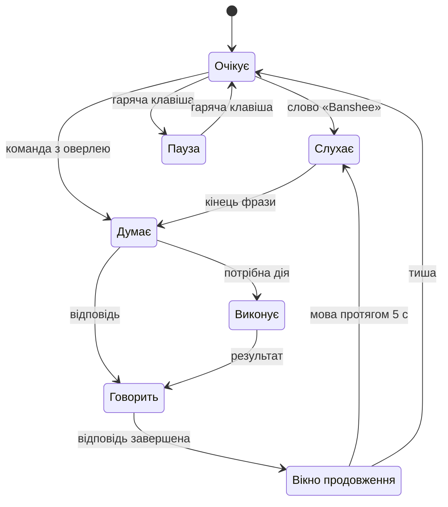

# 09 · Інтерфейс

Banshee — тихий асистент: більшість часу його видно лише як значок у треї. Решта інтерфейсу з'являється, коли потрібна, і зникає сама.

## Принципи
- **Стан видно завжди:** слухає, думає, виконує, пауза, базовий режим без ШІ.
- **Кожну дію видно** і можна скасувати. Небезпечну дію підтверджують лише руками.
- **Усе працює з клавіатури.** Голос — швидший шлях, а не єдиний.
- **Українською й коротко.** Подробиці — на вимогу.
- **Вигляд Windows:** системний шрифт, світла й темна теми за налаштуванням Windows.

## Поверхні

| Поверхня | Коли видно | Що показує |
|---|---|---|
| Значок у треї | завжди | стан асистента й позначка базового режиму; меню: оверлей, пауза мікрофона, «ШІ: увімкнено», центр керування, синхронізація, довідка, вихід |
| Оверлей | гаряча клавіша або слово «Banshee» | поле команди, хід виконання, відповідь, дії з кнопкою «Скасувати» |
| Картка підтвердження | 🟡 і 🔴 дії | що саме буде зроблено, кнопки, зворотний відлік |
| Сповіщення Windows | фонові події | нагадування, завершення довгої задачі, ліміт витрат, базовий режим, синхронізація |
| Центр керування | з меню трею | Огляд, Активність, Пам'ять, Навички, Журнал, Налаштування, Синхронізація, Довідка, Про програму |

## Стани

- «Стоп» з будь-якого стану повертає в «Очікує».
- Базовий режим — позначка поверх будь-якого стану. Причина (ШІ вимкнено, ліміт, немає зв'язку, ключа чи кредитів) — у підказці значка й на «Огляді» ([03-brain.md](03-brain.md)).
- У треї стан показує форма значка, а не лише колір: кільце, пульс, крапки, шестерня, перекреслений мікрофон.
- **Крок 1.1:** значок — коло зі смужками звуку; базовий режим — позначка внизу праворуч; core не працює — сіре коло з перекресленням. Підказка значка — стан ШІ або core; меню — «Центр керування», «Вийти», після 3 збоїв core — «Перезапустити core». Клік по значку відкриває центр керування. Стани голосу (кільце, пульс, крапки, шестерня, мікрофон) додає етап 2. Етап 2 (2026-10-06): стан голосу — у підказці значка («слухає слово "Banshee"», «мікрофон на паузі»), пункт меню «Пауза мікрофона» з поєднанням; окремі значки — пізніше.

## Оверлей
- **Вікно:** без рамки, 640 px завширшки, по центру вгорі, над усіма вікнами. На Windows 11 22H2+ фон — матеріал Mica, на Windows 10 — суцільний.
- **Кілька моніторів:** оверлей з'являється на моніторі з активним вікном. Крок 1.7 — на моніторі з курсором миші: активного вікна іншої програми Electron не бачить; монітор активного вікна через user32 — разом із голосом на етапі 2.
- **Повноекранні програми й «Не турбувати».** Коли відкрито гру чи відео на весь екран або ввімкнено «Не турбувати» Windows, оверлей сам не з'являється й фокус не забирає. Banshee відповідає голосом, а значок у треї показує стан. Гаряча клавіша відкриває оверлей завжди.
- **Рядок команди:** кружок стану, поле вводу, кнопка мікрофона. Етап 2 (2026-10-06): кнопка мікрофона — команда голосом без слова «Banshee»; неактивна, коли голос вимкнено чи моделі не завантажено, з підказкою чому. Кружок: товсте пульсуюче кільце — слухає команду, пунктир — розпізнає. Слово «Banshee» показує оверлей без фокусу; почута команда — в рядку ходу, «так» / «ні» на картку — «Почуто: …».
- **Під ним** — відповідь стрімом і картки дій. У кожної картки іконка рівня, що саме зроблено, і кнопка «Скасувати».
- **Позначки:** «⚡ без ШІ» для рутин, «чужий вміст», «голос не впізнано», «базовий режим» з кнопкою «Увімкнути ШІ» чи «Поповнити».
- **Ховається** через 8 с бездіяльності, якщо курсор не в ньому. Esc — сховати одразу.

**Реалізація — крок 1.7** (`apps/desktop/src/renderer/overlay.tsx`, 2026-10-05): кружок стану — кільце (готовий), пунктир (ядро не підключено), пульс (думає), заповнене коло (виконує); кнопка мікрофона вимкнена до етапу 2. Висота вікна — за вмістом, від 64 до 560 px. Mica — лише з Windows 11 22H2 (збірка 22621), на Windows 10 фон суцільний. Оверлей створюється разом із програмою й ховається, а не закривається: гаряча клавіша показує його одразу.

## Картки підтвердження
- **🟡:**
  - одне речення про те, що буде зроблено;
  - кнопки «Так (Enter)» і «Ні (Esc)»;
  - голосове «так» приймається протягом 8 с, кільце показує відлік.
- **🔴:**
  - точна команда моноширинним шрифтом і наслідок, наприклад «не можна скасувати»;
  - кнопка «Виконати (Ctrl+Enter)» стає активною через 1 с, поруч «Скасувати (Esc)»;
  - на рішення 60 с; голос не приймається.
- **Крок 1.7** (`components/ConfirmCard.tsx`): картку видно в оверлеї й у центрі керування — хто відповів першим, той і вирішив; core закриває обидві. Enter підтверджує 🟡, лише коли в полі вводу нічого не набрано, — тоді він належить полю. Якщо підтвердження прийшло, а оверлей схований і центр керування не перед очима, головний процес показує оверлей. «Чужий вміст» — рядок пояснення на картці.

## Центр керування

| Розділ | Що там |
|---|---|
| Огляд | стан асистента й стан ШІ, команди за сьогодні, частка без ШІ з міні-графіком за 30 днів, витрати API за день і місяць проти ліміту, p50 затримки, стан синхронізації |
| Активність | графіки використання й навчання, порівняння періодів — розділ нижче |
| Пам'ять | профіль, факти, правила; «Нове про тебе» — що чекає підтвердження; «забути» |
| Навички | рутини власника й вивчені: шаблон, приклади, кроки, успішність; увімкнути, змінити, видалити; «Чого я поки не вмію» |
| Журнал | усі дії з фільтрами, «скасувати» для 🟡 дій з файлами; журнал навчання з «відкотити» |
| Налаштування | [10-settings.md](10-settings.md) |
| Синхронізація | пристрої, експорт, імпорт, тека синхронізації — [11-sync.md](11-sync.md) |
| Довідка | коротка інструкція з посиланнями на налаштування — розділ нижче |
| Про програму | версія Banshee, версія Windows, тека Banshee, системні вимоги поруч з даними цього ПК ([01-architecture.md](01-architecture.md)), ліцензії |

**Крок 1.7** (`apps/desktop/src/renderer/center`, 2026-10-05): «Огляд», «Активність», «Журнал», «Налаштування» з карткою «Стан ШІ» й майстер першого запуску. Пам'ять, Навички й Синхронізація — з етапів 3–4, Довідка й «Про програму» — крок 1.10.
- **Майстер у версії етапу 1:** вітання, ключ Claude або «Пропустити — базовий режим», гарячі клавіші. Мікрофон, слово «Banshee» й «Мій голос» додає крок 2.6, перенесення пам'яті — етап 4. Показується, доки налаштування пристрою `general.setupDone` не стане «так».
- **Налаштування** будуються зі схеми `@banshee/shared`: тип, межі й варіанти — з zod, тож новий пункт з'являється без нового коду. Перемикачі й вибір зберігаються одразу, решта — кнопкою «Зберегти». Безпекові й грошові — з підтвердженням кліком у самому пункті. У розділі «Голос» — примітка, що голос з'явиться в наступній версії.
- **Ключ Claude** — у картці «Стан ШІ» (Налаштування → Мозок і витрати) і в майстрі: поле з «•», «Перевірити й зберегти», «Видалити ключ» з підтвердженням. Ключ іде портом до core: core перевіряє формат і список моделей і лише тоді зберігає його в Credential Manager; назад повертається тільки «••••1234».
- **Журнал** — 50 записів на сторінку, фільтри рівня й стану, «Скасувати» для дій з даними для скасування: файли й налаштування. Опис дії — те саме речення, що й на картці (`actions.summary`).
- **Знімки для перевірки вигляду** — `npm run desktop:shots`: кожен розділ і оверлей у світлій і темній темах, у `.data/ui-shots`; команду в оверлей набирає клавіатура. Відстеження перекриття вікон Chromium у цьому режимі вимкнено (2026-10-07): поки працює ще один Banshee, його оверлей поверх усіх перекривав оверлей знімків, Chromium його не малював — висота не росла, знімок падав з `UnknownVizError`.
- **Картка «Голос»** показує, яким мікрофоном слухає Banshee і що з ним: обраного немає — типовий Windows, не дає звуку, від'єднався, не відкрився (2026-10-07).

## Активність

Вимога власника F10: бачити, як Banshee використовується й наскільки добре вчиться.

- **Період:** 7 днів, 30 днів, 90 днів або рік. Перемикач «Цей ПК / Усі ПК» — коли ввімкнено синхронізацію.
- **Графіки:**

  | Графік | Що показує |
  |---|---|
  | Команди за днями | стовпчики: без ШІ (рутини й вбудовані команди) і з ШІ; ескалації на Sonnet і помилки — позначками |
  | Частка без ШІ | лінія, ковзне середнє за 7 днів; пунктир — ціль 40 %. Головний графік того, як Banshee вчиться |
  | Витрати API | стовпчики за днями з лінією денного ліміту; накопичення за місяць проти $20 |
  | Навчання | за тижнями: нові рутини, назви й правила, відкати; запуски вивчених рутин — заощаджені виклики ШІ — і ≈ $, які вони зберегли |
  | Якість | частка успішних ходів, виправлення власника, p50 і p90 затримки |

- **Порівняння** з попереднім періодом: команд, частка без ШІ, $ на команду, успішність, виправлення, p50 — зі зміною в числах і стрілкою.
- **Списки:**
  - «Що найчастіше йде через ШІ» — кандидати в рутини з кнопкою «Зробити рутиною»;
  - «Найкорисніші рутини» — за кількістю запусків.
- **Дані** — з `usage_daily`, а за сьогодні — з `turns` і `llm_calls` наживо ([04-memory.md](04-memory.md)). Лише числа, без тексту команд; нікуди не відправляються.
  - **Крок 1.7:** усі дні рахуються з `turns` і `llm_calls` (`apps/core/src/views.ts`) — тими самими рядками, що й журнал, тож числа збігаються (F10). Нічне зведення в `usage_daily` потрібне для синхронізації між ПК і з'явиться з нею. «Частка без ШІ» — частка ходів з `route = routine` серед усіх завершених ([07-quality.md](07-quality.md)); дні — місцеві. Графік «Навчання» й кнопка «Зробити рутиною» — з етапу 3.
- **Доступність:** у кожного графіка є «Показати таблицею». Серії розрізняються не лише кольором, а й підписом та візерунком.

## Довідка

Вимога власника (2026-10-04): коротка й зрозуміла інструкція — у самій програмі, з посиланнями на конкретні налаштування.

- **Де:** розділ «Довідка» в центрі керування; F1 у центрі керування відкриває тему поточного розділу; пункт «Довідка» в меню трею; команда «довідка» в оверлеї чи голосом — вбудована, без ШІ. Біля складних налаштувань — значок «?» з потрібною темою.
- **Теми** — по 5–10 рядків простою мовою. Кожна закінчується посиланнями на кшталт «Відкрити: Налаштування → Голос → Мікрофон», що ведуть просто на потрібне місце:

| Тема | Куди ведуть посилання |
|---|---|
| Як почати: майстер, ключ API, базовий режим | майстер першого запуску; Налаштування → Мозок і витрати |
| Як кликати Banshee: слово, оверлей, вікно продовження | Налаштування → Голос; гарячі клавіші |
| Що Banshee вміє і чого ні | Навички, «Чого я поки не вмію» |
| Підтвердження й безпека: 🟢 🟡 🔴, «так», «скасуй» | Налаштування → Безпека; Журнал |
| Голос і мікрофон: перевірка, навчання слова, мій голос, пауза | Налаштування → Голос → Мікрофон, «Навчити слово», «Мій голос» |
| Пам'ять і навчання: «запам'ятай», «забудь» | Пам'ять; Налаштування → Пам'ять і навчання |
| ШІ й витрати: стан ШІ, ліміти | Огляд; Налаштування → Мозок і витрати |
| Кілька ПК: перенесення й синхронізація | Синхронізація |
| Приватність: що лишається на ПК, що йде в Claude | Налаштування → Безпека |
| Гарячі клавіші | Налаштування → Загальні |
| Якщо щось не так: не чує, не впізнає голос, ШІ недоступний | «Перевірити мікрофон»; Про програму → «Зібрати діагностику» |
| Системні вимоги | Про програму |

- **Джерело** — markdown-файли в `apps/desktop/help/`, разом з кодом. Посилання — внутрішні адреси розділів (`settings/voice/microphone`); тест перевіряє, що кожне веде на наявний розділ.
- **Актуальність:** зміна, що додає чи змінює функцію для користувача, оновлює її тему в довідці в тій самій зміні (з кроку 1.10).
- **Реалізація — крок 1.10** (2026-10-05): 12 тем таблиці вище — `apps/desktop/help/01-start.md` … `12-requirements.md`. Розмітка — заголовок, абзаци, списки, таблиці, **жирне**, `код`; посилання — окремим рядком `[Відкрити: …](settings/ai.limits)`: розділ центру керування, пункт або розділ налаштувань, інша тема (`help/safety`). Сторінка будує елементи сама, без HTML. Тест `apps/desktop/help/topics.test.ts`: кожне посилання веде на наявний розділ, у кожної теми є посилання й до 10 блоків, F1 кожного розділу веде на наявну тему.
  - F1 — тема поточного розділу, у налаштуваннях — поточного підрозділу; «? Довідка до розділу» — угорі кожного розділу налаштувань.
  - Команда «довідка», «відкрий довідку», «допомога» — керування в core, без ШІ: core надсилає `open`, головний процес відкриває центр керування на довідці.
  - «Про програму»: версія, Windows, тека Banshee з «Відкрити в Провіднику», системні вимоги поруч з даними цього ПК, «Зібрати діагностику» — ZIP у «Завантаження» з журналами роботи й версіями, без пам'яті, налаштувань і дампів пам'яті процесів.

## Візуальна мова
- **Кольори** — ті самі токени, що в презентації: акцент #0b7a72 у світлій темі й #4cc3b6 у темній. Статуси 🟢 🟡 🔴 перевірені на розрізнюваність для дальтоніків і завжди мають іконку та підпис.
- **Шрифти:**
  - інтерфейс — Segoe UI Variable (Windows 11) або Segoe UI (Windows 10);
  - команди й код — JetBrains Mono;
  - назва Banshee — Unbounded.

  Шрифти з ліцензією OFL вбудовані в застосунок, тож інтернет для них не потрібен.
- **Іконки** — Fluent UI System Icons (MIT), як у самій Windows.
- **Тема** — за налаштуванням Windows, з підтримкою контрастних тем Windows. Анімації — до 200 мс; якщо в Windows увімкнено «зменшити анімацію», їх немає.

## Доступність
- Усе керується з клавіатури, порядок фокусу логічний, фокус видно.
- Екранний диктор Windows читає зміну стану й нові відповіді.
- Контраст тексту ≥ 4,5 : 1. Масштаб тексту Windows до 200 % нічого не обрізає.

## Гарячі клавіші
Типові значення — рішення власника (2026-10-03); кожне змінюється в налаштуваннях.

| Дія | Клавіші |
|---|---|
| Оверлей | Ctrl+Shift+B |
| Пауза мікрофона | Ctrl+Shift+M |
| Стоп | Ctrl+Shift+X |
| Підтвердити 🔴 | Ctrl+Enter, лише в картці підтвердження |
| Довідка до поточного розділу | F1, лише в центрі керування |

- **Перехоплення.** Поки Banshee працює, ці поєднання не доходять до інших програм:
  - Ctrl+Shift+B — збірка у VS Code, панель закладок у Chrome і Edge;
  - Ctrl+Shift+M — вимкнення мікрофона в дзвінку Teams і Discord, панель проблем у VS Code;
  - Ctrl+Shift+X — розширення у VS Code.

  Власник лишає Ctrl+Shift для Banshee, а ці поєднання в Teams і Discord вимкне сам (рішення 2026-10-03).
- **Зайняте поєднання.** Якщо поєднання вже зареєструвала інша програма, Banshee каже про це й пропонує інше.
- **Крок 1.7:** головний процес реєструє оверлей і «стоп» з налаштування `general.hotkeys` і перереєструє їх після зміни; зайняте поєднання — сповіщення Windows з порадою змінити його в налаштуваннях. Пауза мікрофона реєструється з етапу 2, коли з'явиться мікрофон: до того Ctrl+Shift+M не перехоплюється. Ctrl+Enter, Enter і Esc картки підтвердження діють лише в її вікні.
