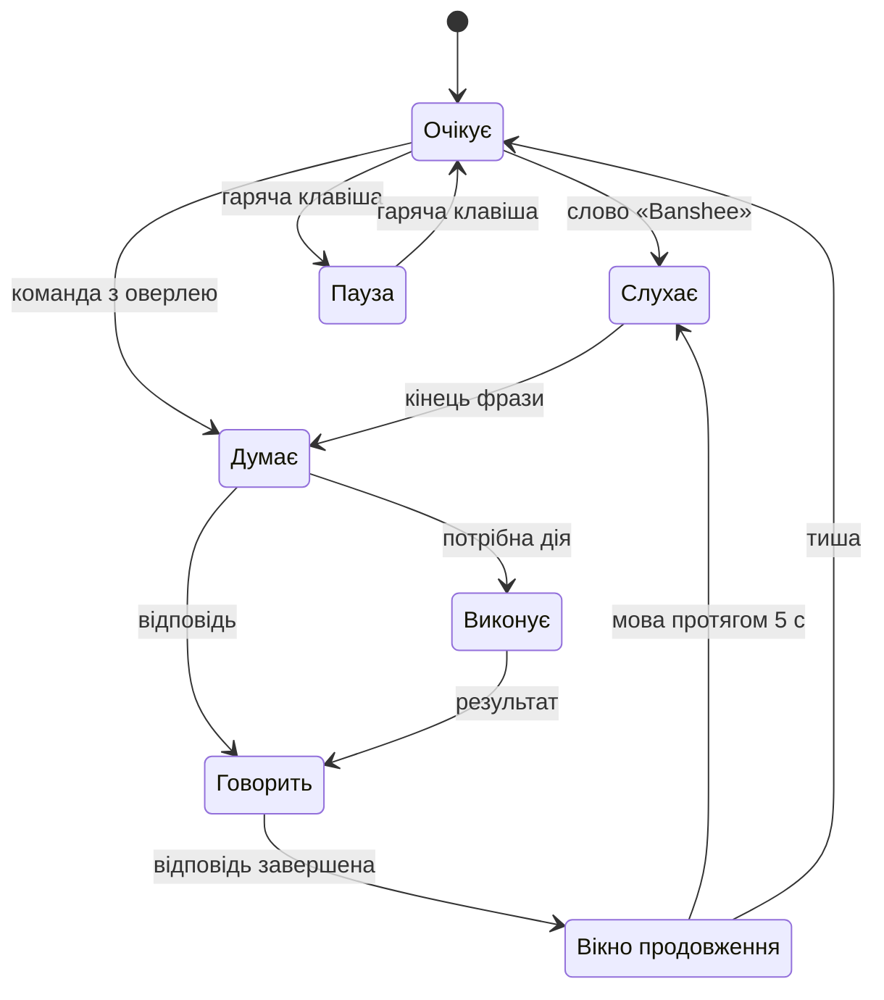

# 09 · Інтерфейс

Banshee — тихий асистент: більшість часу його видно лише як значок у треї. Решта інтерфейсу з'являється, коли потрібна, і зникає сама.

## Принципи
- **Стан видно завжди:** слухає, думає, виконує, пауза, базовий режим без ШІ.
- **Кожну дію видно** і можна скасувати. Небезпечну дію підтверджують лише руками.
- **Усе працює з клавіатури.** Голос — швидший шлях, а не єдиний.
- **Українською й коротко.** Подробиці — на вимогу.
- **Вигляд Windows:** системний шрифт, світла й темна теми за налаштуванням Windows.

## Поверхні

| Поверхня | Коли видно | Що показує |
|---|---|---|
| Значок у треї | завжди | стан асистента й позначка базового режиму; меню: оверлей, пауза мікрофона, «ШІ: увімкнено», центр керування, синхронізація, вихід |
| Оверлей | гаряча клавіша або слово «Banshee» | поле команди, хід виконання, відповідь, дії з кнопкою «Скасувати» |
| Картка підтвердження | 🟡 і 🔴 дії | що саме буде зроблено, кнопки, зворотний відлік |
| Сповіщення Windows | фонові події | нагадування, завершення довгої задачі, ліміт витрат, базовий режим, синхронізація |
| Центр керування | з меню трею | Огляд, Активність, Пам'ять, Навички, Журнал, Налаштування, Синхронізація, Про програму |

## Стани

- «Стоп» з будь-якого стану повертає в «Очікує».
- Базовий режим — позначка поверх будь-якого стану. Причина (ШІ вимкнено, ліміт, немає зв'язку, ключа чи кредитів) — у підказці значка й на «Огляді» ([03-brain.md](03-brain.md)).
- У треї стан показує форма значка, а не лише колір: кільце, пульс, крапки, шестерня, перекреслений мікрофон.

## Оверлей
- **Вікно:** без рамки, 640 px завширшки, по центру вгорі, над усіма вікнами. На Windows 11 22H2+ фон — матеріал Mica, на Windows 10 — суцільний.
- **Кілька моніторів:** оверлей з'являється на моніторі з активним вікном.
- **Повноекранні програми й «Не турбувати».** Коли відкрито гру чи відео на весь екран або ввімкнено «Не турбувати» Windows, оверлей сам не з'являється й фокус не забирає. Banshee відповідає голосом, а значок у треї показує стан. Гаряча клавіша відкриває оверлей завжди.
- **Рядок команди:** кружок стану, поле вводу, кнопка мікрофона.
- **Під ним** — відповідь стрімом і картки дій. У кожної картки іконка рівня, що саме зроблено, і кнопка «Скасувати».
- **Позначки:** «⚡ без ШІ» для рутин, «чужий вміст», «голос не впізнано», «базовий режим» з кнопкою «Увімкнути ШІ» чи «Поповнити».
- **Ховається** через 8 с бездіяльності, якщо курсор не в ньому. Esc — сховати одразу.

## Картки підтвердження
- **🟡:**
  - одне речення про те, що буде зроблено;
  - кнопки «Так (Enter)» і «Ні (Esc)»;
  - голосове «так» приймається протягом 8 с, кільце показує відлік.
- **🔴:**
  - точна команда моноширинним шрифтом і наслідок, наприклад «не можна скасувати»;
  - кнопка «Виконати (Ctrl+Enter)» стає активною через 1 с, поруч «Скасувати (Esc)»;
  - на рішення 60 с; голос не приймається.

## Центр керування

| Розділ | Що там |
|---|---|
| Огляд | стан асистента й стан ШІ, команди за сьогодні, частка без ШІ з міні-графіком за 30 днів, витрати API за день і місяць проти ліміту, p50 затримки, стан синхронізації |
| Активність | графіки використання й навчання, порівняння періодів — розділ нижче |
| Пам'ять | профіль, факти, правила; «Нове про тебе» — що чекає підтвердження; «забути» |
| Навички | рутини власника й вивчені: шаблон, приклади, кроки, успішність; увімкнути, змінити, видалити; «Чого я поки не вмію» |
| Журнал | усі дії з фільтрами, «скасувати» для 🟡 дій з файлами; журнал навчання з «відкотити» |
| Налаштування | [10-settings.md](10-settings.md) |
| Синхронізація | пристрої, експорт, імпорт, тека синхронізації — [11-sync.md](11-sync.md) |
| Про програму | версія Banshee, версія Windows, ліцензії |

## Активність

Вимога власника F10: бачити, як Banshee використовується й наскільки добре вчиться.

- **Період:** 7 днів, 30 днів, 90 днів або рік. Перемикач «Цей ПК / Усі ПК» — коли ввімкнено синхронізацію.
- **Графіки:**

  | Графік | Що показує |
  |---|---|
  | Команди за днями | стовпчики: без ШІ (рутини й вбудовані команди) і з ШІ; ескалації на Sonnet і помилки — позначками |
  | Частка без ШІ | лінія, ковзне середнє за 7 днів; пунктир — ціль 40 %. Головний графік того, як Banshee вчиться |
  | Витрати API | стовпчики за днями з лінією денного ліміту; накопичення за місяць проти $20 |
  | Навчання | за тижнями: нові рутини, назви й правила, відкати; запуски вивчених рутин — заощаджені виклики ШІ — і ≈ $, які вони зберегли |
  | Якість | частка успішних ходів, виправлення власника, p50 і p90 затримки |

- **Порівняння** з попереднім періодом: команд, частка без ШІ, $ на команду, успішність, виправлення, p50 — зі зміною в числах і стрілкою.
- **Списки:**
  - «Що найчастіше йде через ШІ» — кандидати в рутини з кнопкою «Зробити рутиною»;
  - «Найкорисніші рутини» — за кількістю запусків.
- **Дані** — з `usage_daily`, а за сьогодні — з `turns` і `llm_calls` наживо ([04-memory.md](04-memory.md)). Лише числа, без тексту команд; нікуди не відправляються.
- **Доступність:** у кожного графіка є «Показати таблицею». Серії розрізняються не лише кольором, а й підписом та візерунком.

## Візуальна мова
- **Кольори** — ті самі токени, що в презентації: акцент #0b7a72 у світлій темі й #4cc3b6 у темній. Статуси 🟢 🟡 🔴 перевірені на розрізнюваність для дальтоніків і завжди мають іконку та підпис.
- **Шрифти:**
  - інтерфейс — Segoe UI Variable (Windows 11) або Segoe UI (Windows 10);
  - команди й код — JetBrains Mono;
  - назва Banshee — Unbounded.

  Шрифти з ліцензією OFL вбудовані в застосунок, тож інтернет для них не потрібен.
- **Іконки** — Fluent UI System Icons (MIT), як у самій Windows.
- **Тема** — за налаштуванням Windows, з підтримкою контрастних тем Windows. Анімації — до 200 мс; якщо в Windows увімкнено «зменшити анімацію», їх немає.

## Доступність
- Усе керується з клавіатури, порядок фокусу логічний, фокус видно.
- Екранний диктор Windows читає зміну стану й нові відповіді.
- Контраст тексту ≥ 4,5 : 1. Масштаб тексту Windows до 200 % нічого не обрізає.

## Гарячі клавіші
Типові значення — рішення власника (2026-10-03); кожне змінюється в налаштуваннях.

| Дія | Клавіші |
|---|---|
| Оверлей | Ctrl+Shift+B |
| Пауза мікрофона | Ctrl+Shift+M |
| Стоп | Ctrl+Shift+X |
| Підтвердити 🔴 | Ctrl+Enter, лише в картці підтвердження |

- **Перехоплення.** Поки Banshee працює, ці поєднання не доходять до інших програм:
  - Ctrl+Shift+B — збірка у VS Code, панель закладок у Chrome і Edge;
  - Ctrl+Shift+M — вимкнення мікрофона в дзвінку Teams і Discord, панель проблем у VS Code;
  - Ctrl+Shift+X — розширення у VS Code.

  Власник лишає Ctrl+Shift для Banshee, а ці поєднання в Teams і Discord вимкне сам (рішення 2026-10-03).
- **Зайняте поєднання.** Якщо поєднання вже зареєструвала інша програма, Banshee каже про це й пропонує інше.
