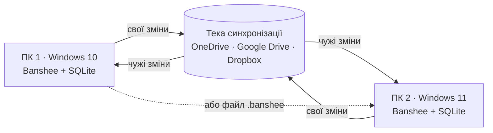

# 11 · Перенесення й синхронізація

Пам'ять Banshee — це його знання. Її можна перенести на інший ПК файлом і тримати синхронною між кількома ПК. На кожному ПК Banshee продовжує вчитися, а вивчене зливається.

## Що переноситься

| Дані | Переноситься | Чому |
|---|---|---|
| Факти, правила, профіль | так | знання про власника |
| Рутини (власника й вивчені), словник назв | так | навички |
| Спогади: підсумки розмов | так | `recall` на будь-якому ПК |
| Транскрипти | лише якщо ввімкнено | приватність |
| Налаштування користувача | так | [10-settings.md](10-settings.md) |
| Журнал дій, ходи, витрати, журнал навчання | ні | історія конкретного ПК |
| Статистика за днями (`usage_daily`), лише числа | так | «Активність» і ліміти витрат для всіх ПК разом |
| Налаштування пристрою | ні | мікрофон, шляхи, клавіші на кожному ПК свої |
| Голосовий профіль власника | ні | біометричні дані; інший мікрофон — інший відбиток; запис голосу на новому ПК — 30 с |
| Ключі й паролі | ніколи | вводяться на кожному ПК |
| Моделі: wake word, VAD, розпізнавання (Parakeet), Piper | ні | завантажуються під час першого запуску ([01-architecture.md](01-architecture.md)) |

## Файл пам'яті `.banshee`
- **Вміст.** ZIP-архів:
  - `manifest.json` — версія формату й схеми, версія Banshee, дата, пристрій, збірка Windows, кількість записів, SHA-256 кожного файлу;
  - по файлу JSONL на кожну таблицю.
- **Шифрування** — паролем: AES-256-GCM, ключ із пароля через scrypt (є в Node, без залежностей). Без пароля файл не відкрити; втрачений пароль — втрачений файл.
- **Експорт** — центр керування → Синхронізація → «Експортувати пам'ять» або голосом «зроби копію пам'яті» (🟡).
- **Автокопія** — щотижня в локальну теку; зберігаються 4 останні копії.

## Імпорт на новому ПК
1. Перший запуск пропонує «Перенести пам'ять з іншого ПК».
2. Файл і пароль → перевірка контрольних сум і версії схеми.
3. Попередній перегляд: скільки фактів, правил, рутин і назв.
4. Режим:
   - «замінити» — поточна пам'ять іде в резервну копію;
   - «об'єднати» — за правилами злиття нижче.
5. Підсумок: що додано, що оновлено, які рутини недоступні на цьому ПК (наприклад, немає потрібної програми).

## Синхронізація через теку
- **Без сервера.** Тека — у хмарному диску, який уже синхронізує файли між ПК.
- **OneDrive** — рішення 2026-10-03. Він вбудований у Windows, дає 5 ГБ безкоштовно й уже налаштований на ПК власника. Типова тека — `OneDrive\Banshee`; у налаштуваннях можна обрати іншу, наприклад у Google Drive чи Dropbox.
- **Кількість ПК не обмежена.** На кожному має бути Windows 10 22H2 або новіша і той самий обліковий запис OneDrive.
- **Кожен ПК пише лише свої файли:** `devices/<id>/<номер>.chg` — зашифровані пакети змін. Чужі файли він тільки читає, тому конфліктів файлів у хмарному сховищі немає.
- **Робоча база SQLite ніколи не лежить у теці синхронізації:** хмарні клієнти можуть пошкодити відкритий файл бази.
- **Коли:** під час запуску, кожні 10 хв, перед виходом і за кнопкою «Синхронізувати зараз».
- **Стиснення:** раз на тиждень старі пакети зводяться в знімок.

## Правила злиття
- **Порядок змін.** Кожен запис має глобальний `uid` (ULID) і мітку `hlc` — гібридний логічний годинник. Він впорядковує зміни з різних ПК, навіть коли їхні годинники розходяться.
- **Новіша зміна перемагає.** Попередня версія лишається в журналі навчання, щоб її можна було відкотити.
- **Видалення поширюється.** «Забудь» ставить позначку `deleted`, і вона перемагає старіші зміни: забуте на одному ПК забувається всюди.
- **Лічильники** запусків і успіхів беруть максимум зі значень.
- **Однакові рутини** (ті самі кроки й шаблон) зливаються, приклади й лічильники об'єднуються.
- **Безпекові налаштування**, що прийшли синхронізацією, діють лише після підтвердження на цьому ПК.

## Версії
- Пам'ять зі старішої версії Banshee імпортується з міграцією схеми.
- Пам'ять із новішою схемою не імпортується: Banshee просить оновитися.
- У центрі керування є список пристроїв: назва, версія Banshee, версія Windows, остання синхронізація. «Забути пристрій» перестає читати його пакети.

## Сумісність з Windows

| Платформа | Підтримка |
|---|---|
| Windows 10 22H2 (збірка 19045), x64 — як на поточному ПК | так, мінімальна версія |
| Windows 11, усі версії (23H2, 24H2, 25H2 і новіші), x64 | так, основна платформа |
| Windows 11 на ARM64 | через емуляцію x64; перевірити на етапі 1 |
| Windows 10 у режимі S, 32-бітні Windows, Windows 7 і 8.1 | ні |

- **API** — лише стабільні й публічні: UI Automation, Core Audio, Windows PowerShell 5.1 (є і в Windows 10, і в 11), Credential Manager, сповіщення Windows.
- **Можливості Windows 11** вмикаються, лише якщо вони є (Mica з 22H2, шрифт Segoe UI Variable). Без них усе працює.
- **Пам'ять не залежить від версії Windows:** файл з Windows 10 відкривається на Windows 11 і навпаки.
- **Перевіряємо** на Windows 10 22H2 і найновішій Windows 11. Windows 11 — у віртуальній машині Hyper-V, вона є в Windows 10 Pro.
- **Встановлення** — для поточного користувача, без прав адміністратора, у теку на диску, який обрав користувач ([01-architecture.md](01-architecture.md)).

### Ризики платформи
- **Windows 10 22H2 поза основною підтримкою Microsoft.** Безпекові оновлення приходять через програму ESU до 12.10.2027; зареєструватися можна до кінця програми. Вона безкоштовна через синхронізацію параметрів у резервну копію Windows або за 1000 балів Microsoft Rewards і потребує облікового запису Microsoft; одна реєстрація покриває до 10 ПК.
- **ESU на поточному ПК увімкнено 2026-10-03.**
  - До того ПК ~11 місяців не отримував безпекових оновлень: останнє накопичувальне — листопад 2025.
  - Реєстрація безкоштовна, бо параметри Windows уже зберігаються в резервній копії в OneDrive. Windows Update тепер пише «Ваш ПК зареєстровано для отримання Розширених оновлень системи безпеки».
  - Оновлення приходитимуть як звичайні щомісячні, до 12.10.2027. Швидкодії ESU не змінює. Перше оновлення наздоганяє пропущене, тож воно велике й потребує перезавантаження.
- **Після 12.10.2027** оновлень для цього ПК не буде: Windows 11 він офіційно не підтримує, бо процесор i5-6600 — 6-го покоління. До того часу Banshee має працювати й на новішому ПК з Windows 11 — це вже вимога N7.
- **Chromium і Electron.** Edge на Windows 10 Microsoft підтримуватиме щонайменше до жовтня 2028. Electron про припинення підтримки Windows 10 ще не оголошував. Фіксуємо версію Electron і стежимо за оголошеннями.
- **Microsoft Defender** може вважати підозрілою непідписану програму, що запускає PowerShell і керує вікнами через UI Automation. Якщо так станеться, — виняток для теки програми в «Безпеці у Windows». Більше нічого в захисті не змінюємо.
- **Без підпису коду** SmartScreen попереджає під час встановлення, а Smart App Control на Windows 11, якщо він увімкнений, може заблокувати запуск. Сертифікат платний, тому не купуємо. Для особистого використання: «Однаково запустити» або вимкнути Smart App Control на цьому ПК.
