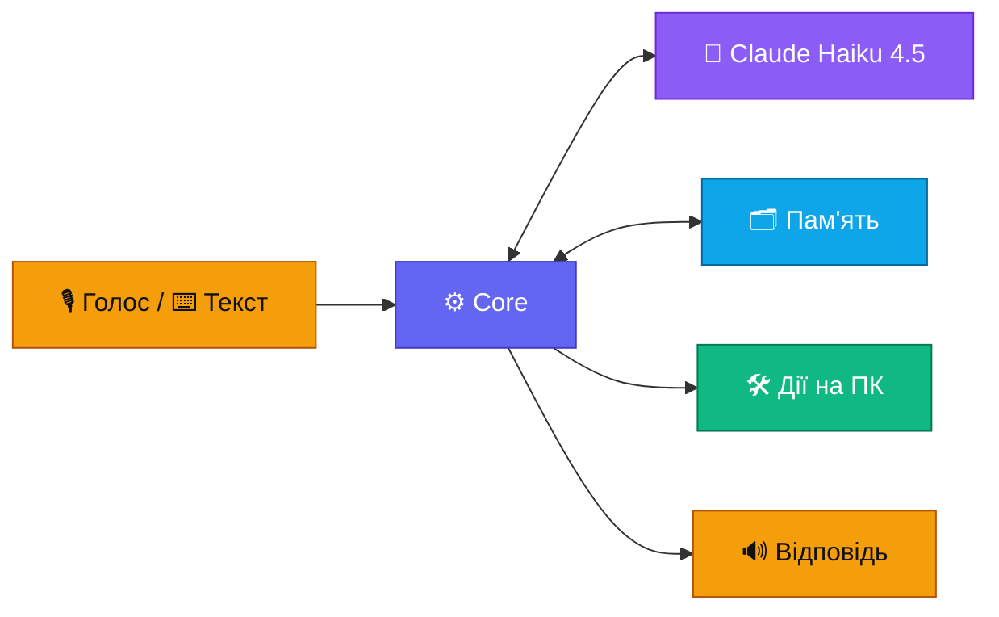

# Banshee — ТЗ коротко

> Banshee — персональний голосовий асистент для Windows. Прокидається на слово «Banshee», розуміє голос і текст українською, вчиться на спілкуванні з власником і виконує команди на ПК. Мозок — Claude Haiku 4.5.

`Статус: розробка, 12 % ТЗ — кроки 0.1, 0.2, 0.3 і 0.6 виконано; 0.4 — вибір голосу (13-plan.md)` · `Версія 3.19 · 2026-10-04` · Презентація для браузера: [presentation.html](presentation.html)

## Вимоги

| ID | Вимога | Рішення | Критерій приймання |
|---|---|---|---|
| F1 | Команди голосом і текстом | wake word «Banshee» → VAD → STT; оверлей за гарячою клавішею | ≤ 1 хибне спрацювання на 10 год фонової мови; ≤ 5 % пропусків |
| F2 | Добре розуміє власника | Haiku 4.5, профіль у системному промпті, словник назв | ≥ 90 % правильних дій на еталонному наборі |
| F3 | Вчиться сам | профіль, правила, рутини, зокрема вивчені з успішних виконань ШІ, спогади, нічний самоаналіз із перевіркою | виправлена помилка не повторюється в 9 з 10 перевірок; частка команд без ШІ ≥ 40 % через місяць; навчання не погіршує еталонний набір |
| F4 | Виконує команди на ПК | MCP-сервери: програми, вікна, файли, PowerShell, браузер | кожна дія має рівень і запис у журналі |
| F5 | Claude на найдешевшій і найшвидшій моделі | Haiku 4.5 за замовчуванням, Sonnet 5.5 лише через ескалацію | Sonnet — ≤ 10 % викликів |
| F6 | Зрозумілий інтерфейс | трей, оверлей, картки підтвердження, центр керування; світла й темна теми ([09-ui.md](09-ui.md)) | кожен стан видно; усе доступне з клавіатури; контраст ≥ 4,5 : 1 |
| F7 | Налаштування видно й можна змінити | центр керування, частина — голосом; безпекові — лише вручну ([10-settings.md](10-settings.md)) | кожен пункт має опис, типове значення й «скинути»; зміни в журналі зі «скасуй» |
| F8 | Пам'ять переноситься на інші ПК і синхронізується | зашифрований файл `.banshee` і тека хмарного диска ([11-sync.md](11-sync.md)) | експорт → імпорт відтворює знання повністю; «забудь» поширюється; ключів у файлі немає |
| F9 | Слухає лише власника | голосовий профіль власника: sherpa-onnx порівнює з ним кожну фразу ([02-voice.md](02-voice.md)) | чужий голос прийнято ≤ 5 %; власника не впізнано ≤ 5 % |
| F10 | Видно, як Banshee вчиться | розділ «Активність»: графіки команд з ШІ й без ШІ, витрат і навчання, порівняння періодів ([09-ui.md](09-ui.md)) | числа на графіках збігаються з журналом; періоди 7, 30, 90 днів і рік; порівняння з попереднім періодом |
| F11 | ШІ можна вимкнути | стан ШІ видно завжди; перемикач; базовий режим без ШІ ([03-brain.md](03-brain.md)); покрокове підключення API ([12-api.md](12-api.md)) | у базовому режимі 0 запитів до API, рутини й вбудовані команди працюють; стан ШІ видно в треї, оверлеї й налаштуваннях |
| N1 | Швидка реакція | стрімінг, фраза перед дією, рутини без LLM | від кінця фрази до першого звуку: p50 ≤ 1,5 с, p90 ≤ 2,5 с |
| N2 | Безпека | рівні дій, 🔴 лише фізичним підтвердженням, канал без портів, захист пам'яті | 🔴 не приймає голос; сценарії ін'єкцій не виконуються й не потрапляють у пам'ять |
| N3 | Низька вартість | платимо лише за API Claude: кеш на 1 год, одна відповідь на просту дію, ліміти $1 на день і $20 на місяць; голос — безкоштовно | API ≤ $15 на місяць при 50 командах на день; інші сервіси — $0; ліміт спрацьовує |
| N4 | Надійність | автозапуск, перезапуск core, базовий режим без інтернету | core відновлюється за ≤ 5 с; без інтернету працюють рутини |
| N5 | Приватність | аудіо не залишає ПК: слово, розпізнавання й озвучка локальні; секрети не зберігаються; строки зберігання | транскрипти старші 90 днів видаляються; «забудь» видаляє запис |
| N6 | Легкість у фоні | wake word і трей працюють постійно | у спокої CPU < 3 %, RAM ≤ 1,5 ГБ (без браузера; переглянуто 2026-10-04 — модель розпізнавання ≈ 0,8 ГБ) |
| N7 | Сумісність | Windows 10 22H2 (збірка 19045) і всі новіші, включно з Windows 11; лише публічні API, можливості Windows 11 — за наявності; мінімальні й рекомендовані системні вимоги ([01-architecture.md](01-architecture.md)) | встановлюється й проходить перевірки на Windows 10 22H2 і найновішій Windows 11 |

Як вимірювати кожен критерій — [07-quality.md](07-quality.md).

**Бюджет власника.** Платні лише підписка Claude (уже є) і API Claude з оплатою за використання: ≈ $11 на місяць, ліміти $1 на день і $20 на місяць. Розрахунок — у [03-brain.md](03-brain.md), підключення — у [12-api.md](12-api.md). Нових підписок і платних сервісів немає, голос і решта — лише безкоштовне.

## Поза межами

- Віддалене керування з телефону чи через інтернет: Banshee слухає лише локальні мікрофон і клавіатуру.
- Кілька користувачів: команди виконує лише власник, інші голоси Banshee ігнорує (F9). Гостьовий режим і довірені голоси — поки ні (рішення власника, 2026-10-03).
- Пошта й календар — поки ні (рішення власника, 2026-10-03).
- Окреме шифрування бази даних — поки ні (рішення власника, 2026-10-03). Файл експорту й пакети синхронізації шифруються завжди, бо виходять за межі ПК.
- macOS і Linux.
- Дії з правами адміністратора: Banshee показує команду, запускає її власник.
- Донавчання моделі (fine-tuning): Banshee вчиться через пам'ять ([08-learning.md](08-learning.md)).
- Свій сервер синхронізації: пам'ять синхронізується через теку хмарного диска власника.
- Дії з власної ініціативи. Виняток — нагадування й брифінги з етапу 4, і ті без дій на ПК.

## Ключові рішення

✅ — рішення власника · ⏸ — власник відклав · 💬 — пропозиція, чекає підтвердження (зараз таких немає)

| Рішення | Замість | Чому | Статус |
|---|---|---|---|
| Ім'я й слово активації «Banshee» | Jarvis | вибір власника | ✅ |
| TypeScript + Node.js LTS | — | стек власника; офіційні SDK для Claude, MCP і Agent SDK | ✅ |
| Claude Haiku 4.5 за замовчуванням | дорожчі моделі | вимога власника: найдешевша й найшвидша модель | ✅ |
| Мозок через API Claude, оплата за використання | підписка Claude | підписка не покриває API, а власні застосунки за правилами Anthropic працюють лише з API-ключем; ≈ $11 на місяць; підключення — [12-api.md](12-api.md) | ✅ 2026-10-03 |
| Ключі API вводяться в налаштуваннях Banshee, зберігаються в Credential Manager | змінні середовища `BANSHEE_*` | вибір власника: ключем керує сам Banshee — стан, перевірка, заміна; ключа немає в оточенні інших програм; до вікна налаштувань — команда `npm run key` | ✅ 2026-10-03 |
| Ліміти витрат: $1 на день, $20 на місяць | лише залишок кредитів | ловлять помилку, через яку модель ходить по колу; ≈ 3× звичайних витрат | ✅ 2026-10-03 |
| ШІ можна вимкнути: базовий режим, стан ШІ видно завжди | ШІ завжди ввімкнений | власник керує витратами; без ключа, зв'язку чи кредитів Banshee теж працює | ✅ вимога власника |
| Вбудовані команди без ШІ: гучність, медіа, програми, вікна, час | лише рутини власника й вивчені | базовий режим корисний з першого дня | ✅ 2026-10-03 |
| SQLite + FTS5 (`sqlite-vec` пізніше) | MongoDB | один файл без сервера, бекап — копія файлу | ✅ |
| Electron + React | Tauri, нативний UI | той самий стек; вбудоване ехоподавлення Chromium | ✅ 2026-10-03 |
| Монорепо на npm workspaces | pnpm | вбудовані в npm, без додаткових інструментів | ✅ 2026-10-03 |
| Definition of Done: typecheck, lint, тести, еталонний набір | — | зміна готова, лише коли пройшли всі перевірки | ✅ 2026-10-03 |
| Власний агентний цикл на `@anthropic-ai/sdk` | Agent SDK як ядро | мінімальна затримка й повний контроль над контекстом | ✅ 2026-10-03 |
| Власна модель слова «Banshee»: ознаки openWakeWord + мала нейромережа на TypeScript + перевірка голосу на «слово + команда» | sherpa-onnx KWS, Porcupine, довша фраза активації | рішення власника за вимірами 0.5: готові моделі sherpa-onnx KWS ловлять вимову власника щонайбільше 12 з 33, Porcupine з 30.06.2026 не має безкоштовного тарифу. Власна модель вчиться на ПК за хвилини, тож довчається на вимовах користувача; з перевіркою голосу — ≤ 1 хибне на 10 год. Ціна: 17 % пропусків на старті при цілі 5 % — далі довчання ([02-voice.md](02-voice.md)) | ✅ 2026-10-05 |
| Голос лише локально: Parakeet на процесорі, Piper `tetiana` high | Azure Speech F0, ElevenLabs | рішення власника: картку не вводимо, а Azure без неї не активується. $0, без облікових записів, працює без інтернету, аудіо не залишає ПК. Розпізнавання — рядком нижче; хмарний Whisper Groq — лише за рішенням власника | ✅ 2026-10-03 |
| Розпізнавання — Parakeet TDT 0.6B v3 на процесорі (`sherpa-onnx-node`) | Whisper large-v3-turbo на відеокарті | рішення власника за вимірами 0.3: 0,47 с на фразу проти 1,67 с у Whisper на GTX 960; у процесі Node без порту й Build Tools; відеокарта вільна. Ціна: точність 72 % на старті — словник назв, гарячі слова й виправлення власника (крок 2.2); RAM ≈ 0,8 ГБ — N6 переглянуто до 1,5 ГБ. Запасний — варіант 3: Whisper на відеокарті лише для команд, які Haiku не зрозумів ([02-voice.md](02-voice.md)) | ✅ 2026-10-04 |
| Голос озвучки — Piper `tetiana` high | Piper `lada` x_low, Coqui `olena` | рішення власника за вимірами 0.4: найчіткіший жіночий голос — 15–17 помилок на 100 слів у розпізнавача проти 21–23; ціна — нова фраза звучить через 0,45 с, тому часті фрази Banshee готує заздалегідь ([02-voice.md](02-voice.md)) | ✅ 2026-10-04 |
| Розпізнавання власника за голосом (sherpa-onnx) | слухати будь-який голос | телевізор та інші люди не керують ПК і не потрапляють у пам'ять | ✅ вимога власника |
| Мікрофон — Bluetooth-гарнітура JBL TUNE710BT, поки що: на голові або на столі | мікрофон у кімнаті: вхід Realtek, вебкамера | вибір власника. Режим дзвінка дає 16 кГц моно — формат розпізнавання й моделі слова; на столі гарнітура чує слово з 3 м. Ціна: поки Banshee слухає, музика в гарнітурі гірша. Що робити, коли гарнітури немає поруч, відкладено: поки вона завжди ввімкнена й поруч ([02-voice.md](02-voice.md)) | ✅ 2026-10-04 |
| Налаштування під голос і мікрофон у програмі: перевірка мікрофона, навчання слова, мій голос | налаштування лише розробником на етапі 0 | вимога власника: той, хто встановив Banshee, сам налаштовує його під свій мікрофон і голос — у майстрі й у Налаштуваннях → Голос, до 3 хв ([02-voice.md](02-voice.md)) | ✅ 2026-10-04 |
| Одна тека `Banshee` на диску, який обрав користувач | програма в `%LOCALAPPDATA%\Programs\Banshee`, дані в `%LOCALAPPDATA%\Banshee` | вимога власника: програма, дані, моделі й журнали — в одній теці, яку легко знайти, перенести й видалити; на C: часто мало місця. Поза текою — лише ярлики, запис для видалення, автозапуск і ключі в Credential Manager ([01-architecture.md](01-architecture.md)) | ✅ 2026-10-04 |
| Довідка в програмі з посиланнями на налаштування; системні вимоги для користувача | окрема документація | вимога власника: коротка інструкція там, де користувач працює, кожне посилання відкриває потрібне налаштування; мінімальні й рекомендовані вимоги — у встановлювачі, довідці й «Про програму» ([09-ui.md](09-ui.md), [01-architecture.md](01-architecture.md)) | ✅ 2026-10-04 |
| Голосовий профіль лише на цьому ПК | синхронізувати профіль | біометричні дані; інший мікрофон — інший відбиток; запис голосу займає 30 с | ✅ 2026-10-03 |
| Чужі голоси ігноруються | гостьовий режим | вибір власника | ✅ 2026-10-03 |
| Гарячі клавіші Ctrl+Shift+B / M / X | Ctrl+Alt+B / M / X | вибір власника; ті самі поєднання в Teams і Discord власник вимкне сам | ✅ 2026-10-03 |
| Розділ «Активність» із графіками | лише числа на «Огляді» | видно, як Banshee вчиться: частка команд без ШІ, витрати, навчання | ✅ вимога власника |
| Статистика за днями синхронізується, лише числа | статистика лише свого ПК | графіки й ліміти витрат для всіх ПК разом | ✅ 2026-10-03 |
| Windows UI Automation | computer use | computer use у Haiku 4.5 є, але це скриншоти й координати: ~1,5K токенів і виклик моделі на кожен крок. Дерево елементів за назвами швидше, дешевше й надійніше | ✅ 2026-10-03 |
| core ↔ desktop через IPC, без мережевих портів | WebSocket на localhost | до відкритого порту може підключитися будь-яка програма чи сторінка в браузері | ✅ 2026-10-03 |
| Кеш промпта на 1 год | кеш на 5 хв | команди йдуть з паузами, кеш на 5 хв майже завжди холодний | ✅ 2026-10-03 |
| Проста дія завершує хід без другого виклику | відповідь моделі після кожної дії | удвічі дешевше й швидше | ✅ 2026-10-03 |
| Профіль у системному промпті | memory tool з API | memory tool додає +1 запит до кожної команди | ✅ 2026-10-03 |
| Рутини виконуються локально | кожна команда через LLM | миттєво й безкоштовно | ✅ 2026-10-03 |
| Вивчені рутини з успішних виконань ШІ | кожна повторна команда через LLM | з кожним днем швидше й дешевше | ✅ вимога власника |
| Ціль навчання: ≥ 40 % команд без ШІ через місяць | 30 % | вибір власника; на цілі витрати падають до ≈ $9,5 на місяць | ✅ 2026-10-03 |
| Самонавчання з перевіркою на еталонному наборі | зміни пам'яті без перевірки | навчання не може погіршити поведінку | ✅ 2026-10-03 |
| Окремий профіль браузера | профіль власника з логінами | чужа сторінка не дістанеться до акаунтів власника | ✅ 2026-10-03 |
| Claude Code у терміналі за підпискою власника | Claude Code через Agent SDK за API | $0 понад підписку; автономні задачі через API оплачувалися б окремо | ✅ 2026-10-03 |
| Перенесення пам'яті й синхронізація між ПК | пам'ять лише на одному ПК | вимога власника: Banshee переїжджає й донавчається на кількох ПК | ✅ вимога власника |
| Синхронізація через теку хмарного диска, зашифровані пакети змін | свій сервер; база SQLite у хмарній теці | безкоштовно й без сервера; кожен ПК пише лише свої файли, тож конфліктів файлів немає | ✅ 2026-10-03 |
| Тека синхронізації — OneDrive | Google Drive, Dropbox | уже налаштований на ПК власника й вбудований у Windows; кількість ПК не обмежена | ✅ 2026-10-03 |
| Windows 10 22H2 і всі новіші, включно з Windows 11 | лише Windows 11 | вимога власника: поточний ПК і всі новіші версії | ✅ вимога власника |
| Інтерфейс у стилі Windows: Fluent-іконки, системний шрифт | власний стиль | виглядає як частина системи; безкоштовно | ✅ 2026-10-03 |
| Без підпису коду | сертифікат підпису | сертифікат платний; для особистого використання вистачає «Однаково запустити» | ✅ 2026-10-03 |
| Шифрування самої БД (SQLCipher) | — | поки не потрібне; файл експорту й синхронізація шифруються завжди | ⏸ 2026-10-03 |
| Пошта й календар | — | поки не потрібні | ⏸ 2026-10-03 |
| Векторний пошук у пам'яті | — | рішення відкладено; поки вистачає FTS5 | ⏸ 2026-10-03 |
| Гостьовий режим і довірені голоси | — | поки не потрібні: чужі голоси ігноруються | ⏸ 2026-10-03 |

Кожне рішення власника одразу вноситься в ТЗ: відповідний файл, ця таблиця з датою, «Історія змін», відкриті питання в [06-roadmap.md](06-roadmap.md), презентація.

## Документи

| Файл | Зміст |
|---|---|
| [presentation.html](presentation.html) | усе ТЗ однією сторінкою для браузера, зі схемами; знімок md-файлів, оновлюється після правок |
| [01-architecture.md](01-architecture.md) | компоненти, процеси, структура репозиторію |
| [02-voice.md](02-voice.md) | голосовий конвеєр, бюджет затримки |
| [03-brain.md](03-brain.md) | моделі Claude, маршрутизація, прайс API, оплата, ліміти, пастки API |
| [04-memory.md](04-memory.md) | пам'ять, захист від ін'єкцій, рутини, схема БД |
| [05-safety.md](05-safety.md) | рівні дій, підтвердження, ізоляція |
| [06-roadmap.md](06-roadmap.md) | етапи, критерії готовності, відкриті питання |
| [07-quality.md](07-quality.md) | метрики, еталонний набір, телеметрія |
| [08-learning.md](08-learning.md) | рутини з успішних виконань ШІ, самонавчання з перевіркою |
| [09-ui.md](09-ui.md) | інтерфейс: трей, оверлей, підтвердження, центр керування, стани |
| [10-settings.md](10-settings.md) | налаштування: розділи, рівні зберігання, правила зміни |
| [11-sync.md](11-sync.md) | перенесення й синхронізація пам'яті, сумісність з Windows |
| [12-api.md](12-api.md) | підключення Claude API покроково з посиланнями, ключ до появи вікна налаштувань, стан ШІ, базовий режим |
| [13-plan.md](13-plan.md) | план створення: передумови, кроки етапів 0–4, бюджет і ризики розробки |

Джерело правди — md-файли. Презентація показує їх у зручному вигляді й перегенеровується після правок.

## Історія змін

- **v3.22 · 2026-10-06** — етап 2 почато: голос у програмі без мікрофона власника; ТЗ — 44 %.
  - Текст для озвучки (крок 2.3, `apps/core/src/speech`): числа й знаки словами з родом і відмінком, назви латиницею — кирилицею зі словника вимов і словника назв власника, абревіатури літерами, без лапок, розмітки й емодзі ([02-voice.md](02-voice.md)).
  - Процес voice (`apps/voice`, крок 2.1): усе зі звуком — в одному `utilityProcess`, а не в main, бо падіння нативного модуля в main закривало б Banshee. Автомат станів: слово → команда → розпізнавання з перевіркою голосу → хід core → вікно продовження; кнопка мікрофона, перебивання, «так» / «ні» на 🟡 голосом ([01-architecture.md](01-architecture.md), [02-voice.md](02-voice.md)).
  - Знахідка кроку 0.5: мел-модель openWakeWord обрізає тихі кадри відносно найгучнішого кадру входу, тож потокові ознаки відрізнялись від пакетних, на яких вчилась модель. З однаковим порогом обрізання вони збігаються до сотих; продукт бере поріг від останніх 3 с. Виміри потоком: слово з 1 м — 32 з 33, з 3 м — 21 з 30, під музику — майже глухо.
  - `npm run voice:check` — конвеєр на записах етапу 0: 50 команд кнопкою мікрофона — почуто 50, голос власника — 50 з 50; «Banshee» + команда — слово 50 з 50, почуто 49; розпізнавання після паузи — 0,37 с.
  - У програмі: приховане вікно звуку з мікрофоном і озвучкою, «Голосові команди» — типово вимкнено, пауза мікрофона (Ctrl+Shift+M, трей), кнопка мікрофона в оверлеї. Відповідь голосом — на голосову команду, на набрану — текстом. Моделі голосу (≈ 0,8 ГБ) — з Налаштувань → Голос, з перевіркою SHA-256 і докачуванням; дані вимови espeak-ng (813 КБ) — у самій програмі ([10-settings.md](10-settings.md), [09-ui.md](09-ui.md)).
  - Перевірка програми проганяє голос без мікрофона: Banshee каже собі «Котра година?» і слухає це — у розробці й у зібраній програмі (голос готовий за 4,9 с, усі процеси — 1,40 ГБ). Встановлювач з голосом — 140 МБ.
  - Крок 2.4: «Мій голос» у Налаштуваннях → Голос — 5 фраз уголос; аудіо лише в пам'яті, на диск — профіль (числа), лише на цьому ПК.
  - 2026-10-07, перша спроба власника — «Замало мови» на кожній фразі. Ланцюжок «вікно звуку → VAD» справний (перевірено підставним мікрофоном Chromium із WAV), тож «Мій голос» тепер показує рівень мікрофона під час запису, а після фрази — скільки звуку, мови й наскільки гучно; ті самі числа — у журнал. Фрази слухає окремий VAD ([02-voice.md](02-voice.md)).
  - Крок 2.5 (без перевірки наживо): заблокований ПК — лише час і дата, музика, гучність, решта — «Розблокуй комп'ютер»; дзвінок — мікрофон тримає програма зв'язку, відповіді лише текстом; «Слухати, лише коли ПК активний». Протокол core ↔ desktop — версія 3.
  - Виправлено: оверлей, що сховався через бездіяльність, міг сховатися знову одразу після Ctrl+Shift+B — таймер сторінки «спав», поки вікно було приховане.
  - Знайдено самоперевіркою: урізаним даним espeak-ng бракувало `en_dict` — на «…п'ятдесят вісім.» процес voice падав (0xC0000005); словник повернуто (813 КБ), перевірено на 422 фразах.
  - Виправлено: `npm test` з робочою текою «d:\…» (мала літера диска) провалював усі набори — vitest 5 бачив дві копії себе; тепер vitest запускає обгортка `scripts/test.ts`. Саме це двічі давало провал перевірки, що потрапив у коміт.
  - Виправлено: `npm run dev` і кожна збірка друкували 10 попереджень Rollup про коментарі zod 4 зі словом «@__PURE__»; збірка більше не показує `INVALID_ANNOTATION` з `node_modules`, вихідні файли — ті самі байт у байт.
  - Модель слова й профіль голосу власника лишаються лише на його ПК (`data\voice`); базової моделі слова програма не везе — модель ітерації 4 вчилась на подкастах UK-PODS (CC BY-NC 4.0).

- **v3.21 · 2026-10-05** — слово «Banshee» — власна модель; етап 1: каркас Electron, інтерфейс, довідка, встановлювач; ТЗ — 44 %.
  - Рішення власника: слово «Banshee» ловить власна модель — ознаки openWakeWord, мала нейромережа на TypeScript, перевірка голосу на «слово + команда»; далі — довчання. Ключове рішення «sherpa-onnx KWS» замінено. Крок 0.5 лишається відкритим до цілі 5 % пропусків; ітерація 5 — важкі обчислення, після кроків без них ([02-voice.md](02-voice.md)).
  - Рішення власника: дії інструментів ПК, що змінюють стан ПК, він перевіряє сам у встановленій програмі — після кроку 1.9 ([13-plan.md](13-plan.md)).
  - Власник дозволив коміт: код і ТЗ етапів 0–1 — у локальному git.
  - Крок 1.1 виконано: каркас Electron — значок у треї, один екземпляр, core в `utilityProcess` під наглядом, вікно з портом `MessagePort` до core. `npm run desktop:check`: після падіння core знову готовий за 0,65 с (ціль ≤ 5 с), процес `mcp/pc` упалого core сиротою не лишається. Збірка — electron-vite 5, Vite 7, React 19 ([01-architecture.md](01-architecture.md)). ТЗ — 36 %.
  - Крок 1.7 виконано: інтерфейс етапу 1 — оверлей з полем команди, картки підтвердження (🟡 — Enter і Esc з відліком, 🔴 — точна команда й Ctrl+Enter через 1 с), гарячі клавіші з налаштувань, центр керування — «Огляд», «Активність» з графіками й таблицями, «Журнал» зі «Скасувати», «Налаштування» з карткою «Стан ШІ» — і майстер першого запуску. Ключ Claude вводиться в налаштуваннях і майстрі: core перевіряє його списком моделей і зберігає в Credential Manager. 80 % ліміту — сповіщення Windows. Протокол core ↔ desktop — версія 2 ([09-ui.md](09-ui.md), [01-architecture.md](01-architecture.md)). ТЗ — 42 %.
  - Крок 1.9 — встановлювач NSIS зібрано (`npm run dist`, 113 МБ): тека за замовчуванням `%LOCALAPPDATA%\Banshee`, програма в `app\`, Program Files і хмарні теки не приймаються, перевірка системних вимог. На цьому ПК тихе встановлення й видалення пройшли, дані лишаються. «Видалити всі дані» — у «Про програму». Крок не закрито: чекає встановлення власником і ВМ Windows 11 ([01-architecture.md](01-architecture.md)).
  - Крок 1.10 виконано: довідка в програмі — 12 тем з посиланнями на розділи й налаштування (тест перевіряє кожне), F1, «Довідка» в треї, команда «довідка» без ШІ; «Про програму» — версії, тека Banshee, системні вимоги поруч з даними ПК, «Зібрати діагностику» ([09-ui.md](09-ui.md)). ТЗ — 44 %.
- **v3.20 · 2026-10-05** — голос Banshee — `tetiana`; слово «Banshee» — виміри кроку 0.5; етап 1 почато: `packages/shared`.
  - Рішення власника: голос озвучки — Piper `tetiana` high. Крок 0.4 закрито, ТЗ — 13 %.
  - Вказівка власника: кроки без важких обчислень робимо паралельно з етапом 0. Крок 1.2 виконано: `packages/shared` — рівні дій і підтвердження, стан ШІ, 37 налаштувань з межами й правилами змін, протокол core ↔ desktop з перевіркою кожного повідомлення ([01-architecture.md](01-architecture.md), [10-settings.md](10-settings.md)). Базовий список дозволених команд PowerShell — у [05-safety.md](05-safety.md).
  - Крок 1.3 виконано: `apps/core` — БД SQLite з міграціями й копією перед міграцією, журнал роботи, `npm run db` ([04-memory.md](04-memory.md)).
  - Крок 1.6 виконано: базовий режим без ШІ — 24 вбудовані рутини, словник назв, стан ШІ з лімітами, перемикач. Без ШІ Banshee виконує 21 з 50 команд еталонного набору, і всі правильно; у базовому режимі — 0 запитів до API ([03-brain.md](03-brain.md)).
  - Крок 1.4 виконано: `mcp/pc` — MCP-сервер з 11 інструментами ПК, постійним PowerShell, рівнем довільного PowerShell за AST, Кошиком і «скасуй». Схеми для Claude перенесено без змін — кеш і точність кроку 0.1 ті самі. Нові правила безпеки: відкрити файл програми — 🔴, без перезапису, процеси Windows не закриваються ([05-safety.md](05-safety.md)).
  - Крок 1.5 виконано: рушій ходів core — маршрут, цикл Haiku з двома точками кешу, `final`, Sonnet-субагент, один хід за раз, «стоп», «скасуй», облік витрат, ліміти, збої API → базовий режим ([03-brain.md](03-brain.md)). Невдалий хід не псує розмову; голосове «так» на 🔴 — відмова; вбудована рутина з 🟡 кроком питає щоразу.
  - Крок 1.8 виконано: еталонний набір іде циклом core; 12 сценаріїв ін'єкцій — назви файлів, вивід PowerShell, вставлений текст. Прогін: 96 %, кеш 94 %, $0,10; ін'єкцій виконано 0 з 12. Дві вади продукту знайдено й виправлено: шлях з одним «\» і мовчазна відповідь `system_info` ([07-quality.md](07-quality.md)).
  - Крок 0.8 виконано: Electron 44.5.1; усі нативні модулі на Node-API — без перезбирання; `onnxruntime-node` має вантажитися до `sherpa-onnx-node`. У спокої — CPU 2,5 %, RAM 923 МБ ([01-architecture.md](01-architecture.md)). ТЗ — 33 %.
  - 0.5, ітерація 4: власна модель з перевіркою голосу — 17 % пропусків і 1 хибне на 10 год на епізодах, яких модель не чула. Мел-модель openWakeWord нормує ознаки по всьому входу, тож наступна ітерація рахує їх потоком. Ключове рішення «sherpa-onnx KWS» — ⏸, рішення про слово за власником ([06-roadmap.md](06-roadmap.md)).
  - 0.5: готові моделі sherpa-onnx KWS коротке «Ба́нші» власника не ловлять — щонайбільше 12 з 33 вимов з 1 м і 2 з 30 з 3 м. Власна модель — ознаки openWakeWord + нейромережа на TypeScript + перевірка голосу на «слово + команда» ([02-voice.md](02-voice.md), «Слово "Banshee"»).
  - Перевірка голосу на «слово + команда» не губить жодної знайденої фрази власника (45 з 45) і відсіює чужих.
  - На ПК власника `D:` — жорсткий диск: крок 0.8 міряє й час завантаження моделей ([13-plan.md](13-plan.md)).
- **v3.19 · 2026-10-04** — кращий жіночий голос і фон із подкастів.
  - Власник попросив приємніші й чіткіші жіночі голоси. Новий кандидат — Piper `tetiana` high з офіційного каталогу Piper: найчіткіший — 15–17 помилок на 100 слів, коли Parakeet розпізнає 121 відповідь Banshee, проти 21–23 у `lada` й `olena`. Перший звук — 0,45 с; часті фрази Banshee готуватиме заздалегідь ([02-voice.md](02-voice.md)).
  - Фон для перевірки слова — 51 год українських подкастів UK-PODS замість 10 год записів власника. Крок 0.2 виконано, ТЗ — 12 %.
  - Знахідки для кроку 2.3: голоси espeak читають лапки вголос, латиницю голоси читають погано — core готує текст для озвучки.
- **v3.18 · 2026-10-04** — кроки 0.6 і 0.4.
  - 0.6 виконано (`npm run voiceprint`): NeMo TitaNet small відрізняє власника від 20 чужих голосів без жодної помилки на 50 + 20 фразах — 21 мс на фразу, поріг ≈ 0,32; запасна модель — 3D-Speaker ERes2Net ([02-voice.md](02-voice.md)).
  - 0.4 (`npm run tts`): у ціль 0,2 с вкладаються Piper `lada` (58 мс) і Coqui `olena` (93 мс); Piper `ukrainian_tts` у sherpa-onnx не працює, Meta MMS — 683 мс. Голос обирає власник на слух — `.data/tts/index.html`.
  - Знахідка для кроку 2.3: голоси на літерах пропускають латиницю й цифри — core переписує назви кирилицею зі словника, а числа словами.
  - ТЗ виконано на 10 %. `npm run check` — 107 тестів.
- **v3.17 · 2026-10-04** — розпізнавання — Parakeet; одна тека Banshee; довідка й системні вимоги.
  - Рішення власника за вимірами 0.3: розпізнавання — Parakeet TDT 0.6B v3 на процесорі. Точність піднімаємо на кроці 2.2 словником назв, гарячими словами й виправленнями власника. Запасний — варіант 3: Whisper на відеокарті лише для команд, які Haiku не зрозумів. Крок 0.3 закрито, ТЗ виконано на 8 %.
  - N6: RAM у спокої ≤ 1,5 ГБ замість 500 МБ — модель розпізнавання займає ≈ 0,8 ГБ.
  - Вимоги власника: встановлення з вибором диска, усе в одній теці `Banshee` (`app\`, `data\`, `models\`, `logs\`); довідка в програмі з посиланнями на налаштування; мінімальні й рекомендовані системні вимоги ([01-architecture.md](01-architecture.md), [09-ui.md](09-ui.md)).
  - План: крок 1.9 — встановлювач з вибором теки й перевіркою вимог; новий крок 1.10 — довідка; разом 102 очки.
- **v3.16 · 2026-10-04** — крок 0.3: виміри розпізнавання мови.
  - `npm run stt` розпізнає 50 записаних команд власника; `npm run evals -- --texts` дає Haiku розпізнаний текст і перевіряє, чи дія та сама.
  - Whisper large-v3-turbo q5 на GTX 960 (whisper.cpp, CUDA 12.4): 1,67 с на фразу, Haiku — 80 %, відеопам'ять +831 МБ. Parakeet TDT 0.6B v3 на процесорі (`sherpa-onnx-node`): 0,47 с, Haiku — 72 %, RAM ≈ 780 МБ. Еталонний текст — 98 %.
  - Цілі кроку не досягає жоден варіант. Нове відкрите питання: яке розпізнавання брати ([06-roadmap.md](06-roadmap.md)); звіт — [evals/stage0-report.md](../../evals/stage0-report.md).
  - Підказка назв Whisper погіршує розпізнавання; правило «читай голосовий текст на слух» у промпті — у межах шуму, не лишили.
- **v3.15 · 2026-10-04** — налаштування під голос і мікрофон у програмі; гарнітура поки завжди поруч.
  - Вимога власника: той, хто встановив Banshee, сам налаштовує його під свій мікрофон і голос. Три кроки — у майстрі першого запуску й у Налаштуваннях → Голос: перевірка мікрофона з прослуховуванням і порадами, навчання слова «Banshee» (10 вимов, написання й поріг), мій голос ([02-voice.md](02-voice.md), [10-settings.md](10-settings.md)). Новий крок 2.6, план — 99 очок ([13-plan.md](13-plan.md)).
  - Рішення власника: поки вважаємо, що гарнітура завжди ввімкнена й поруч; питання «чим слухати без неї» відкладено ([06-roadmap.md](06-roadmap.md)). Відкритих питань немає.
- **v3.14 · 2026-10-04** — перший огляд записів етапу 0.
  - Власник носить гарнітуру не завжди: коли вона не на голові, то лежить на столі й слухає кімнату. Серії «Banshee» знову з 1 і 3 м — саме так власник їх і записав.
  - `npm run recordings` — перевірка записів: рівні, шум, перевантаження, смуга, обрізані фрази, слова в серіях «Banshee».
  - Записано все, крім фону. Смуга широка (спектр до ≈ 7,7 кГц), рівні добрі. З 3 м у тиші слово лише на ≈ 3 дБ тихіше, ніж з 1 м. Під музикою з колонок слово й музика однаково гучні ([07-quality.md](07-quality.md), «Перший огляд записів»).
  - Слова в серіях звучать не за підказками, тож мітки слів для кроку 0.5 беремо зі звуку ([13-plan.md](13-plan.md)).
  - Нове відкрите питання: чим слухати, коли гарнітури немає поруч ([06-roadmap.md](06-roadmap.md)).
  - `npm run check` проходить: 97 тестів.
- **v3.13 · 2026-10-04** — мікрофон: Bluetooth-гарнітура JBL TUNE710BT, поки що (рішення власника).
  - Виміряно з параметрів звуку Windows: у режимі дзвінка гарнітура дає 16 кГц, 16 біт, моно — широку смугу, а не 8 кГц, як припускала v3.12. Це формат, який чекають Whisper, KWS і відбитки голосу.
  - Ціна рішення: поки Banshee слухає, гарнітура в режимі дзвінка й музика в навушниках звучить гірше; команди — лише в гарнітурі ([02-voice.md](02-voice.md)).
  - Серії «Banshee» в записувачі — без відстаней: тиша, тихий голос, музика, розмова в кімнаті, 4 × 25 ([07-quality.md](07-quality.md)). Записувач попереджає, якщо обрано не гарнітуру.
  - Відкритих питань немає. `npm run check` проходить: 91 тест.
- **v3.12 · 2026-10-04** — відсоток виконання ТЗ і записувач кроку 0.2.
  - Правило власника: кожен звіт про роботу містить відсоток виконання ТЗ. Ваги кроків — у [13-plan.md](13-plan.md), разом 96 очок; зараз 5 % (П1, П3, П4, 0.1).
  - `npm run recorder` — сторінка в браузері й тимчасовий сервер на `127.0.0.1` з одноразовим токеном. Набори: 50 команд, «Banshee» 4 × 25, профіль голосу, чужі голоси, 10 год фону. Формат — WAV 16 кГц моно в `.data/recordings` з маніфестом ([07-quality.md](07-quality.md)).
  - Відкрите питання: яким мікрофоном слухатиме Banshee. Типовий — Bluetooth-гарнітура в режимі дзвінка: вузька смуга, гірша музика в навушниках, команди здалеку неможливі ([06-roadmap.md](06-roadmap.md)).
  - `npm run check` проходить: 90 тестів.
- **v3.11 · 2026-10-04** — крок 0.1 виконано, звіт — [evals/stage0-report.md](../../evals/stage0-report.md).
  - П4: ключ введено, `npm run check:api` — «OK». `check:api` більше не пише «Haiku недоступна»: список моделей містить ID з датою, а ми звертаємось за аліасом.
  - Еталонний набір: точність 98 % (ціль ≥ 90 %), кеш 94 % (ціль ≥ 70 %), 0,15 ¢ за виклик, $0,10 за прогін. Префікс — 6288 токенів, перший токен — p50 0,61 с, p90 0,82 с.
  - `strict` на інструментах вимкнено: +22 с на перший запит після зміни схем і ≈ +0,35 с на кожен наступний, а точність без нього не гірша ([03-brain.md](03-brain.md)).
  - Виправлено промпт. Перша вада: модель записала виклик текстом, наслідуючи формат прикладів; тепер у прикладах `say:` і `call:`, а набір окремо ловить «виклик текстом». Друга вада: «пам'ять» модель розуміла як місце на диску, тепер у промпті пояснено, що це оперативна пам'ять.
  - Ризик «незалежні прості дії по одній» не підтвердився.
  - `npm run check` проходить: 81 тест.
- **v3.10 · 2026-10-04** — виправлено збереження ключа.
  - У `@napi-rs/keyring` 2.1.0 запис, створений через `withTarget`, новий об'єкт читає як порожній рядок. Через це `npm run key` писав «збережено», а `check:api` ключа не бачив.
  - Тепер запис — `claude-api-key.Banshee` (`new AsyncEntry(служба, обліковий запис)`). Старий запис `Banshee/claude-api-key` видаляється під час наступного збереження. Тест на справжньому сховищі з тестовим записом ловить цю помилку.
  - `npm run key` відхиляє ключ, переданий аргументом: аргумент лишився б в історії PowerShell ([12-api.md](12-api.md)).
  - `npm run check` проходить: 79 тестів.
- **v3.9 · 2026-10-03** — код кроку 0.1; прогін чекає на ключ (П4).
  - Схеми 11 інструментів ПК і `escalate`: описи англійською, `strict: true`. `window` отримав дію «згорнути всі» ([01-architecture.md](01-architecture.md)).
  - Системний промпт: роль, політика, рівні дій, чужий вміст, правила інструментів, приклади. Префікс разом з інструментами — ≈ 5,2–5,6K токенів, тобто більше за поріг кешу Haiku 4.5 ([03-brain.md](03-brain.md)).
  - Рядок контексту ходу `[2026-10-05 10:30 Monday · voice]`. Незалежні дії однієї команди модель викликає разом, бо проста дія завершує хід; це новий ризик у [13-plan.md](13-plan.md).
  - Еталонний набір: 50 команд (30 / 12 / 5 / 3), тестовий профіль і детермінована оцінка без моделі-судді ([07-quality.md](07-quality.md)).
  - `npm run evals`: стрімінг, ціна з урахуванням кешу, стеля прогону $0,50, звіт у `evals/results/`.
  - `npm run check` проходить: 77 тестів.
  - Дія власника: переписати формулювання команд під свою мову ([06-roadmap.md](06-roadmap.md)).
- **v3.8 · 2026-10-03** — початок розробки, крок П3 виконано.
  - Каркас: npm workspaces, TypeScript 6, ESLint 10, Prettier 3, Vitest 5. Кеш npm лежить на D:.
  - Команди `npm run key` (приховане введення ключа в Credential Manager, запис `Banshee/claude-api-key`) і `npm run check:api`.
  - Класифікація помилок API за станами ШІ з [03-brain.md](03-brain.md).
  - `npm run check` проходить: 27 тестів.
  - Порожній `text.txt` — у Кошику.
- **v3.7 · 2026-10-03** — перевірка ТЗ перед кодом. Факти про API звірено з документацією Anthropic (скіл `claude-api`).
  - Виправлено: Haiku 4.5 підтримує computer use. Рішення на користь UI Automation лишається, змінено обґрунтування.
  - Повтори запитів робить лише SDK, без власних поверх нього.
  - Дата й час — у тексті ходу, а не в системному промпті, інакше кеш історії не спрацює.
  - Sonnet 5.5: effort `medium` для ескалації, обробка `stop_reason: "refusal"`, історію субагента лише дописуємо.
  - Whisper: інтеграція без Build Tools і без мережевого порту — вибір на кроці 0.3; `whisper-server` — лише за рішенням власника.
  - Погода — з етапу 4 (Open-Meteo, без ключа); зі списків дій на заблокованому ПК прибрано, бо інструмента ще немає.
  - Узгоджено:
    - назви інструментів у [08-learning.md](08-learning.md);
    - кількість фраз для розпізнавання голосу: етап 0 — 50 + 20;
    - джерело 10 год фонового аудіо;
    - автор 50 команд еталонного набору;
    - таблиці `routines` і `aliases` уже на кроці 1.3;
    - зміни налаштувань — у журналі `actions`;
    - крок П3 — репозиторій уже є, плюс `.npmrc`.
- **v3.6 · 2026-10-03** — рішення власника: дані картки не вводимо, а без них Azure не активується. Тому Azure Speech прибрано, голос лише локальний.
  - Розпізнавання — Whisper large-v3-turbo q5 на GTX 960, озвучка — Piper `uk_UA`; обидва працюють в окремому процесі voice.
  - Аудіо не залишає ПК (N5).
  - Whisper стартує з першою тишею, щоб пауза 0,5 с ховала частину розпізнавання.
  - Етап 0: крок 0.3 — швидкість і точність Whisper, ціль ≤ 0,8 с на фразу; крок 0.4 — вибір голосу Piper.
  - Запасний план, якщо Whisper не вкладеться в ціль, — хмарний Whisper Groq без картки, за рішенням власника.
  - Передумови тепер П1–П4: Azure прибрано, ключ лише Claude.
  - Розробка: `.mcp.json` і `.claude/settings.local.json` — у `.gitignore`, щоб токен не потрапив у git; кеш npm — на D: (`.data/npm-cache`).
  - `.mcp.json` лишається, але лише з context7 і chrome-devtools (рішення власника); сервери payments — figma, mui, atlassian, gitlab — прибрано.
- **v3.5 · 2026-10-03** — покрокова інструкція Azure Speech F0 з посиланнями ([12-api.md](12-api.md)); у v3.6 Azure прибрано:
  - пряме посилання на ресурс Speech, бо ресурс Foundry, на який тепер веде документація Microsoft, не має F0;
  - перехід на оплату за використання з безкоштовним планом підтримки Basic до 30-го дня — інакше підписка вимкнеться разом із F0;
  - бюджет-сповіщення $1;
  - квоти F0: 1 одночасне розпізнавання, 20 синтезів за 60 с; понад ліміт — 429, а не рахунок;
  - що буде через 30 днів: закінчується кредит $200, а не безкоштовність F0. З оплатою за використання F0 лишається $0; без неї Azure вимикає підписку, і голос працює лише на локальних моделях.
- **v3.4 · 2026-10-03** — рішення власника: ключі API Claude й Azure вводяться в налаштуваннях Banshee і зберігаються в Credential Manager, змінні середовища `BANSHEE_*` скасовано.
  - Поки вікна налаштувань немає (до кроку 1.7), ті самі записи заповнює команда `npm run key`; запускає її власник.
  - Модуль сховища — `@napi-rs/keyring`.
  - Передумови плану переставлено: ключі вводяться після каркаса (П5).
  - Хук `guard-secrets` блокує читання сховища облікових даних і `npm run key`.
- **v3.3 · 2026-10-03** — перевірка ТЗ перед кодом і план:
  - ключ API в розробці — `BANSHEE_ANTHROPIC_API_KEY`, бо змінна `ANTHROPIC_API_KEY` перевела б Claude Code власника з підписки на оплату за API (у v3.4 замінено налаштуваннями Banshee);
  - інструкція Azure Speech F0;
  - 11 інструментів етапу 1;
  - середовище розробки: Node 22, electron-vite, ESLint, Vitest, Playwright, дані в `.data/` на D:;
  - журнали роботи й діагностика;
  - один хід за раз;
  - склад системного промпту й еталонного набору;
  - зміна аудіопристроїв, дзвінки, кілька ПК поруч, кілька моніторів, повноекранні програми;
  - тека моделей на іншому диску;
  - видалення програми, CSP, ризик Defender;
  - план створення ([13-plan.md](13-plan.md)).

  Налаштування Claude Code приведено під Banshee: payments-архів і зайвий скіл — у Кошик, дозволи й хуки оновлено.
- **v3.2 · 2026-10-03** — рішення власника:
  - усі 17 пропозицій ухвалено;
  - ціль навчання — ≥ 40 % команд без ШІ через місяць;
  - чужі голоси ігноруються, гостьовий режим відкладено;
  - Ctrl+Shift лишається, конфліктні поєднання в Teams і Discord власник вимкне сам;
  - тека синхронізації — OneDrive, він уже налаштований на ПК власника;
  - ESU на цьому ПК увімкнено (безкоштовно, до 12.10.2027);
  - меню презентації — без прокрутки.

  Відкритих питань немає.
- **v3.1 · 2026-10-03** — рішення власника:
  - ухвалено: ліміти $1 на день і $20 на місяць; API Claude з покроковим підключенням ([12-api.md](12-api.md)); стан ШІ й базовий режим без ШІ (F11); Electron + React; npm workspaces; Definition of Done; розпізнавання власника за голосом (F9); розділ «Активність» із графіками (F10); гарячі клавіші Ctrl+Shift;
  - відкладено: шифрування БД, пошта й календар, векторний пошук;
  - перевірено на ПК власника: GTX 960 на 2 ГБ — локальний Whisper лишається резервом; ESU не ввімкнено;
  - денний ліміт тепер зупиняє витрати до 00:00, а не лише вимикає ескалації;
  - правило: кожне рішення одразу вноситься в ТЗ.
- **v3 · 2026-10-03** — нові частини за запитом власника: рутини з успішних виконань ШІ й самонавчання з перевіркою ([08-learning.md](08-learning.md)), інтерфейс ([09-ui.md](09-ui.md)), налаштування ([10-settings.md](10-settings.md)), перенесення й синхронізація пам'яті між ПК, сумісність з Windows 10 22H2 і новішими ([11-sync.md](11-sync.md)); вимоги F6–F8 і N7; нова схема БД.
- **v2.1 · 2026-10-02** — рішення власника: SQLite замість MongoDB; голос — безкоштовно (Azure F0 + локальний резерв), ElevenLabs прибрано; бюджет — лише Claude; прайс API ≈ $5,5–20 на місяць залежно від навантаження; Claude Code — у терміналі за підпискою.
- **v2 · 2026-10-02** — правки після розбору:
  - безпека: канал без портів, захист пам'яті від ін'єкцій, 🔴 лише фізичним підтвердженням, Claude Code через політику дій, правила для заблокованого ПК;
  - голос: VAD, вікно продовження, «стоп», ехоподавлення, словник назв, бюджет затримки;
  - вартість: кеш на 1 год, одна відповідь на просту дію, ліміти, повна оцінка (≈ $11 на місяць);
  - пам'ять: походження фактів, підтвердження правил, рутини зі слотами, «забудь», строки зберігання;
  - вимоги з критеріями, «Поза межами», етап 0, статуси рішень, [07-quality.md](07-quality.md).
- **v1 · 2026-10-02** — перша версія; Jarvis → Banshee; Porcupine → sherpa-onnx.
