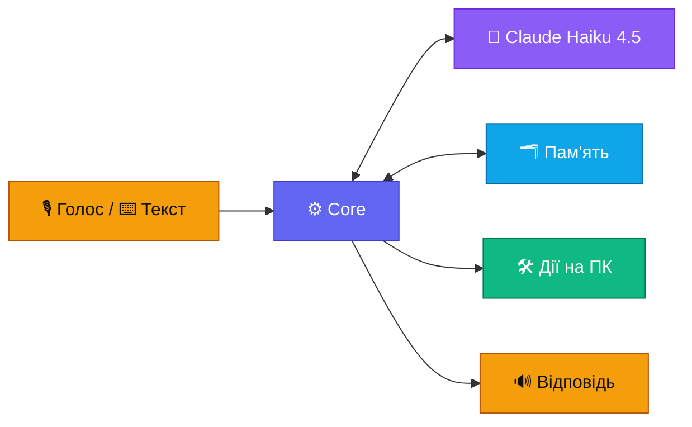

# Banshee — ТЗ коротко

> Banshee — персональний голосовий асистент для Windows. Прокидається на слово «Banshee», розуміє голос і текст українською, вчиться на спілкуванні з власником і виконує команди на ПК. Мозок — Claude Haiku 4.5.

`Статус: ТЗ готове, план — 13-plan.md; коду ще немає` · `Версія 3.6 · 2026-10-03` · Презентація для браузера: [presentation.html](presentation.html)

## Вимоги

| ID | Вимога | Рішення | Критерій приймання |
|---|---|---|---|
| F1 | Команди голосом і текстом | wake word «Banshee» → VAD → STT; оверлей за гарячою клавішею | ≤ 1 хибне спрацювання на 10 год фонової мови; ≤ 5 % пропусків |
| F2 | Добре розуміє власника | Haiku 4.5, профіль у системному промпті, словник назв | ≥ 90 % правильних дій на еталонному наборі |
| F3 | Вчиться сам | профіль, правила, рутини, зокрема вивчені з успішних виконань ШІ, спогади, нічний самоаналіз із перевіркою | виправлена помилка не повторюється в 9 з 10 перевірок; частка команд без ШІ ≥ 40 % через місяць; навчання не погіршує еталонний набір |
| F4 | Виконує команди на ПК | MCP-сервери: програми, вікна, файли, PowerShell, браузер | кожна дія має рівень і запис у журналі |
| F5 | Claude на найдешевшій і найшвидшій моделі | Haiku 4.5 за замовчуванням, Sonnet 5.5 лише через ескалацію | Sonnet — ≤ 10 % викликів |
| F6 | Зрозумілий інтерфейс | трей, оверлей, картки підтвердження, центр керування; світла й темна теми ([09-ui.md](09-ui.md)) | кожен стан видно; усе доступне з клавіатури; контраст ≥ 4,5 : 1 |
| F7 | Налаштування видно й можна змінити | центр керування, частина — голосом; безпекові — лише вручну ([10-settings.md](10-settings.md)) | кожен пункт має опис, типове значення й «скинути»; зміни в журналі зі «скасуй» |
| F8 | Пам'ять переноситься на інші ПК і синхронізується | зашифрований файл `.banshee` і тека хмарного диска ([11-sync.md](11-sync.md)) | експорт → імпорт відтворює знання повністю; «забудь» поширюється; ключів у файлі немає |
| F9 | Слухає лише власника | голосовий профіль власника: sherpa-onnx порівнює з ним кожну фразу ([02-voice.md](02-voice.md)) | чужий голос прийнято ≤ 5 %; власника не впізнано ≤ 5 % |
| F10 | Видно, як Banshee вчиться | розділ «Активність»: графіки команд з ШІ й без ШІ, витрат і навчання, порівняння періодів ([09-ui.md](09-ui.md)) | числа на графіках збігаються з журналом; періоди 7, 30, 90 днів і рік; порівняння з попереднім періодом |
| F11 | ШІ можна вимкнути | стан ШІ видно завжди; перемикач; базовий режим без ШІ ([03-brain.md](03-brain.md)); покрокове підключення API ([12-api.md](12-api.md)) | у базовому режимі 0 запитів до API, рутини й вбудовані команди працюють; стан ШІ видно в треї, оверлеї й налаштуваннях |
| N1 | Швидка реакція | стрімінг, фраза перед дією, рутини без LLM | від кінця фрази до першого звуку: p50 ≤ 1,5 с, p90 ≤ 2,5 с |
| N2 | Безпека | рівні дій, 🔴 лише фізичним підтвердженням, канал без портів, захист пам'яті | 🔴 не приймає голос; сценарії ін'єкцій не виконуються й не потрапляють у пам'ять |
| N3 | Низька вартість | платимо лише за API Claude: кеш на 1 год, одна відповідь на просту дію, ліміти $1 на день і $20 на місяць; голос — безкоштовно | API ≤ $15 на місяць при 50 командах на день; інші сервіси — $0; ліміт спрацьовує |
| N4 | Надійність | автозапуск, перезапуск core, базовий режим без інтернету | core відновлюється за ≤ 5 с; без інтернету працюють рутини |
| N5 | Приватність | аудіо не залишає ПК: слово, розпізнавання й озвучка локальні; секрети не зберігаються; строки зберігання | транскрипти старші 90 днів видаляються; «забудь» видаляє запис |
| N6 | Легкість у фоні | wake word і трей працюють постійно | у спокої CPU < 3 %, RAM < 500 МБ (без браузера) |
| N7 | Сумісність | Windows 10 22H2 (збірка 19045) і всі новіші, включно з Windows 11; лише публічні API, можливості Windows 11 — за наявності | встановлюється й проходить перевірки на Windows 10 22H2 і найновішій Windows 11 |

Як вимірювати кожен критерій — [07-quality.md](07-quality.md).

**Бюджет власника.** Платні лише підписка Claude (уже є) і API Claude з оплатою за використання: ≈ $11 на місяць, ліміти $1 на день і $20 на місяць. Розрахунок — у [03-brain.md](03-brain.md), підключення — у [12-api.md](12-api.md). Нових підписок і платних сервісів немає, голос і решта — лише безкоштовне.

## Поза межами

- Віддалене керування з телефону чи через інтернет: Banshee слухає лише локальні мікрофон і клавіатуру.
- Кілька користувачів: команди виконує лише власник, інші голоси Banshee ігнорує (F9). Гостьовий режим і довірені голоси — поки ні (рішення власника, 2026-10-03).
- Пошта й календар — поки ні (рішення власника, 2026-10-03).
- Окреме шифрування бази даних — поки ні (рішення власника, 2026-10-03). Файл експорту й пакети синхронізації шифруються завжди, бо виходять за межі ПК.
- macOS і Linux.
- Дії з правами адміністратора: Banshee показує команду, запускає її власник.
- Донавчання моделі (fine-tuning): Banshee вчиться через пам'ять ([08-learning.md](08-learning.md)).
- Свій сервер синхронізації: пам'ять синхронізується через теку хмарного диска власника.
- Дії з власної ініціативи. Виняток — нагадування й брифінги з етапу 4, і ті без дій на ПК.

## Ключові рішення

✅ — рішення власника · ⏸ — власник відклав · 💬 — пропозиція, чекає підтвердження (зараз таких немає)

| Рішення | Замість | Чому | Статус |
|---|---|---|---|
| Ім'я й слово активації «Banshee» | Jarvis | вибір власника | ✅ |
| TypeScript + Node.js LTS | — | стек власника; офіційні SDK для Claude, MCP і Agent SDK | ✅ |
| Claude Haiku 4.5 за замовчуванням | дорожчі моделі | вимога власника: найдешевша й найшвидша модель | ✅ |
| Мозок через API Claude, оплата за використання | підписка Claude | підписка не покриває API, а власні застосунки за правилами Anthropic працюють лише з API-ключем; ≈ $11 на місяць; підключення — [12-api.md](12-api.md) | ✅ 2026-10-03 |
| Ключі API вводяться в налаштуваннях Banshee, зберігаються в Credential Manager | змінні середовища `BANSHEE_*` | вибір власника: ключем керує сам Banshee — стан, перевірка, заміна; ключа немає в оточенні інших програм; до вікна налаштувань — команда `npm run key` | ✅ 2026-10-03 |
| Ліміти витрат: $1 на день, $20 на місяць | лише залишок кредитів | ловлять помилку, через яку модель ходить по колу; ≈ 3× звичайних витрат | ✅ 2026-10-03 |
| ШІ можна вимкнути: базовий режим, стан ШІ видно завжди | ШІ завжди ввімкнений | власник керує витратами; без ключа, зв'язку чи кредитів Banshee теж працює | ✅ вимога власника |
| Вбудовані команди без ШІ: гучність, медіа, програми, вікна, час | лише рутини власника й вивчені | базовий режим корисний з першого дня | ✅ 2026-10-03 |
| SQLite + FTS5 (`sqlite-vec` пізніше) | MongoDB | один файл без сервера, бекап — копія файлу | ✅ |
| Electron + React | Tauri, нативний UI | той самий стек; вбудоване ехоподавлення Chromium | ✅ 2026-10-03 |
| Монорепо на npm workspaces | pnpm | вбудовані в npm, без додаткових інструментів | ✅ 2026-10-03 |
| Definition of Done: typecheck, lint, тести, еталонний набір | — | зміна готова, лише коли пройшли всі перевірки | ✅ 2026-10-03 |
| Власний агентний цикл на `@anthropic-ai/sdk` | Agent SDK як ядро | мінімальна затримка й повний контроль над контекстом | ✅ 2026-10-03 |
| sherpa-onnx KWS для слова «Banshee» | Porcupine | Picovoice з 30.06.2026 не має безкоштовного тарифу; sherpa-onnx відкритий, працює в Node і не потребує навчання | ✅ 2026-10-03 |
| Голос лише локально: Whisper large-v3-turbo на відеокарті, Piper `uk_UA` | Azure Speech F0, ElevenLabs | рішення власника: картку не вводимо, а Azure без неї не активується. $0, без облікових записів, працює без інтернету, аудіо не залишає ПК. Ризик — швидкість Whisper на GTX 960 (етап 0); запасний план — хмарний Whisper Groq без картки, за рішенням власника | ✅ 2026-10-03 |
| Розпізнавання власника за голосом (sherpa-onnx) | слухати будь-який голос | телевізор та інші люди не керують ПК і не потрапляють у пам'ять | ✅ вимога власника |
| Голосовий профіль лише на цьому ПК | синхронізувати профіль | біометричні дані; інший мікрофон — інший відбиток; запис голосу займає 30 с | ✅ 2026-10-03 |
| Чужі голоси ігноруються | гостьовий режим | вибір власника | ✅ 2026-10-03 |
| Гарячі клавіші Ctrl+Shift+B / M / X | Ctrl+Alt+B / M / X | вибір власника; ті самі поєднання в Teams і Discord власник вимкне сам | ✅ 2026-10-03 |
| Розділ «Активність» із графіками | лише числа на «Огляді» | видно, як Banshee вчиться: частка команд без ШІ, витрати, навчання | ✅ вимога власника |
| Статистика за днями синхронізується, лише числа | статистика лише свого ПК | графіки й ліміти витрат для всіх ПК разом | ✅ 2026-10-03 |
| Windows UI Automation | computer use | для Haiku 4.5 computer use не заявлено; дерево елементів надійніше за координати | ✅ 2026-10-03 |
| core ↔ desktop через IPC, без мережевих портів | WebSocket на localhost | до відкритого порту може підключитися будь-яка програма чи сторінка в браузері | ✅ 2026-10-03 |
| Кеш промпта на 1 год | кеш на 5 хв | команди йдуть з паузами, кеш на 5 хв майже завжди холодний | ✅ 2026-10-03 |
| Проста дія завершує хід без другого виклику | відповідь моделі після кожної дії | удвічі дешевше й швидше | ✅ 2026-10-03 |
| Профіль у системному промпті | memory tool з API | memory tool додає +1 запит до кожної команди | ✅ 2026-10-03 |
| Рутини виконуються локально | кожна команда через LLM | миттєво й безкоштовно | ✅ 2026-10-03 |
| Вивчені рутини з успішних виконань ШІ | кожна повторна команда через LLM | з кожним днем швидше й дешевше | ✅ вимога власника |
| Ціль навчання: ≥ 40 % команд без ШІ через місяць | 30 % | вибір власника; на цілі витрати падають до ≈ $9,5 на місяць | ✅ 2026-10-03 |
| Самонавчання з перевіркою на еталонному наборі | зміни пам'яті без перевірки | навчання не може погіршити поведінку | ✅ 2026-10-03 |
| Окремий профіль браузера | профіль власника з логінами | чужа сторінка не дістанеться до акаунтів власника | ✅ 2026-10-03 |
| Claude Code у терміналі за підпискою власника | Claude Code через Agent SDK за API | $0 понад підписку; автономні задачі через API оплачувалися б окремо | ✅ 2026-10-03 |
| Перенесення пам'яті й синхронізація між ПК | пам'ять лише на одному ПК | вимога власника: Banshee переїжджає й донавчається на кількох ПК | ✅ вимога власника |
| Синхронізація через теку хмарного диска, зашифровані пакети змін | свій сервер; база SQLite у хмарній теці | безкоштовно й без сервера; кожен ПК пише лише свої файли, тож конфліктів файлів немає | ✅ 2026-10-03 |
| Тека синхронізації — OneDrive | Google Drive, Dropbox | уже налаштований на ПК власника й вбудований у Windows; кількість ПК не обмежена | ✅ 2026-10-03 |
| Windows 10 22H2 і всі новіші, включно з Windows 11 | лише Windows 11 | вимога власника: поточний ПК і всі новіші версії | ✅ вимога власника |
| Інтерфейс у стилі Windows: Fluent-іконки, системний шрифт | власний стиль | виглядає як частина системи; безкоштовно | ✅ 2026-10-03 |
| Без підпису коду | сертифікат підпису | сертифікат платний; для особистого використання вистачає «Однаково запустити» | ✅ 2026-10-03 |
| Шифрування самої БД (SQLCipher) | — | поки не потрібне; файл експорту й синхронізація шифруються завжди | ⏸ 2026-10-03 |
| Пошта й календар | — | поки не потрібні | ⏸ 2026-10-03 |
| Векторний пошук у пам'яті | — | рішення відкладено; поки вистачає FTS5 | ⏸ 2026-10-03 |
| Гостьовий режим і довірені голоси | — | поки не потрібні: чужі голоси ігноруються | ⏸ 2026-10-03 |

Кожне рішення власника одразу вноситься в ТЗ: відповідний файл, ця таблиця з датою, «Історія змін», відкриті питання в [06-roadmap.md](06-roadmap.md), презентація.

## Документи

| Файл | Зміст |
|---|---|
| [presentation.html](presentation.html) | усе ТЗ однією сторінкою для браузера, зі схемами; знімок md-файлів, оновлюється після правок |
| [01-architecture.md](01-architecture.md) | компоненти, процеси, структура репозиторію |
| [02-voice.md](02-voice.md) | голосовий конвеєр, бюджет затримки |
| [03-brain.md](03-brain.md) | моделі Claude, маршрутизація, прайс API, оплата, ліміти, пастки API |
| [04-memory.md](04-memory.md) | пам'ять, захист від ін'єкцій, рутини, схема БД |
| [05-safety.md](05-safety.md) | рівні дій, підтвердження, ізоляція |
| [06-roadmap.md](06-roadmap.md) | етапи, критерії готовності, відкриті питання |
| [07-quality.md](07-quality.md) | метрики, еталонний набір, телеметрія |
| [08-learning.md](08-learning.md) | рутини з успішних виконань ШІ, самонавчання з перевіркою |
| [09-ui.md](09-ui.md) | інтерфейс: трей, оверлей, підтвердження, центр керування, стани |
| [10-settings.md](10-settings.md) | налаштування: розділи, рівні зберігання, правила зміни |
| [11-sync.md](11-sync.md) | перенесення й синхронізація пам'яті, сумісність з Windows |
| [12-api.md](12-api.md) | підключення Claude API покроково з посиланнями, ключ до появи вікна налаштувань, стан ШІ, базовий режим |
| [13-plan.md](13-plan.md) | план створення: передумови, кроки етапів 0–4, бюджет і ризики розробки |

Джерело правди — md-файли. Презентація показує їх у зручному вигляді й перегенеровується після правок.

## Історія змін

- **v3.6 · 2026-10-03** — рішення власника: дані картки не вводимо, а без них Azure не активується. Тому Azure Speech прибрано, голос лише локальний.
  - Розпізнавання — Whisper large-v3-turbo q5 на GTX 960, озвучка — Piper `uk_UA`; обидва працюють в окремому процесі voice.
  - Аудіо не залишає ПК (N5).
  - Whisper стартує з першою тишею, щоб пауза 0,5 с ховала частину розпізнавання.
  - Етап 0: крок 0.3 — швидкість і точність Whisper, ціль ≤ 0,8 с на фразу; крок 0.4 — вибір голосу Piper.
  - Запасний план, якщо Whisper не вкладеться в ціль, — хмарний Whisper Groq без картки, за рішенням власника.
  - Передумови тепер П1–П4: Azure прибрано, ключ лише Claude.
  - Розробка: `.mcp.json` і `.claude/settings.local.json` — у `.gitignore`, щоб токен не потрапив у git; кеш npm — на D: (`.data/npm-cache`).
  - `.mcp.json` лишається, але лише з context7 і chrome-devtools (рішення власника); сервери payments — figma, mui, atlassian, gitlab — прибрано.
- **v3.5 · 2026-10-03** — покрокова інструкція Azure Speech F0 з посиланнями ([12-api.md](12-api.md)); у v3.6 Azure прибрано:
  - пряме посилання на ресурс Speech, бо ресурс Foundry, на який тепер веде документація Microsoft, не має F0;
  - перехід на оплату за використання з безкоштовним планом підтримки Basic до 30-го дня — інакше підписка вимкнеться разом із F0;
  - бюджет-сповіщення $1;
  - квоти F0: 1 одночасне розпізнавання, 20 синтезів за 60 с; понад ліміт — 429, а не рахунок;
  - що буде через 30 днів: закінчується кредит $200, а не безкоштовність F0. З оплатою за використання F0 лишається $0; без неї Azure вимикає підписку, і голос працює лише на локальних моделях.
- **v3.4 · 2026-10-03** — рішення власника: ключі API Claude й Azure вводяться в налаштуваннях Banshee і зберігаються в Credential Manager, змінні середовища `BANSHEE_*` скасовано.
  - Поки вікна налаштувань немає (до кроку 1.7), ті самі записи заповнює команда `npm run key`; запускає її власник.
  - Модуль сховища — `@napi-rs/keyring`.
  - Передумови плану переставлено: ключі вводяться після каркаса (П5).
  - Хук `guard-secrets` блокує читання сховища облікових даних і `npm run key`.
- **v3.3 · 2026-10-03** — перевірка ТЗ перед кодом і план:
  - ключ API в розробці — `BANSHEE_ANTHROPIC_API_KEY`, бо змінна `ANTHROPIC_API_KEY` перевела б Claude Code власника з підписки на оплату за API (у v3.4 замінено налаштуваннями Banshee);
  - інструкція Azure Speech F0;
  - 11 інструментів етапу 1;
  - середовище розробки: Node 22, electron-vite, ESLint, Vitest, Playwright, дані в `.data/` на D:;
  - журнали роботи й діагностика;
  - один хід за раз;
  - склад системного промпту й еталонного набору;
  - зміна аудіопристроїв, дзвінки, кілька ПК поруч, кілька моніторів, повноекранні програми;
  - тека моделей на іншому диску;
  - видалення програми, CSP, ризик Defender;
  - план створення ([13-plan.md](13-plan.md)).

  Налаштування Claude Code приведено під Banshee: payments-архів і зайвий скіл — у Кошик, дозволи й хуки оновлено.
- **v3.2 · 2026-10-03** — рішення власника:
  - усі 17 пропозицій ухвалено;
  - ціль навчання — ≥ 40 % команд без ШІ через місяць;
  - чужі голоси ігноруються, гостьовий режим відкладено;
  - Ctrl+Shift лишається, конфліктні поєднання в Teams і Discord власник вимкне сам;
  - тека синхронізації — OneDrive, він уже налаштований на ПК власника;
  - ESU на цьому ПК увімкнено (безкоштовно, до 12.10.2027);
  - меню презентації — без прокрутки.

  Відкритих питань немає.
- **v3.1 · 2026-10-03** — рішення власника:
  - ухвалено: ліміти $1 на день і $20 на місяць; API Claude з покроковим підключенням ([12-api.md](12-api.md)); стан ШІ й базовий режим без ШІ (F11); Electron + React; npm workspaces; Definition of Done; розпізнавання власника за голосом (F9); розділ «Активність» із графіками (F10); гарячі клавіші Ctrl+Shift;
  - відкладено: шифрування БД, пошта й календар, векторний пошук;
  - перевірено на ПК власника: GTX 960 на 2 ГБ — локальний Whisper лишається резервом; ESU не ввімкнено;
  - денний ліміт тепер зупиняє витрати до 00:00, а не лише вимикає ескалації;
  - правило: кожне рішення одразу вноситься в ТЗ.
- **v3 · 2026-10-03** — нові частини за запитом власника: рутини з успішних виконань ШІ й самонавчання з перевіркою ([08-learning.md](08-learning.md)), інтерфейс ([09-ui.md](09-ui.md)), налаштування ([10-settings.md](10-settings.md)), перенесення й синхронізація пам'яті між ПК, сумісність з Windows 10 22H2 і новішими ([11-sync.md](11-sync.md)); вимоги F6–F8 і N7; нова схема БД.
- **v2.1 · 2026-10-02** — рішення власника: SQLite замість MongoDB; голос — безкоштовно (Azure F0 + локальний резерв), ElevenLabs прибрано; бюджет — лише Claude; прайс API ≈ $5,5–20 на місяць залежно від навантаження; Claude Code — у терміналі за підпискою.
- **v2 · 2026-10-02** — правки після розбору:
  - безпека: канал без портів, захист пам'яті від ін'єкцій, 🔴 лише фізичним підтвердженням, Claude Code через політику дій, правила для заблокованого ПК;
  - голос: VAD, вікно продовження, «стоп», ехоподавлення, словник назв, бюджет затримки;
  - вартість: кеш на 1 год, одна відповідь на просту дію, ліміти, повна оцінка (≈ $11 на місяць);
  - пам'ять: походження фактів, підтвердження правил, рутини зі слотами, «забудь», строки зберігання;
  - вимоги з критеріями, «Поза межами», етап 0, статуси рішень, [07-quality.md](07-quality.md).
- **v1 · 2026-10-02** — перша версія; Jarvis → Banshee; Porcupine → sherpa-onnx.
